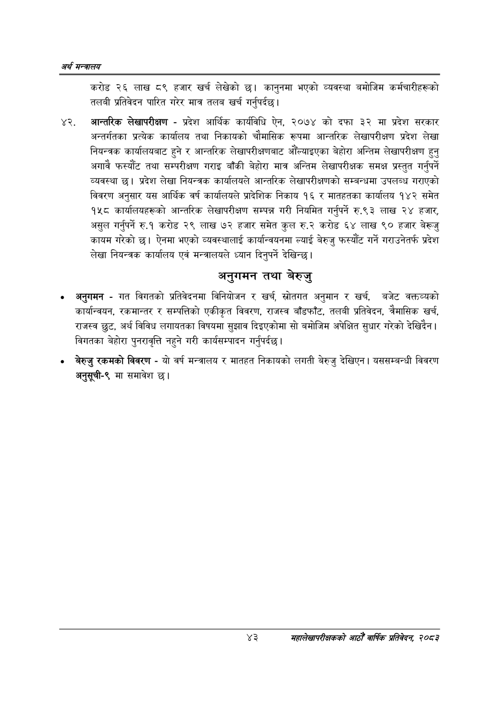

# Page 65 QA

## Rendered page


## Extracted text

```text
अर्थ सन्वबालय
करोड २६ लाख ८९ हजार खर्च लेखेको छ। कानुनमा भएको व्यवस्था बमोजिम कर्मचारीहरूको तलबी प्रतिवेदन पारित गरेर मात्र तलब खर्च गर्नुपर्दछ |
अन्तरिक लेखापरीक्षण -प्रदेश आर्थिक कार्यविधि ऐन, २०७४ को दफा ३२ मा प्रदेश सरकार अन्तर्गतका प्रत्येक कार्यालय तथा निकायको चौमासिक रूपमा आन्तरिक लेखापरीक्षण प्रदेश लेखा नियन्त्रक कार्यालयबाट हुने र आन्तरिक लेखापरीक्षणबाट औंँल्याइएका बेहोरा अन्तिम लेखापरीक्षण हुनु अगावै फस्यौट तथा सम्परीक्षण गराइ बाँकी बेहोरा मात्र अन्तिम लेखापरीक्षक समक्ष प्रस्तुत गर्नुपर्ने व्यवस्था छ। प्रदेश लेखा नियन्त्रक कार्यालयले आन्तरिक लेखापरीक्षणको सम्बन्धमा उपलब्ध गराएको विवरण अनुसार यस आर्थिक वर्ष कार्यालयले प्रादेशिक निकाय १६ र मातहतका कार्यालय १४२ समेत १५८ कार्यालयहरूको आन्तरिक लेखापरीक्षण सम्पन्न गरी नियमित गर्नुपर्ने रु.९३ लाख २४ हजार, असुल गर्नुपर्ने रु.१ करोड २९ लाख ७२ हजार समेत कुल रु.२ करोड ६४ लाख ९० हजार बेरूजु कायम गरेको | ऐनमा भएको व्यवस्थालाई कार्यान्वयनमा ल्याई बेरुजु फस्यौट गर्ने गराउनेतर्फ प्रदेश लेखा नियन्त्रक कार्यालय एवं मन्त्रालयले ध्यान दिनुपर्ने देखिन्छ |
अनुगमन तथा बेरुजु
अनुगमन -गत विगतको प्रतिवेदनमा विनियोजन र खर्च, स्रोतगत अनुमान र खर्च, बजेट वक्तव्यको कार्यान्वयन, रकमान्तर र सम्पत्तिको एकीकृत विवरण, राजस्व बाँडफाँट, तलबी प्रतिवेदन, त्रैमासिक खर्च, राजस्व छुट, अर्थ विविध लगायतका विषयमा सुझाव दिइएकोमा सो बमोजिम अपेक्षित सुधार गरेको देखिदैन। विगतका बेहोरा पुनरावृत्ति नहुने गरी कार्यसम्पादन गर्नुपर्दछ |
बेरुजु रकमको विवरण -यो वर्ष मन्त्रालय र मातहत निकायको लगती बेरुजु देखिएन। यससम्बन्धी विवरण अनुसूची-९ मा समावेश छ।
४३
महालेखापरीक्षकको आठौ वाषिकि प्रतिवेदन २०८२
```

## Flags
- None
