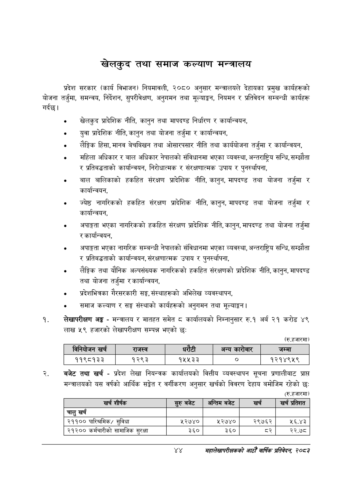

# Page 66 QA

## Rendered page


## Extracted text

```text
खेलकुद तथा समाज कल्याण मन्त्रालय
प्रदेश सरकार (कार्य विभाजन) नियमावली, २०८० अनुसार मन्त्रालयले देहायका प्रमुख कार्यहरूको योजना तर्जुमा, समन्वय, निर्देशन, सुपरीवेक्षण, अनुगमन तथा मूल्याङ्कन, नियमन र प्रतिवेदन सम्बन्धी कार्यहरू गर्दछ।
० खेलकुद प्रादेशिक नीति, कानुन तथा मापदण्ड निर्धारण र कार्यान्वयन,
० युवा प्रादेशिक नीति, कानुन तथा योजना तर्जुमा र कार्यान्वयन,
लैङ्गिक हिंसा, मानव बेचबिखन तथा ओसारपसार नीति तथा कार्ययोजना तर्जुमा र कार्यान्वयन,
महिला अधिकार र बाल अधिकार नेपालको संविधानमा भएका व्यवस्था, अन्तराष्ट्रिय सन्धि, सम्झौता र प्रतिबद्धताको कार्यान्वयन, निरोधात्मक र संरक्षणात्मक उपाय र पुनर्स्थापना,
बाल बालिकाको हकहित संरक्षण प्रादेशिक नीति, कानुन, मापदण्ड तथा योजना तर्जुमा र कार्यान्वयन,
ज्येष्ठ नागरिकको हकहित संरक्षण प्रादेशिक नीति, कानुन, मापदण्ड तथा योजना तर्जुमा र कार्यान्वयन,
० अपाङ्गता भएका नागरिकको हकहित संरक्षण प्रादेशिक नीति, कानुन, मापदण्ड तथा योजना तर्जुमा र कार्यान्वयन,
० अपाङ्गता भएका नागरिक सम्बन्धी नेपालको संविधानमा भएका व्यवस्था, अन्तराष्ट्रिय सन्धि, सम्झौता र प्रतिबद्धताको कार्यान्वयन, संरक्षणात्मक उपाय र पुनर्स्थापना,
१ लैङ्गिक तथा यौनिक अल्पसंख्यक नागरिकको हकहित संरक्षणको प्रादेशिक नीति, कानुन, मापदण्ड तथा योजना तर्जुमा र कार्यान्वयन,
० प्रदेशभित्रका गैरसरकारी सङ्घ, संस्थाहरूको अभिलेख व्यवस्थापन,
समाज कल्याण र सङ्घ संस्थाको कार्यहरूको अनुगमन तथा मूल्याङ्कन |
लेखापरीक्षण अङ्ग -मन्त्रालय र मातहत समेत ८ कार्यालयको निम्नानुसार रु.१ अर्ब २१ करोड ४९ लाख ५९ हजारको लेखापरीक्षण सम्पन्न भएको छ:
(रु.हजारमा)
बजेट तथा खर्च -प्रदेश लेखा नियन्त्रक कार्यालयको वित्तीय व्यवस्थापन सूचना प्रणालीबाट प्राप्त मन्त्रालयको यस वर्षको आर्थिक सङ्ेत र वर्गीकरण अनुसार खर्चको विवरण देहाय बमोजिम रहेको छः (रू.हजारमा)
४४
महालेखापरीक्षकको आठौ वाषिकि प्रतिवेदन २०८२

|  |  | 'ननेपोजन खरी |  | राजस्व |  |  | अन्य कारोबार | जम्मा |
| --- | --- | --- | --- | --- | --- | --- | --- | --- |
|  |  | ११९८१३३ |  | १२९३ | १५५३३ |  | ० | १२१४९५९ |

| खर्च शीर्षक | सुरुबबेट | अन्तिम बजेट | खर्च | खर प्रतिशत |
| --- | --- | --- | --- | --- |
| चालु खर्च |  |  |  |  |
| २११०० पारिश्रमिक/ सुविधा | ५२७४० | ५२७४० | २९७६२ | २६.४३ |
| २१२०० कर्मचारीको सामाजिक सुरक्षा | ३६० | ३६० | व्२ | २२.७८ |
```

## Flags
- table_page
- medium_quality_table
