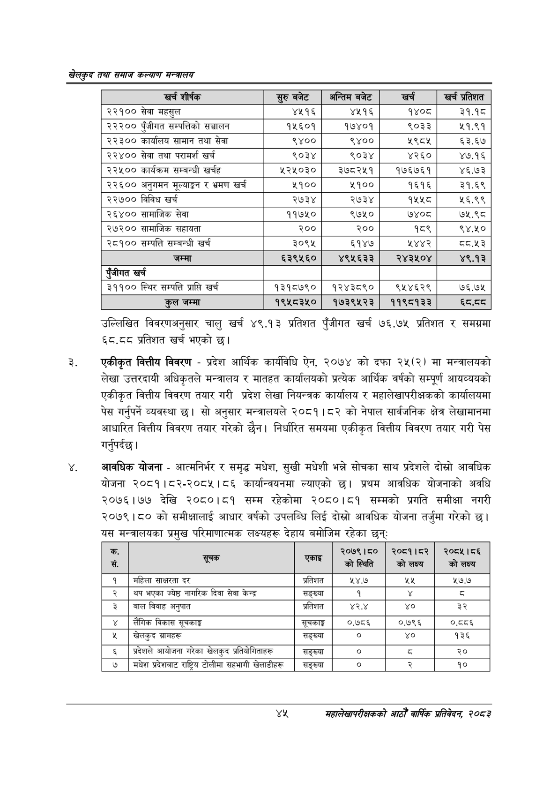

# Page 67 QA

## Rendered page


## Extracted text

```text
खेलकुद तथा समाज कल्याण मन्त्रालय
उल्लिखित विवरणअनुसार चालु खर्च ४९.१३ प्रतिशत पुँजीगत खर्च ७६.७५ प्रतिशत र समग्रमा ६८.८व प्रतिशत खर्च भएको छ।
एकीकृत वित्तीय विवरण -प्रदेश आर्थिक कार्यविधि ऐन, २०७४ को दफा २५(२) मा मन्त्रालयको लेखा उत्तरदायी अधिकृतले मन्त्रालय र मातहत कार्यालयको प्रत्येक आर्थिक वर्षको सम्पूर्ण आयव्ययको एकीकृत वित्तीय विवरण तयार गरी प्रदेश लेखा नियन्त्रक कार्यालय र महालेखापरीक्षकको कार्यालयमा पेस गर्नुपर्ने व्यवस्था | सो अनुसार मन्त्रालयले २०८१।८२ को नेपाल सार्वजनिक क्षेत्र लेखामानमा आधारित वित्तीय विवरण तयार गरेको छैन। निर्धारित समयमा एकीकृत वित्तीय विवरण तयार गरी पेस गर्नुपर्दछ |
आवधिक योजना -आत्मनिर्भर र समृद्ध मधेश, सुखी मधेशी भन्ने सोचका साथ प्रदेशले दोत्रो आवधिक योजना २०८१।८२-२०८५।८६ कार्यान्वयनमा ल्याएको छ। प्रथम आवधिक योजनाको अवधि २०७६।७७ देखि २०८०।८१ सम्म रहेकोमा २०८०।८१ सम्मको प्रगति समीक्षा नगरी २०७९।८० को समीक्षालाई आधार वर्षको उपलब्धि लिई दोस्रो आवधिक योजना तर्जुमा गरेको छ। यस मन्त्रालयका प्रमुख परिमाणात्मक लक्ष्यहरू देहाय बमोजिम रहेका छन्‌ः
यश
महालेखापरीक्षकको आठौ वाषिकि प्रतिवेदन २०८२

| खरी शीर्षक | सुरुबबेट | अन्तिम बजेट | खर्च | प्रतिशत |
| --- | --- | --- | --- | --- |
| २२१०० सेवा महसुल | ४५१६ | ४५१६ | १४०८ | ३१.पठ |
| २२२०० पुँजीगत सम्पत्तिको सञ्चालन | १५६०१ | १७४०१ | ९०३३ | २५१.९१ |
| २२३०० कार्यालय सामान तथा सेवा | ९४०० | ९४०० | ५९८४ | ६३.६७ |
| २२४०० सेवा तथा परामर्श खर्च | ९०३४ | ९०३४ | ४२६० | ४७.१६ |
| २२५०० कार्यक्रम सम्बन्धी खर्चह | १२५०३० | ३७८२५१ | १७६७६१ | ४६.७३ |
| २२६०० अनुगमन मूल्याङ्कन र भ्रमण खर्च | ५१०० | ५१०० | १६१६ | ३१.६९ |
| २२७०० विविध खर्च | २७३४ | २७३४ | १५५८ | २५६.९९ |
| २६४०० सामाजिक सेवा | ११७५० | ९७५० | ७४०८ | ७५.९८ |
| २७२०० चामाजिक सहावता | २०० | २०० | १८९ | ९४.५० |
| २८१०० सम्पत्ति सम्बन्धी खर्च | ३०९५ | ६१४७ | २४४२ | ८्य.५३ |
| जम्मा | ६३९५६० | ४९५६३३ | २४३५०४ | ४९.१३ |
| पुँजीगत खर्च |  |  |  |  |
| ३११०० स्थिर सम्पत्ति प्राप्ति खर्च | १३१८७९० | १२४३८९० | ९५४६२९ | ७६.७४५ |
| जम्मा | १९५८३५० | १७३९५२३ | ११९८१३३ | ध्द.द्व |

| क. सं. | सूचक रा | एकाइ | २०७९।८० कोलस्पति | २०८१।८२ कोलक्य |
| --- | --- | --- | --- | --- |
| १ | महिला साक्षरता दर | प्रतिशत | १४.७ | २५ |
| २ | थप भएका ज्येष्ठ नागरिक दिवा सेवा केन्द्र | सङ्ख्या | १ |  |
| ३ | बाल विवाह अनुपात | प्रतिशत | ४२.४ | ४० |
| ४ | लैगिक विकास सूचकाङ्क | सूचकाङ्क | ०.७८६ | ०.७९६ |
| ५ | खेलकुद ग्रामहरू | सङ्ख्या | ० | ४० |
| ६ | प्रदेशले आयोजना गरेका खेलकुद प्रतिवोगिताहरू | सङ्ख्या | ० | ३ |
| ७ | मधेश प्रदेशबाट राष्ट्रिय टोलीमा सहभागी ७०६६ | सङ्ख्या |  | २ |
```

## Flags
- table_page
- medium_quality_table
