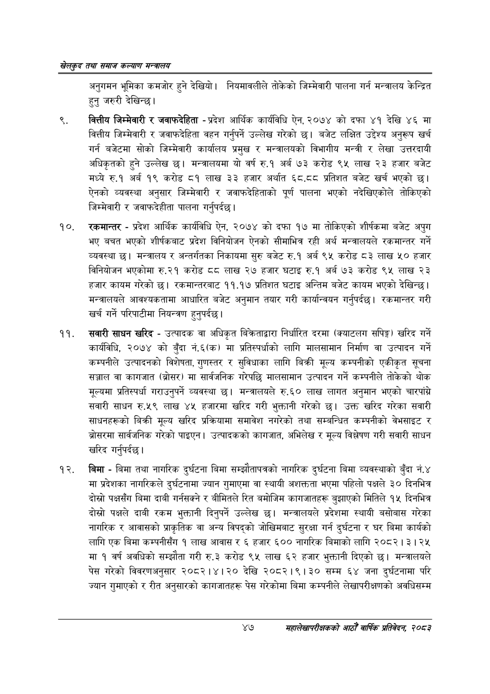

# Page 69 QA

## Rendered page


## Extracted text

```text
खेलकुद तथा समाज कल्याण मन्त्रालय
अनुगमन भूमिका कमजोर हुने देखियो। नियमावलीले तोकेको जिम्मेवारी पालना गर्न मन्त्रालय केन्द्रित हुनु जरुरी देखिन्छ।
वित्तीय जिम्मेवारी र जवाफदेहिता -प्रदेश आर्थिक कार्यविधि ऐन, २०७४ को दफा ४१ देखि ४६ मा वित्तीय जिम्मेवारी र जवाफदेहिता वहन गर्नुपर्ने उल्लेख गरेको छ। बजेट लक्षित उद्देश्य अनुरूप खर्च गर्न बजेटमा सोको जिम्मेवारी कार्यालय प्रमुख र मन्त्रालयको विभागीय मन्त्री र लेखा उत्तरदायी अधिकृतको हुने उल्लेख छ। मन्त्रालयमा यो वर्ष रु.१ अर्ब ७३ करोड ९५ लाख २३ हजार बजेट मध्ये रु.१ अर्ब १९ करोड ८१ लाख ३३ हजार अर्थात ६८,.८व प्रतिशत बजेट खर्च भएको छ। ऐनको व्यवस्था अनुसार जिम्मेवारी र जवाफदेहिताको पूर्ण पालना भएको नदेखिएकोले तोकिएको जिम्मेवारी र जवाफदेहीता पालना गर्नुपर्दछ।
रकमान्तर -प्रदेश आर्थिक कार्यविधि ऐन, २०७४ को दफा १७ मा तोकिएको शीर्षकमा बजेट अपुग भए बचत भएको शीर्षकबाट प्रदेश विनियोजन ऐनको सीमाभित्र रही अर्थ मन्त्रालयले रकमान्तर गर्ने व्यवस्था छ। मन्त्रालय र अन्तर्गतका निकायमा सुरु बजेट रु.१ अर्ब ९५ करोड ८३ लाख ५० हजार विनियोजन भएकोमा रु.२१ करोड दद लाख २७ हजार घटाइ रु.१ अर्ब ७३ करोड ९५ लाख २३ हजार कायम गरेको छ। रकमान्तरबाट ११.१७ प्रतिशत घटाइ अन्तिम बजेट कायम भएको देखिन्छ | मन्त्रालयले आवश्यकतामा आधारित बजेट अनुमान तयार गरी कार्यान्वयन गर्नुपर्दछ। रकमान्तर गरी खर्च गर्ने परिपाटीमा नियन्त्रण हुनुपर्दछ |
सवारी साधन खरिद -उत्पादक वा अधिकृत बिक्रताद्वारा निर्धारित दरमा (क्याटलग सपिङ्ग) खरिद गर्ने कार्यविधि, २०७४ को बुँदा नं.६(क) मा प्रतिस्पर्धाको लागि मालसामान निर्माण वा उत्पादन गर्ने कम्पनीले उत्पादनको विशेषता, गुणस्तर र सुविधाका लागि बिक्री मूल्य कम्पनीको एकीकृत सूचना सञ्जाल वा कागजात (ब्रोसर) मा सार्वजनिक गरेपछि मालसामान उत्पादन गर्ने कम्पनीले तोकेको थोक मूल्यमा प्रतिस्पर्धा गराउनुपर्ने व्यवस्था छ। मन्त्रालयले रु.६० लाख लागत अनुमान भएको चारपांग्ने सवारी साधन रु.५९ लाख ४५ हजारमा खरिद गरी भुक्तानी गरेको छ। उक्त खरिद गरेका सवारी साधनहरूको बिक्री मूल्य खरिद प्रक्रियामा समावेश नगरेको तथा सम्बन्धित कम्पनीको वेभसाइट र ब्रोसरमा सार्वजनिक गरेको पाइएन। उत्पादकको कागजात, अभिलेख र मूल्य विशेषण गरी सवारी साधन खरिद गर्नुपर्दछ।
बिमा -बिमा तथा नागरिक दुर्घटना बिमा सम्झौतापत्रको नागरिक दुर्घटना बिमा व्यवस्थाको बुँदा नं.४ मा प्रदेशका नागरिकले दुर्घटनामा ज्यान गुमाएमा वा स्थायी अशक्तता भएमा पहिलो पक्षले ३० दिनभित्र दोस्रो पक्षसँग बिमा दाबी गर्नसक्ने र बीमितले रित बमोजिम कागजातहरू बुझाएको मितिले १५ दिनभित्र दोस्रो पक्षले दाबी रकम भुक्तानी दिनुपर्ने उल्लेख छ। मन्त्रालयले प्रदेशमा स्थायी बसोबास गरेका नागरिक र आवासको प्राकृतिक वा अन्य विपद्को जोखिमबाट सुरक्षा गर्न दुर्घटना र घर बिमा कार्यको लागि एक बिमा कम्पनीसँग १ लाख आवास र ६ हजार ६०० नागरिक बिमाको लागि २०८२। ३। २५ मा १ वर्ष अवधिको सम्झौता गरी रु.३ करोड ९५ लाख ६२ हजार भुक्तानी दिएको छ। मन्त्रालयले पेस गरेको विवरणअनुसार २०८२।४। २० देखि २०८२।९। ३० सम्म ६४ जना दुर्घटनामा परि ज्यान गुमाएको र रीत अनुसारको कागजातहरू पेस गरेकोमा बिमा कम्पनीले लेखापरीक्षणको अवधिसम्म
४७
महालेखापरीक्षकको आठौ वाषिकि प्रतिवेदन २०८२
```

## Flags
- None
