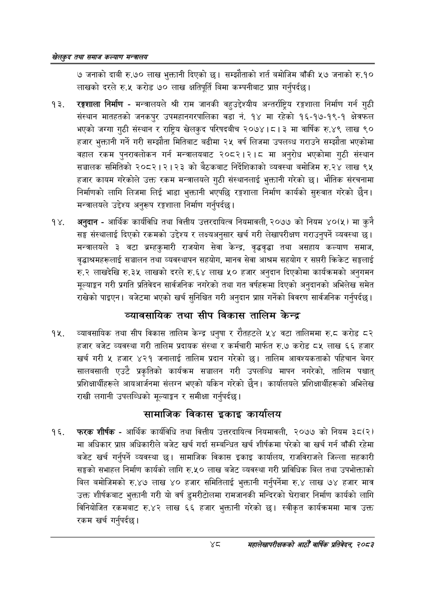

# Page 70 QA

## Rendered page


## Extracted text

```text
खेलकुद तथा समाज कल्याण मन्त्रालय
७ जनाको दाबी रु.७० लाख भुक्तानी दिएको छ। सम्झौताको शर्त बमोजिम बाँकी ५७ जनाको रु.१० लाखको दरले रु.५ करोड ७० लाख क्षतिपूर्ति बिमा कम्पनीबाट प्राप्त गर्नुपर्दछ |
रङ्गशाला निर्माण -मन्त्रालयले श्री राम जानकी वहुउद्देश्यीय अन्तर्राष्ट्रिय रङ्गशाला निर्माण गर्न गुठी संस्थान मातहतको जनकपुर उपमहानगरपालिका वडा नं. १४ मा रहेको १६-१७-१९-१ क्षेत्रफल भएको जग्गा गुठी संस्थान र राष्ट्रिय खेलकुद परिषदबीच २०७४।८। ३ मा वार्षिक रु.४९ लाख ९० हजार भुक्तानी गर्ने गरी सम्झौता मितिबाट बढीमा २५ वर्ष लिजमा उपलब्ध गराउने सम्झौता भएकोमा वहाल रकम पुनरावलोकन गर्न मन्त्रालयबाट २०८२।२।८ मा अनुरोध भएकोमा गुठी संस्थान सञ्चालक समितिको २०८२।२।२३ को बैठकबाट निर्देशिकाको व्यवस्था बमोजिम रु.२४ लाख ९५ हजार कायम गरेकोले उक्त रकम मन्त्रालयले गुठी संस्थानलाई भुक्तानी गरेको | भौतिक संरचनामा निर्माणको लागि लिजमा लिई भाडा भुक्तानी भएपछि रङ्गशाला निर्माण कार्यको सुरुवात गरेको छैन। मन्त्रालयले उद्देश्य अनुरूप रङ्गशाला निर्माण गर्नुपर्दछ।
अनुदान -आर्थिक कार्यविधि तथा वित्तीय उत्तरदायित्व नियमावली, २०७७ को नियम ४०(५) मा कुनै सङ्घ संस्थालाई दिएको रकमको उद्देश्य र लक्ष्यअनुसार खर्च गरी लेखापरीक्षण गराउनुपर्ने व्यवस्था छ। मन्त्रालयले ३ वटा ब्रम्हकुमारी राजयोग सेवा केन्द्र, वृद्धवृद्धा तथा असहाय कल्याण समाज, वृद्धाश्रमहरूलाई सञ्चालन तथा व्यवस्थापन सहयोग, मानव सेवा आश्रम सहयोग र सप्तरी क्रिकेट सङ्घलाई रु.२ लाखदेखि रु.३५ लाखको दरले रु.६४ लाख ५० हजार अनुदान दिएकोमा कार्यक्रमको अनुगमन मूल्याङ्कन गरी प्रगति प्रतिवेदन सार्वजनिक नगरेको तथा गत वर्षहरूमा दिएको अनुदानको अभिलेख समेत राखेको पाइएन। बजेटमा भएको खर्च सुनिश्चित गरी अनुदान प्राप्त गर्नेको विवरण सार्वजनिक गर्नुपर्दछ |
व्यावसायिक तथा सीप विकास तालिम केन्द्र
व्यावसायिक तथा सीप विकास तालिम केन्द्र धनुषा र रौतहटले ५४ वटा तालिममा रु.८ करोड ८२ हजार बजेट व्यवस्था गरी तालिम प्रदायक संस्था र कर्मचारी मार्फत रु.७ करोड ८५ लाख ६६ हजार खर्च गरी « हजार ४२१ जनालाई तालिम प्रदान गरेको छ। तालिम आवश्यकताको पहिचान बेगर सालबसाली एउटै प्रकृतिको कार्यक्रम सञ्चालन गरी उपलब्धि मापन नगरेको, तालिम पश्चात्‌ प्रशिक्षार्थीहरूले आयआर्जनमा संलग्न भएको यकिन गरेको छैन। कार्यालयले प्रशिक्षार्थीहरूको अभिलेख राखी लगानी उपलब्धिको मूल्याङ्कन र समीक्षा गर्नुपर्दछ |
सामाजिक विकास इकाइ कार्यालय
फरक शीर्षक -आर्थिक कार्यविधि तथा वित्तीय उत्तरदायित्व नियमावली, २०७७ को नियम ३८(२) मा अधिकार प्राप्त अधिकारीले बजेट खर्च गर्दा सम्बन्धित खर्च शीर्षकमा परेको वा खर्च गर्न बाँकी रहेमा बजेट खर्च गर्नुपर्ने व्यवस्था | सामाजिक विकास इकाइ कार्यालय, राजविराजले जिल्ला सहकारी सङ्घको सभाहल निर्माण कार्यको लागि रु.५० लाख बजेट व्यवस्था गरी प्राविधिक बिल तथा उपभोक्ताको बिल बमोजिमको रु.४७ लाख ४० हजार समितिलाई भुक्तानी गर्नुपर्नेमा रु.४ लाख ० हजार मात्र उक्त शीर्षकबाट भुक्तानी गरी यो वर्ष डुमरीटोलमा रामजानकी मन्दिरको घेरावार निर्माण कार्यको लागि विनियोजित रकमबाट रु.४२ लाख ६६ हजार भुक्तानी गरेको छ। स्वीकृत कार्यक्रममा मात्र उक्त रकम खर्च गर्नुपर्दछ।
शव
महालेखापरीक्षकको आठौ वाषिकि प्रतिवेदन २०८२
```

## Flags
- None
