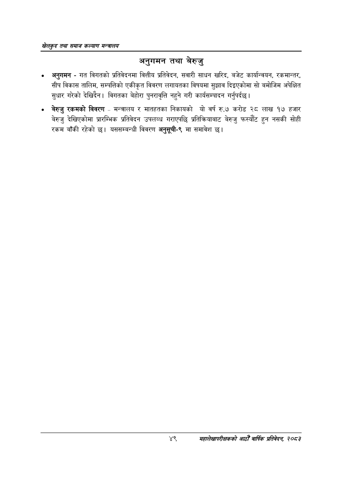

# Page 71 QA

## Rendered page


## Extracted text

```text
खेलकुद तथा समाज कल्याण मन्त्रालय
अनुगमन तथा बेरुजु
० अनुगमन -गत विगतको प्रतिवेदनमा वित्तीय प्रतिवेदन, सवारी साधन खरिद, बजेट कार्यान्वयन, रकमान्तर, सीप विकास तालिम, सम्पत्तिको एकीकृत विवरण लगायतका विषयमा सुझाव दिइएकोमा सो बमोजिम अपेक्षित सुधार गरेको देखिदैन। विगतका बेहोरा पुनरावृत्ति नहुने गरी कार्यसम्पादन गर्नुपर्दछ |
बेरुजु रकमको विवरण -मन्त्रालय र मातहतका निकायको यो वर्ष रु.७ करोड २८ लाख १७ हजार बेरुजु देखिएकोमा प्रारम्भिक प्रतिवेदन उपलब्ध गराएपछि प्रतिक्रियाबाट बेरुजु फस्यौट हुन नसकी सोही रकम बाँकी रहेको छ। यससम्बन्धी विवरण अनुसूची-९ मा समावेश छ।
४९
महालेखापरीक्षकको आठौ वाषिकि प्रतिवेदन २०८२
```

## Flags
- None
