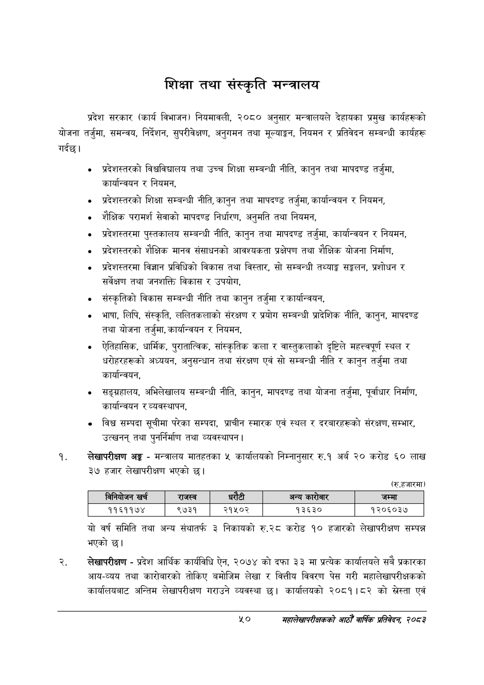

# Page 72 QA

## Rendered page


## Extracted text

```text
शिक्षा तथा संस्कृति मन्त्रालय
प्रदेश सरकार (कार्य विभाजन) नियमावली, २०८० अनुसार मन्त्रालयले देहायका प्रमुख कार्यहरूको योजना तर्जुमा, समन्वय, निर्देशन, सुपरीवेक्षण, अनुगमन तथा मूल्याङ्कन, नियमन र प्रतिवेदन सम्बन्धी कार्यहरू गर्दछ।
«० प्रदेशस्तरको विश्वविद्यालय तथा उच्च शिक्षा सम्बन्धी नीति, कानुन तथा मापदण्ड तर्जुमा, कार्यान्वयन र नियमन,
० प्रदेशस्तरको शिक्षा सम्बन्धी नीति, कानुन तथा मापदण्ड तर्जुमा, कार्यान्वयन र नियमन,
० शैक्षिक परामर्श सेवाको मापदण्ड निर्धारण, अनुमति तथा नियमन,
० प्रदेशस्तरमा पुस्तकालय सम्बन्धी नीति, कानुन तथा मापदण्ड तर्जुमा, कार्यान्वयन र नियमन,
० प्रदेशस्तरको शैक्षिक मानव संसाधनको आवश्यकता प्रक्षेपण तथा शैक्षिक योजना निर्माण,
० प्रदेशस्तरमा विज्ञान प्रविधिको विकास तथा विस्तार, सो सम्बन्धी तथ्याङ्क सङ्कलन, प्रशोधन र सर्वेक्षण तथा जनशक्ति विकास र उपयोग,
० संस्कृतिको विकास सम्बन्धी नीति तथा कानुन तर्जुमा र कार्यान्वयन,
भाषा, लिपि, संस्कृति, ललितकलाको संरक्षण र प्रयोग सम्बन्धी प्रादेशिक नीति, कानुन, मापदण्ड तथा योजना तर्जुमा, कार्यान्वयन र नियमन,
ऐतिहासिक, धार्मिक, पुरातात्विक, सांस्कृतिक कला र वास्तुकलाको दृष्टिले महत्त्वपूर्ण स्थल र धरोहरहरूको अध्ययन, अनुसन्धान तथा संरक्षण एवं सो सम्बन्धी नीति र कानुन तर्जुमा तथा कार्यान्वयन,
० सङ्ग्रहालय, अभिलेखालय सम्बन्धी नीति, कानुन, मापदण्ड तथा योजना तर्जुमा, पूर्वाधार निर्माण, कार्यान्वयन र व्यवस्थापन,
० विश्व सम्पदा सूचीमा परेका सम्पदा, प्राचीन स्मारक एवं स्थल र दरबारहरूको संरक्षण, सम्भार, उत्खनन्‌ तथा पुनर्निर्माण तथा व्यवस्थापन |
लेखापरीक्षण अङ्ग -मन्त्रालय मातहतका ५ कार्यालयको निम्नानुसार रु.१ अर्ब २० करोड ६० लाख ३७ हजार लेखापरीक्षण भएको छ।
(रु.हजारमा)
यो वर्ष समिति तथा अन्य संथातर्फ ३ निकायको रु.२८ करोड १० हजारको लेखापरीक्षण सम्पन्न भएको छ।
लेखापरीक्षण -प्रदेश आर्थिक कार्यविधि ऐन, २०७४ को दफा ३३ मा प्रत्येक कार्यालयले सबै प्रकारका आय-व्यय तथा कारोबारको तोकिए बमोजिम लेखा र वित्तीय विवरण पेस गरी महालेखापरीक्षकको कार्यालयबाट अन्तिम लेखापरीक्षण गराउने व्यवस्था छु। कार्यालयको २०८१।८२ को सस्ता एवं
५०
महालेखापरीक्षकको आठौ वाषिकि प्रतिवेदन २०८२

|  |  | नियोजन खरी |  | राजस्व |  |  | अन्य कारोबार | जम्मा |
| --- | --- | --- | --- | --- | --- | --- | --- | --- |
```

## Flags
- table_page
- medium_quality_table
