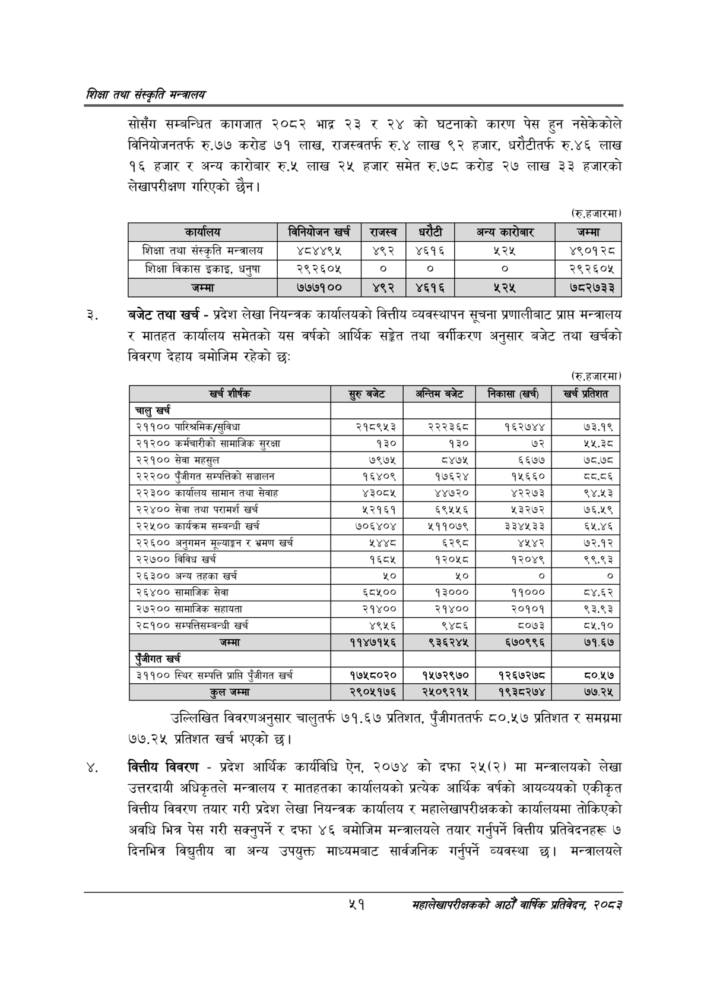

# Page 73 QA

## Rendered page


## Extracted text

```text
णिक्षा तथा संस्कृति मन्त्रालय
सोसँग सम्बन्धित कागजात २०८२ भाद्र २३ र २४ को घटनाको कारण पेस हुन नसेकेकोले विनियोजनतर्फ रु.७७ करोड ७१ लाख, राजस्वतर्फ € लाख ९२ हजार, धरौटीतर्फ रु.४६ लाख १६ हजार र अन्य कारोबार रु.५ लाख २५ हजार समेत रु.७८ करोड २७ लाख ३३ हजारको लेखापरीक्षण गरिएको छैन।
(रु.हजारमा)
बजेट तथा खर्च -प्रदेश लेखा नियन्त्रक कार्यालयको वित्तीय व्यवस्थापन सूचना प्रणालीबाट प्राप्त मन्त्रालय र मातहत कार्यालय समेतको यस वर्षको आर्थिक सङ्गेत तथा वर्गीकरण अनुसार बजेट तथा खर्चको विवरण देहाय बमोजिम रहेको छः
(रु.हजारमा)
उल्लिखित विवरणअनुसार चालुतर्फ ७१.६७ प्रतिशत, पुँजीगततर्फ ८०.५७ प्रतिशत र समग्रमा ७७.२४५ प्रतिशत खर्च भएको छ।
वित्तीय विवरण -प्रदेश आर्थिक कार्यविधि ऐन, २०७४ को दफा २५(२) मा मन्त्रालयको लेखा उत्तरदायी अधिकृतले मन्त्रालय र मातहतका कार्यालयको प्रत्येक आर्थिक वर्षको आयव्ययको एकीकृत वित्तीय विवरण तयार गरी प्रदेश लेखा नियन्त्रक कार्यालय र महालेखापरीक्षकको कार्यालयमा तोकिएको अवधि भित्र पेस गरी सक्नुपर्ने र दफा ४६ बमोजिम मन्त्रालयले तयार गर्नुपर्ने वित्तीय प्रतिवेदनहरू ७ दिनभित्र विद्युतीय वा अन्य उपयुक्त माध्यमबाट सार्वजनिक गर्नुपर्ने व्यवस्था छ। मन्त्रालयले
%९
महालेखापरीक्षकको वाषिकि प्रतिवेदन २०८२

|  |  | राजस्व | धरेटी | अन्य | जम्मा |
| --- | --- | --- | --- | --- | --- |
| शिक्षा तथा संस्कृति मन्त्रालय | ४८४४९५ | ४९२ | ४६१६ | २२५ | ४९०१२८ |
| शिक्षा विकास इकाइ, धनुषा | २९२६०५ | ० | ० | ० | २९२६०५ |
| जम्मा | ७७७१०० | ४९२ | ४६१६ | ५२४५ | ७८२७३३ |

| खर्च शीर्षक | सुरु बजेट | अन्तिम बजेट | निकासा (खर्ची | खर्च प्रतिशत |
| --- | --- | --- | --- | --- |
| चालु खर्च |  |  |  |  |
| २११०० पारिश्रमिक/सुविधा | २१८९५३ | २२२३६८ | १६२७४४ | ७३.१९ |
| २१२०० कर्मचारीको सामाजिक सुरक्षा | १३० | १३० | ७२ | ४३५ |
| २३९०० सेवा महसुल | ७९७५ | ८४७५ | ६६७७ | ७८.७८ |
| २२२०० पुँजीगत सम्पत्तिको सञ्चालन | १६४०९ | १७६२४ | १५६६० | द्य.८६ |
| २२३०० कार्वालय सामान तथा सेवाह | ४३०८५ | ४४७२० | ४२२७३ | ९४.५३ |
| २२४०० सेवा तथा परामर्श खर्च | ५२१६१ | ६९५५६ | ५३२७२ | ७६.५९ |
| २२५०० कार्यक्रम सम्बन्धी खर्च | ७०६४०४ | ५११०७९ | ३३४५३३ | ६५.४६ |
| २२६०० अनुगमन मूल्याङ्कन र भ्रमण खर्च | २४४८ | ६२९८ | ४५४२ | ७२.१२ |
| २२७०० विविध खर्च | १६८५ | १२०५८ | १२०४९ | ९९.९३ |
| २६३०० अन्य तहका खर्च |  | ५० | ० | ० |
| २६४०० सामाजिक सेवा | ६८४५०० | १३००० | ११००० | ८४.६२ |
| २७२०० सामाजिक सहायता | २१४०० | २१४०० | २०१०१ | ९३.९३ |
| २८१०० चन्चािसन्तन्धी खर्च | ४९५६ | ९४८६ | ८०७३ | ८५.१० |
| जम्मा | ११४७१५६ | ९३६२४५ | ६७०९९६ | ७१.६७ |
| रंजीगत खर्च |  |  |  |  |
| ३११०० स्थिर सम्पत्ति प्राप्ति पुँजीगत खर्च | १७५८०२० | १५७२९७० | १२६७२७८ | ८०.५१७ |
| जम्मा | २९०५१७६ | २४५०९२१५ | १९३८२७४ | ७७.२५ |
```

## Flags
- table_page
- medium_quality_table
