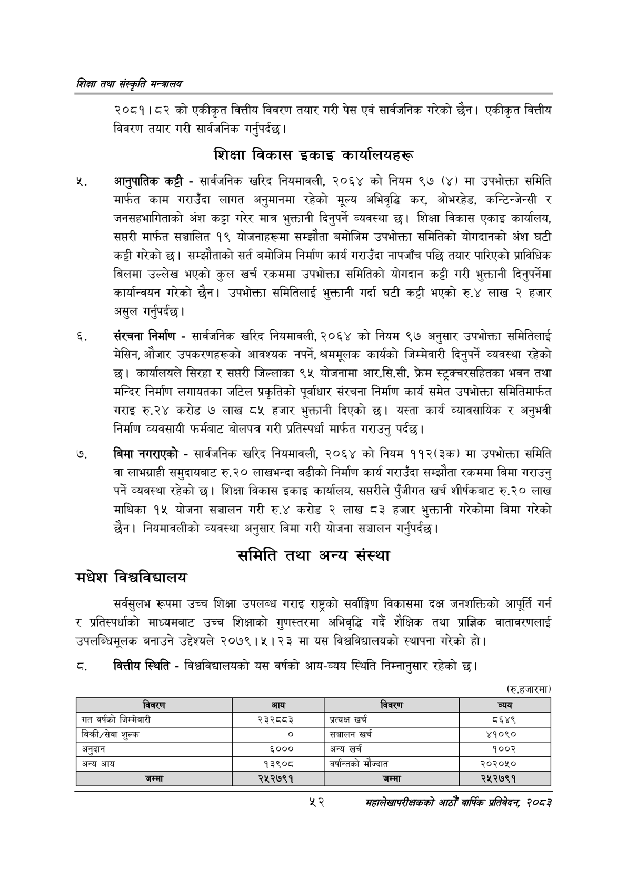

# Page 74 QA

## Rendered page


## Extracted text

```text
णिक्षा तथा संस्कृति मन्त्रालय
२०८१।८२ को एकीकृत वित्तीय विवरण तयार गरी पेस एवं सार्वजनिक गरेको छैन। एकीकृत वित्तीय विवरण तयार गरी सार्वजनिक गर्नुपर्दछ |
शिक्षा विकास इकाइ कार्यालयहरू
५, आनुपातिक कट्टी -सार्वजनिक खरिद नियमावली, २०६४ को नियम ९७ (४) मा उपभोक्ता समिति मार्फत काम गराउँदा लागत अनुमानमा रहेको मूल्य अभिवृद्धि कर, ओभरहेड, कन्टिन्जेन्सी र जनसहभागिताको अंश कट्टा गरेर मात्र भुक्तानी दिनुपर्ने व्यवस्था छ। शिक्षा विकास एकाइ कार्यालय, सप्तरी मार्फत सञ्चालित १९ योजनाहरूमा सम्झौता बमोजिम उपभोक्ता समितिको योगदानको अंश घटी कट्टी गरेको छ। सम्झौताको सर्त बमोजिम निर्माण कार्य गराउँदा नापजाँच पछि तयार पारिएको प्राविधिक बिलमा उल्लेख भएको कुल खर्च रकममा उपभोक्ता समितिको योगदान कट्टी गरी भुक्तानी दिनुपर्नेमा कार्यान्वयन गरेको छैन। उपभोक्ता समितिलाई भुक्तानी गर्दा घटी कट्टी भएको रु.४ लाख २ हजार असुल गर्नुपर्दछ |
संरचना निर्माण -सार्वजनिक खरिद नियमावली, २०६४ को नियम ९७ अनुसार उपभोक्ता समितिलाई मेसिन, औजार उपकरणहरूको आवश्यक नपर्ने, श्रममूलक कार्यको जिम्मेवारी दिनुपर्ने व्यवस्था रहेको छ। कार्यालयले सिरहा र सप्तरी जिल्लाका ९५ योजनामा आर.सि.सी. फ्रेम स्ट्रक्वरसहितका भवन तथा मन्दिर निर्माण लगायतका जटिल प्रकृतिको पूर्वाधार संरचना निर्माण कार्य समेत उपभोक्ता समितिमार्फत गराइ रु.२४ करोड ७ लाख ८५ हजार भुक्तानी दिएको छ। यस्ता कार्य व्यावसायिक र अनुभवी निर्माण व्यवसायी फर्मबाट बोलपत्र गरी प्रतिस्पर्धा मार्फत गराउनु पर्दछ।
बिमा नगराएको -सार्वजनिक खरिद नियमावली, २०६४ को नियम ११२(३क) मा उपभोक्ता समिति वा लाभग्राही समुदायबाट रु. २० लाखभन्दा बढीको निर्माण कार्य गराउँदा सम्झौता रकममा बिमा गराउनु पर्ने व्यवस्था रहेको छ। शिक्षा विकास इकाइ कार्यालय, सप्तरीले पुँजीगत खर्च शीर्षकबाट रु.२० लाख माथिका १५ योजना सञ्चालन गरी रु.४ करोड २ लाख ८३ हजार भुक्तानी गरेकोमा बिमा गरेको छैन। नियमावलीको व्यवस्था अनुसार बिमा गरी योजना सञ्चालन गर्नुपर्दछ |
समिति तथा अन्य संस्था
मधेश विश्वविद्यालय
सर्वसुलभ रूपमा उच्च शिक्षा उपलब्ध गराइ राष्ट्रको सर्वाङ्गिण विकासमा दक्ष जनशक्तिको आपूर्ति गर्न र प्रतिस्पर्धाको माध्यमबाट उच्च शिक्षाको गुणस्तरमा अभिवृद्धि गर्दै शैक्षिक तथा प्राज्ञिक वातावरणलाई उपलब्धिमूलक बनाउने उद्देश्यले २०७९।५। २३ मा यस विश्वविद्यालयको स्थापना गरेको हो।
वित्तीय स्थिति -विश्वविद्यालयको यस वर्षको आय-व्यय स्थिति निम्नानुसार रहेको छ।
(रु.हजारमा)
महालेखापरीक्षकको वाषिकि प्रतिवेदन २०८२

| विवरण | आय | विवरण | व्यय |
| --- | --- | --- | --- |
| गत वर्षको जिम्मेवारी | २३३५५३ | प्रत्यक्ष खर्च | ८६४९ |
| बिकी/सेवा शुल्क | ० | सञ्चालन खर्च | ४१०९० |
| अनुदान | ६००० | अन्य खर्च | १००२ |
| अन्य आय | १३९०८ | वर्षान्तको मौज्दात | २०२०५० |
| जम्मा | २५२७९१ | जम्मा | २५२७९१ |
```

## Flags
- table_page
- medium_quality_table
