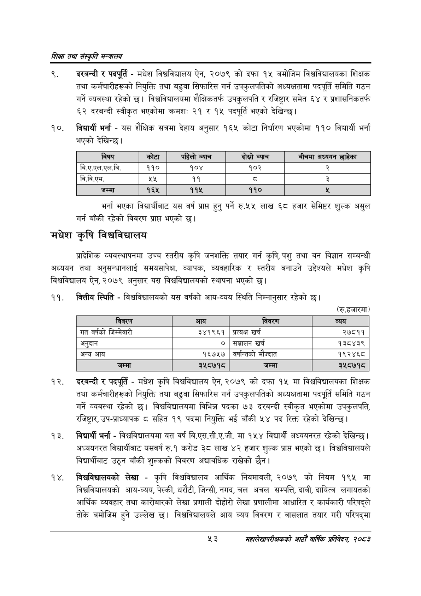

# Page 75 QA

## Rendered page


## Extracted text

```text
णिक्षा तथा संस्कृति मन्त्रालय
दरबन्दी र पदपूर्ति -मधेश विश्वविद्यालय ऐन, २०७९ को दफा १५ बमोजिम विश्वविद्यालयका शिक्षक तथा कर्मचारीहरूको नियुक्ति तथा बढुवा सिफारिस गर्न उपकुलपतिको अध्यक्षतामा पदपूर्ति समिति गठन गर्ने व्यवस्था रहेको छ। विश्वविद्यालयमा शैक्षिकतर्फ उपकुलपति र रजिष्ट्रार समेत ६४ र प्रशासनिकतर्फ ६२ दरबन्दी स्वीकृत भएकोमा क्रमशः २१ र १५ पदपूर्ति भएको देखिन्छ |
विद्यार्थी भर्ना -यस शैक्षिक सत्रमा देहाय अनुसार १६५ कोटा निर्धारण भएकोमा ११० विद्यार्थी भर्ना भएको देखिन्छ।
भर्ना भएका विद्यार्थीबाट यस वर्ष प्राप्त हुन्‌ पर्ने रु.५५ लाख ६८ हजार सेमिष्टर शुल्क असुल गर्न बाँकी रहेको विवरण प्रापत भएको |
मधेश कृषि विश्वविद्यालय
प्रादेशिक व्यवस्थापनमा उच्च स्तरीय कृषि जनशक्ति तयार गर्न कृषि, पशु तथा वन विज्ञान सम्बन्धी अध्ययन तथा अनुसन्धानलाई समयसापेक्ष, व्यापक, व्यवहारिक र स्तरीय बनाउने उद्देश्यले मधेश कृषि विश्वविद्यालय ऐन, २०७९ अनुसार यस विश्वविद्यालयको स्थापना भएको |
वित्तीय स्थिति -विश्वविद्यालयको यस वर्षको आय-व्यय स्थिति निम्नानुसार रहेको छ।
(रु.हजारमा)
दरबन्दी र पदपूर्ति -मधेश कृषि विश्वविद्यालय ऐन, २०७९ को दफा १५ मा विश्वविद्यालयका शिक्षक तथा कर्मचारीहरूको नियुक्ति तथा बढुवा सिफारिस गर्न उपकुलपतिको अध्यक्षतामा पदपूर्ति समिति गठन गर्ने व्यवस्था रहेको छ। विश्वविद्यालयमा विभिन्न पदका ७३ दरबन्दी स्वीकृत भएकोमा उपकुलपति, रजिष्ट्रार, उप-प्राध्यापक ८ सहित १९ पदमा नियुक्ति भई बाँकी पद रिक्त रहेको देखिन्छ।
विद्यार्थी भर्ना -विश्वविद्यालयमा यस वर्ष बि.एस.सी.ए.जी. मा १५४ विद्यार्थी अध्ययनरत रहेको देखिन्छ। अध्ययनरत विद्यार्थीबाट यसवर्ष रु.१ करोड ३८ लाख ४२ हजार शुल्क प्रापत भएको | विश्वविद्यालयले विद्यार्थीबाट उठ्न बाँकी शुल्कको विवरण अद्यावधिक राखेको छैन।
विश्वविद्यालयको लेखा -कृषि विश्वविद्यालय आर्थिक नियमावली, २०७९ को नियम १९५ मा विश्वविद्यालयको आय-व्यय, पेस्की, धरौटी, जिन्सी, नगद, चल अचल सम्पत्ति, दाबी, दायित्व लगायतको आर्थिक व्यवहार तथा कारोबारको लेखा प्रणाली दोहोरो लेखा प्रणालीमा आधारित र कार्यकारी परिषद्ले तोके बमोजिम हुने उल्लेख छ। विश्वविद्यालयले आय व्यय विवरण र वासलात तयार गरी परिषद्मा
%३
महालेखापरीक्षकको वाषिकि प्रतिवेदन २०८२

| विषय | 'कोटा | पहिलो व्याच | दोस्रो व्याच | बीचमा अध्ययन छाडेका |
| --- | --- | --- | --- | --- |
| बि.ए.एल.एल.वि. | ११० | १०४ | १०२ | र्‌ |
| वि.वि.एम. | ४४ | ११ | व्‌ | २ |
| जम्मा |  | ११५ | ११० |  |

| विवरण | आय | विवरण | व्यय |
| --- | --- | --- | --- |
| गत वर्षको जिम्मेवारी | ३४१९६१ | प्रत्यक्ष खर्च | २७८११ |
| अनुदान | ० | च्चालन खर्च | १३८४३९ |
| अन्य आय | १६७५७ | वर्षान्तको मौज्दात | १९२४६८ |
| जम्मा | ३५८७१८ | जम्मा | ३५८७१८ |
```

## Flags
- table_page
- medium_quality_table
