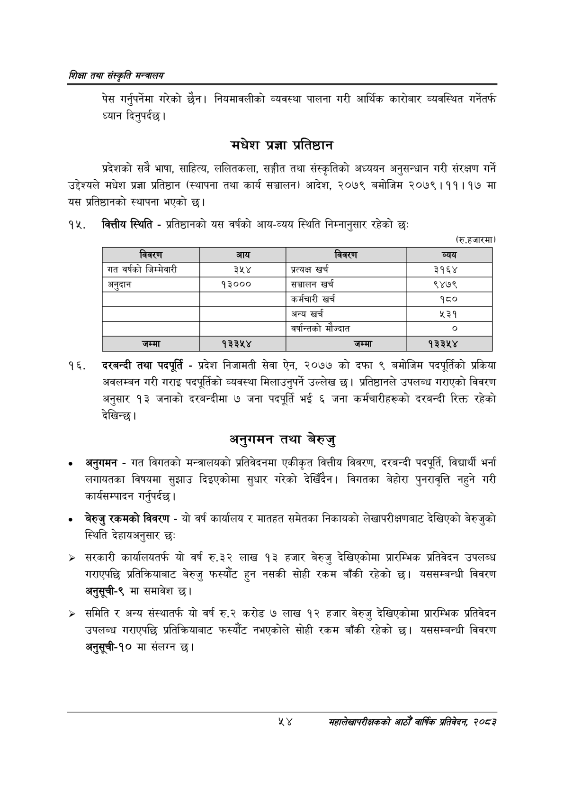

# Page 76 QA

## Rendered page


## Extracted text

```text
णिक्षा तथा संस्कृति मन्त्रालय
पेस गर्नुपर्नेमा गरेको | नियमावलीको व्यवस्था पालना गरी आर्थिक कारोबार व्यवस्थित गर्नेतर्फ ध्यान दिनुपर्दछ।
मधेश प्रज्ञा प्रतिष्ठान
प्रदेशको सबै भाषा, साहित्य, ललितकला, सङ्गीत तथा संस्कृतिको अध्ययन अनुसन्धान गरी संरक्षण गर्ने उद्देश्यले मधेश प्रज्ञा प्रतिष्ठान (स्थापना तथा कार्य सञ्चालन) आदेश, २०७९ बमोजिम २०७९।११।१७ मा यस प्रतिष्ठानको स्थापना भएको छ।
बित्तीय स्थिति -प्रतिष्ठानको यस वर्षको आय-व्यय स्थिति निम्नानुसार रहेको छः
(रु.हजारमा)
दरबन्दी तथा पदपूर्ति -प्रदेश निजामती सेवा ऐन, २०७७ को दफा ९ बमोजिम पदपूर्तिको प्रकिया अवलम्बन गरी गराइ पदपूर्तिको व्यवस्था मिलाउनुपर्ने उल्लेख छ। प्रतिष्ठानले उपलब्ध गराएको विवरण अनुसार १३ जनाको दरबन्दीमा ७ जना पदपूर्ति भई ६ जना कर्मचारीहरूको दरबन्दी रिक्त रहेको देखिन्छ।
अनुगमन तथा बेरुजु
अनुगमन -गत विगतको मन्त्रालयको प्रतिवेदनमा एकीकृत वित्तीय विवरण, दरबन्दी पदपूर्ति, विद्यार्थी भर्ना लगायतका विषयमा सुझाउ दिइएकोमा सुधार गरेको देखिँदैन। विगतका बेहोरा पुनरावृत्ति नहुने गरी कार्यसम्पादन गर्नुपर्दछ |
बेरुजु रकमको विवरण -यो वर्ष कार्यालय र मातहत समेतका निकायको लेखापरीक्षणबाट देखिएको बेरुजुको स्थिति देहायअनुसार छः
> सरकारी कार्यालयतर्फ यो वर्ष रु.३२ लाख १३ हजार बेरुजु देखिएकोमा प्रारम्भिक प्रतिवेदन उपलब्ध गराएपछि प्रतिक्रियाबाट बेरुजु फस्यौट हुन नसकी सोही रकम बाँकी रहेको छ। यससम्बन्धी विवरण अनुसूची-९ मा समावेश छ।
> समिति र अन्य संस्थातर्फ यो वर्ष रु.२ करोड ७ लाख १२ हजार बेरुजु देखिएकोमा प्रारम्भिक प्रतिवेदन उपलब्ध गराएपछि प्रतिक्रियाबाट फस्यौट नभएकोले सोही रकम बाँकी रहेको छ। यससम्बन्धी विवरण अनुसूची-१० मा संलग्न छ।
४४
महालेखापरीक्षकको आठौ वाषिकि प्रतिवेदन २०८२

| विवरण | आय | विवरण | व्यय |
| --- | --- | --- | --- |
| गत वर्षको जिन्मेवारी | ३५४ | प्रत्यक्ष खर्च | ३१६४ |
| अनुदान | १३००० | सञ्चालन खर्च | ९४७९ |
|  |  | कर्मचारी खर्च | १८० |
|  |  | अन्य खर्च | ५३१ |
|  |  | वर्षान्तको मौज्दात |  |
```

## Flags
- table_page
- medium_quality_table
