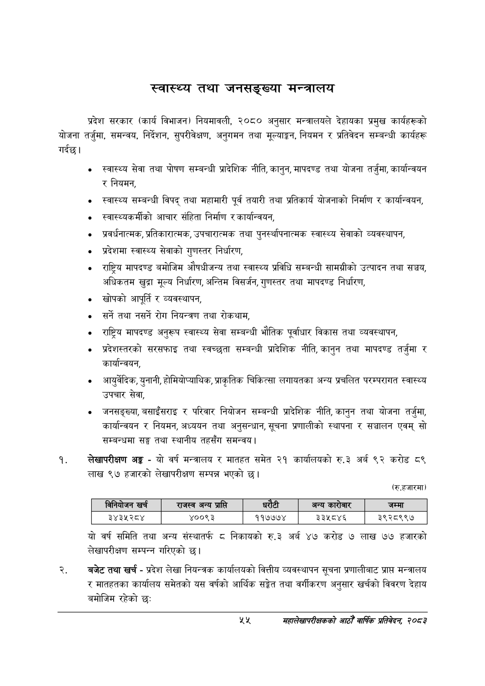

# Page 77 QA

## Rendered page


## Extracted text

```text
स्वास्थ्य तथा जनसङ्ख्या मन्त्रालय
प्रदेश सरकार (कार्य विभाजन) नियमावली, २०८० अनुसार मन्त्रालयले देहायका प्रमुख कार्यहरूको योजना तर्जुमा, समन्वय, निर्देशन, सुपरीवेक्षण, अनुगमन तथा मूल्याङ्कन, नियमन र प्रतिवेदन सम्बन्धी कार्यहरू गर्दछ।
० स्वास्थ्य सेवा तथा पोषण सम्बन्धी प्रादेशिक नीति, कानुन, मापदण्ड तथा योजना तर्जुमा, कार्यान्वयन र नियमन,
स्वास्थ्य सम्बन्धी विपद्‌ तथा महामारी पूर्व तयारी तथा प्रतिकार्य योजनाको निर्माण र कार्यान्वयन,
«० स्वास्थ्यकर्मीको आचार संहिता निर्माण र कार्यान्वयन,
० प्रवर्धनात्मक, प्रतिकारात्मक, उपचारात्मक तथा पुनर्स्थापनात्मक स्वास्थ्य सेवाको व्यवस्थापन,
० प्रदेशमा स्वास्थ्य सेवाको गुणस्तर निर्धारण,
राष्ट्रिय मापदण्ड बमोजिम औषधीजन्य तथा स्वास्थ्य प्रविधि सम्बन्धी सामग्रीको उत्पादन तथा सञ्चय, अधिकतम खुद्रा मूल्य निर्धारण, अन्तिम विसर्जन, गुणस्तर तथा मापदण्ड निर्धारण,
खोपको आपूर्ति र व्यवस्थापन,
सर्ने तथा नसर्ने रोग नियन्त्रण तथा रोकथाम,
० राष्ट्रिय मापदण्ड अनुरूप स्वास्थ्य सेवा सम्बन्धी भौतिक पूर्वाधार विकास तथा व्यवस्थापन,
प्रदेशस्तरको सरसफाइ तथा स्वच्छता सम्बन्धी प्रादेशिक नीति, कानुन तथा मापदण्ड तर्जुमा र कार्यान्वयन,
«० आयुर्वेदिक, युनानी, होमियोप्याथिक, प्राकृतिक चिकित्सा लगायतका अन्य प्रचलित परम्परागत स्वास्थ्य उपचार सेवा,
० जनसङ्ख्या, बसाइँसराइ र परिवार नियोजन सम्बन्धी प्रादेशिक नीति, कानुन तथा योजना तर्जुमा, कार्यान्वयन र नियमन, अध्ययन तथा अनुसन्धान, सूचना प्रणालीको स्थापना र सञ्चालन एवम्‌ सो सम्बन्धमा सङ्घ तथा स्थानीय तहसँग समन्वय |
लेखापरीक्षण अङ्ग -यो वर्ष मन्त्रालय र मातहत समेत २१ कार्यालयको रु.३ अर्ब ९२ करोड ८९ लाख ९७ हजारको लेखापरीक्षण सम्पन्न भएको |
(रुू.हजारमा)
यो वर्ष समिति तथा अन्य संस्थातर्फ ८ निकायको रु.३ अर्ब ४७ करोड ७ लाख ७७ हजारको लेखापरीक्षण सम्पन्न गरिएको छ।
बजेट तथा खर्च -प्रदेश लेखा नियन्त्रक कार्यालयको वित्तीय व्यवस्थापन सूचना प्रणालीबाट प्राप्त मन्त्रालय र मातहतका कार्यालय समेतको यस वर्षको आर्थिक सङ्गेत तथा वर्गीकरण अनुसार खर्चको विवरण देहाय बमोजिम रहेको छ:
महालेखापरीक्षकको वाषिकि प्रतिवेदन २०८२

|  | निनिवोजन खर्च | राजस्व अन्य प्राप्ति |  |  |  | अन्य कारोबार | जम्मा |
| --- | --- | --- | --- | --- | --- | --- | --- |
|  | ३४३५२८४ | ४००९३ |  | ११७७७४ |  | ३३५८४६ | ३९२८९९७ |
```

## Flags
- table_page
- medium_quality_table
