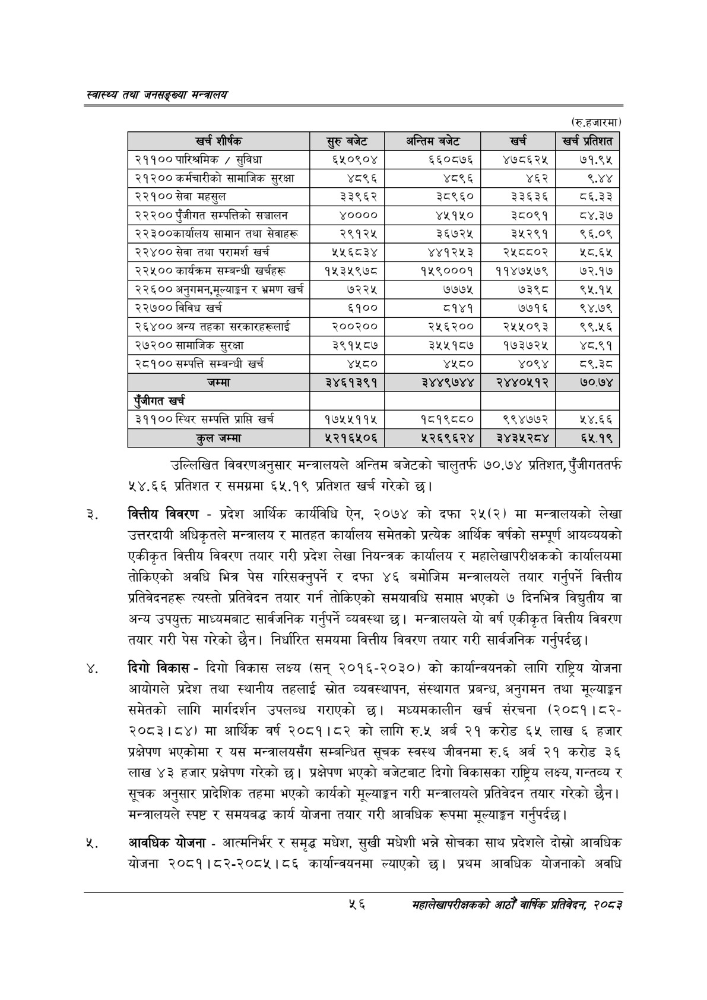

# Page 78 QA

## Rendered page


## Extracted text

```text
स्वास्थ्य तथा जनसङ्ख्या मन्त्रालय
(रु.हजारमा)
उल्लिखित विवरणअनुसार मन्त्रालयले अन्तिम बजेटको चालुतर्फ ७०.७४ प्रतिशत, पुँजीगततर्फ ५४.६६ प्रतिशत र समग्रमा ६५.१९ प्रतिशत खर्च गरेको छु।
वित्तीय विवरण -प्रदेश आर्थिक कार्यविधि ऐन, २०७४ को दफा २५(२) मा मन्त्रालयको लेखा उत्तरदायी अधिकृतले मन्त्रालय र मातहत कार्यालय समेतको प्रत्येक आर्थिक वर्षको सम्पूर्ण आयव्ययको एकीकृत वित्तीय विवरण तयार गरी प्रदेश लेखा नियन्त्रक कार्यालय र महालेखापरीक्षकको कार्यालयमा तोकिएको अवधि भित्र पेस गरिसक्नुपर्ने र दफा ४६ बमोजिम मन्त्रालयले तयार गर्नुपर्ने वित्तीय प्रतिवेदनहरू त्यस्तो प्रतिवेदन तयार गर्न तोकिएको समयावधि समाप्त भएको ७ दिनभित्र विद्युतीय वा अन्य उपयुक्त माध्यमबाट सार्वजनिक गर्नुपर्ने व्यवस्था छ। मन्त्रालयले यो वर्ष एकीकृत वित्तीय विवरण तयार गरी पेस गरेको छैन। निर्धारित समयमा वित्तीय विवरण तयार गरी सार्वजनिक गर्नुपर्दछ |
दिगो विकास -दिगो विकास लक्ष्य (सन्‌ २०१६-२०३०) को कार्यान्वयनको लागि राष्ट्रिय योजना आयोगले प्रदेश तथा स्थानीय तहलाई स्रोत व्यवस्थापन, संस्थागत प्रबन्ध, अनुगमन तथा मूल्याङ्कन समेतको लागि मार्गदर्शन उपलब्ध गराएको छ। मध्यमकालीन खर्च संरचना (२०८१।८२२०८३।८४) मा आर्थिक वर्ष २०८१।८२ को लागि रु.५ अर्ब २१ करोड ६५ लाख ६ हजार प्रक्षेपण भएकोमा र यस मन्त्रालयसँग सम्बन्धित सूचक स्वस्थ जीवनमा रु.६ अर्ब २१ करोड ३६ लाख ४३ हजार प्रक्षेपण गरेको छ। प्रक्षेपण भएको बजेटबाट दिगो विकासका राष्ट्रिय लक्ष्य, गन्तव्य र सूचक अनुसार प्रादेशिक तहमा भएको कार्यको मूल्याङ्कन गरी मन्त्रालयले प्रतिवेदन तयार गरेको छैन। मन्त्रालयले स्पष्ट र समयबद्ध कार्य योजना तयार गरी आवधिक रूपमा मूल्याङ्कन गर्नुपर्दछ |
आवधिक योजना -आत्मनिर्भर र समृद्ध मधेश, सुखी मधेशी भन्ने सोचका साथ प्रदेशले दोस्रो आवधिक योजना २०८१।८२-२०८५।८६ कार्यान्वयनमा ल्याएको छ। प्रथम आवधिक योजनाको अवधि
५६
महालेखापरीक्षकको आठौ वाषिकि प्रतिवेदन २०८२

| खर शीष्क | हरु बजेट | अन्तिम बजेट | खच | == प्रतिशत |
| --- | --- | --- | --- | --- |
| २११०० पारिश्रमिक / सुविधा | ६५०९०४ | ६६०८७६ | ४७८६२५ | ७१.९५ |
| २१२०० कर्मचारीको सामाजिक सुरक्षा | ४८९६ | ४८९६ | ४६२ | ९४४ |
| २२१०० सेवा महसुल | ३३९६२ | ३८९६० | ३३६३६ | ८६.३३ |
| २२२०० पुँजीगत खन्पतिको सञ्चालन | ४०००० | ४४१४५० | ३८०९१ | ८४.३७ |
| २२३००कार्थालय सामान तथा सेवाहरू | २९१२५ | ३६७२४५ | ३५२९१ | ९६.०९ |
| २२४०० सेवा तथा परामर्श खर्च | ५५६८३४ | ४४१२५३ | २५८८०२ | २८.६४५ |
| २२५०० कार्यक्रम सम्बन्धी खर्चहरू | १५३५९७८ | १५९०००१ | ११४७५७९ | ७२.१७ |
| २२६०० अनुगमन,सूल्याङ्कन र भ्रमण खर्च | ७२२५ | ७७७५ | ७३९८ | ९५.१५ |
| २२७०० विविध खर्च | ६१०० | ८१४१ | ७७१६ | ९४.७९ |
| २६४०० अन्य तहका खरकारहरूलाई | २००२०० | २५६२०० | र२५४५०९३ | ९९.५६ |
| २७२०० सामाजिक सुरक्षा | ३९१५८७ | ३५५१८७ | १७३७२५ | ४८.९१ |
| २८१०० सम्पत्ति सम्बन्धी खर्च | ४४८० | ४४८० | ४०९४ | ८९.३८ |
| जम्मा | २४६१३९१ | २४४९७४४ | २४४०५१२ | ७०.७४ |
| एंजीगत खर्च |  |  |  |  |
| ३११०० स्थिर सम्पत्ति प्राप्ति खर्च | १७५५११५ | १८१९८८० | ९९४७७२ | २४.६६ |
| कुल जम्मा | २२१६५०६ | २२६९६२४ | २े४३५२८४ | ६५.१९ |
```

## Flags
- table_page
- medium_quality_table
