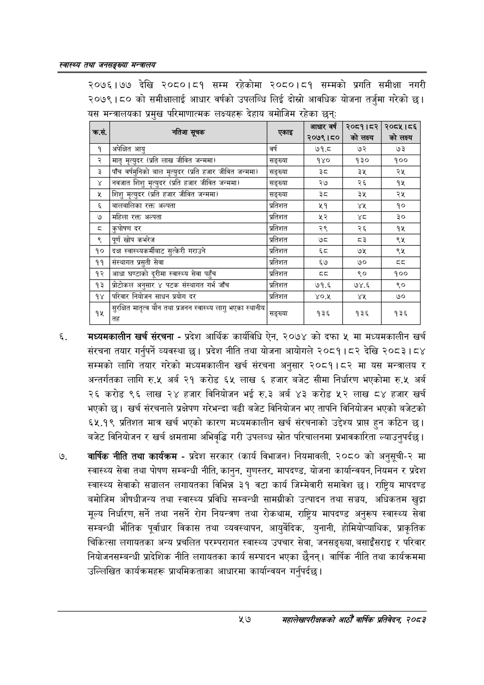

# Page 79 QA

## Rendered page


## Extracted text

```text
स्वास्थ्य तथा जनसङ्ख्या मन्त्रालय
२०७६।७७ देखि २०८०।८१ सम्म रहेकोमा २०८०।८१ सम्मको प्रगति समीक्षा नगरी २०७९।८० को समीक्षालाई आधार वर्षको उपलब्धि लिई दोस्रो आवधिक योजना तर्जुमा गरेको छ। यस मन्त्रालयका प्रमुख परिमाणात्मक लक्ष्यहरू देहाय बमोजिम रहेका छन्‌ः
मंध्यमकालीन खर्च संरचना -प्रदेश आर्थिक कार्यविधि ऐन, २०७४ को दफा ५ मा मध्यमकालीन खर्च संरचना तयार गर्नुपर्ने व्यवस्था छ। प्रदेश नीति तथा योजना आयोगले २०८१। ८२ देखि २०८३। ८४ सम्मको लागि तयार गरेको मध्यमकालीन खर्च संरचना अनुसार २०८१।८२ मा यस मन्त्रालय र अन्तर्गतका लागि रु.५ अर्ब २१ करोड ६५ लाख ६ हजार बजेट सीमा निर्धारण भएकोमा रु.५ अर्ब २६ करोड ९६ लाख २४ हजार विनियोजन भई रु.३ अर्ब ४३ करोड ५२ लाख ८४ हजार खर्च भएको | खर्च संरचनाले प्रक्षेपण गरेभन्दा बढी बजेट विनियोजन भए तापनि विनियोजन भएको बजेटको ६५.१९ प्रतिशत मात्र खर्च भएको कारण मध्यमकालीन खर्च संरचनाको उद्देश्य प्रापत हुन कठिन छ। बजेट विनियोजन र खर्च क्षमतामा अभिवृद्धि गरी उपलब्ध स्रोत परिचालनमा प्रभावकारिता ल्याउनुपर्दछ।
वार्षिक नीति तथा कार्यक्रम -प्रदेश सरकार (कार्य विभाजन) नियमावली, २०८० को अनुसूची-२ मा स्वास्थ्य सेवा तथा पोषण सम्बन्धी नीति, कानुन, गुणस्तर, मापदण्ड, योजना कार्यान्वयन, नियमन र प्रदेश स्वास्थ्य सेवाको सञ्चालन लगायतका विभिन्न ३१ वटा कार्य जिम्मेवारी समावेश छ। राष्ट्रिय मापदण्ड बमोजिम औषधीजन्य तथा स्वास्थ्य प्रविधि सम्बन्धी सामग्रीको उत्पादन तथा सञ्चय, अधिकतम खुद्रा मूल्य निर्धारण, सर्ने तथा नसर्ने रोग नियन्त्रण तथा रोकथाम, राष्ट्रिय मापदण्ड अनुरूप स्वास्थ्य सेवा सम्बन्धी भौतिक पूर्वाधार विकास तथा व्यवस्थापन, आयुर्वेदिक, युनानी, होमियोप्याथिक, प्राकृतिक चिकित्सा लगायतका अन्य प्रचलित परम्परागत स्वास्थ्य उपचार सेवा, जनसङ्ख्या, बसाइँसराइ र परिवार नियोजनसम्बन्धी प्रादेशिक नीति लगायतका कार्य सम्पादन भएका छैनन्‌। वार्षिक नीति तथा कार्यक्रममा उल्लिखित कार्यक्रमहरू प्राथमिकताका आधारमा कार्यान्वयन गर्नुपर्दछ।
५७
महालेखापरीक्षकको आठौ वाषिकि प्रतिवेदन २०८२

| . [छ | २२) | एकाइ | आधार वर्ष २०७९।६० | २०८१।८२ कोलक्य | २०८५।८६ को लक्ष्य |
| --- | --- | --- | --- | --- | --- |
| १ | अपेक्षित आयु | वर्ष | ७१.८ | ७२ | ७३ |
| २ | मातृ मृत्युदर (प्रति लाख जीवित जन्ममा) | सङ्ख्या | १४० | १३० | १०० |
| ३ | पाँच वर्षभुनिको बाल मृत्युदर (प्रति हजार जीवित जन्ममा) | सङ्ख्या |  | ३% | २% |
| ४ | नवजात शिशु मृत्युदर (प्रति हजार जीवित जन्ममा) | सङ्ख्या | २७ | २६ | १४५ |
| ५ | शिशु मृत्युदर (प्रति हजार जीवित जन्ममा) | सङ्ख्या | ३ | ३ | २५ |
| ६ | नालनालिका रक्त अल्पता | प्रतिशत | ५१ | यश | १० |
| ७ | महिला रक्त अल्पता | प्रतिशत | %३ | थ्व | ३० |
| ८ | कुपोषण दर | प्रतिशत | २९ | २६ | १५ |
| ९ | पूर्ण खोप कभरेज | प्रतिशत | ७्द | द३ | ९५ |
| १० | दक्ष स्वास्थ्यकर्थाबाट सुत्केरी गराउने | प्रतिशत | ६्द | ७५ | ९५ |
| ११ | संल्थानत प्रसुती सेवा | प्रतिशत | ६७ | ७० | ५३ |
| १२ | आधा घण्टाको दूरीमा स्वास्थ्य सेवा पहुँच | प्रतिशत | ५३ | ९० | १०० |
| १३ | शत्रोटीकल अनुसार ४ पटक संस्थानत गर्भ जाँच | प्रतिशत | ७१.६ | ७४.६ | ९० |
| १४ | परिवार नियोजन साधन प्रयोग दर | प्रतिशत | ४०.४५ | यश | ७० |
| १५ | हुरभित मातृत्व यौन तथा प्रजनन स्वास्थ्य लागु भएका स्थानीय | सङ्ख्या | १३६ | १३६ |  |
```

## Flags
- table_page
- medium_quality_table
