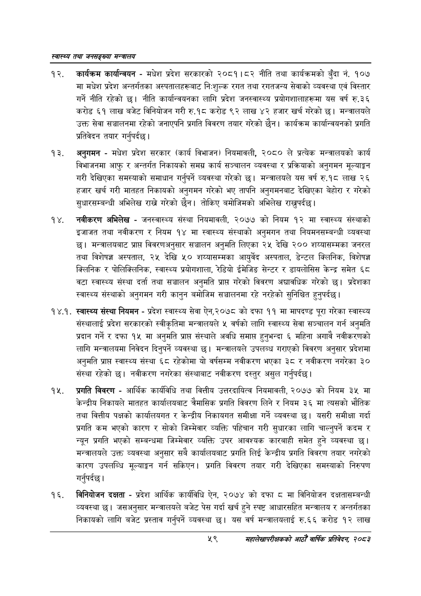

# Page 81 QA

## Rendered page


## Extracted text

```text
स्वास्थ्य तथा जनसङ्ख्या मन्त्रालय
कार्यक्रम कार्यान्वयन -मधेश प्रदेश सरकारको २०८१।८२ नीति तथा कार्यक्रमको बुँदा नं. १०७ मा मधेश प्रदेश अन्तर्गतका अस्पतालहरूबाट नि:शुल्क रगत तथा रगतजन्य सेवाको व्यवस्था एवं विस्तार गर्ने नीति रहेको छ। नीति कार्यान्वयनका लागि प्रदेश जनस्वास्थ्य प्रयोगशालाहरूमा यस वर्ष रु.३६ करोड ६१ लाख बजेट विनियोजन गरी रु.१८ करोड ९२ लाख ४२ हजार खर्च गरेको छ। मन्त्रालयले उक्त सेवा सञ्चालनमा रहेको जनाएपनि प्रगति विवरण तयार गरेको छैन। कार्यक्रम कार्यान्वयनको प्रगति प्रतिवेदन तयार गर्नुपर्दछ |
अनुगमन -मधेश प्रदेश सरकार (कार्य विभाजन) नियमावली, २०८० ले प्रत्येक मन्त्रालयको कार्य विभाजनमा आफु र अन्तर्गत निकायको समग्र कार्य सञ्चालन व्यवस्था र प्रक्रियाको अनुगमन मूल्याङ्कन गरी देखिएका समस्याको समाधान गर्नुपर्ने व्यवस्था गरेको छ। मन्त्रालयले यस वर्ष रु.१८ लाख २६ हजार खर्च गरी मातहत निकायको अनुगमन गरेको भए तापनि अनुगमनबाट देखिएका बेहोरा र गरेको सुधारसम्बन्धी अभिलेख राख्ने गरेको | तोकिए बमोजिमको अभिलेख राख्पर्दछ।
नवीकरण अभिलेख -जनस्वास्थ्य संस्था नियमावली, २०७७ को नियम १२ मा स्वास्थ्य संस्थाको इजाजत तथा नवीकरण र नियम १४ मा स्वास्थ्य संस्थाको अनुमगन तथा नियमनसम्बन्धी व्यवस्था | मन्त्रालयबाट प्राप्त विवरणअनुसार सञ्चालन अनुमति लिएका २५ देखि २०० शय्यासम्मका जनरल तथा विशेषज्ञ अस्पताल, २५ देखि ५० शय्यासम्मका आयुर्वेद अस्पताल, डेन्टल क्लिनिक, विशेषज्ञ क्लिनिक र पोलिक्लिनिक, स्वास्थ्य प्रयोगशाला, रेडियो ईमेजिङ सेन्टर र डायलोसिस केन्द्र समेत ६८ वटा स्वास्थ्य संस्था दर्ता तथा सञ्चालन अनुमति प्राप्त गरेको विवरण अद्यावधिक गरेको छ। प्रदेशका स्वास्थ्य संस्थाको अनुगमन गरी कानुन बमोजिम सञ्चालनमा रहे नरहेको सुनिश्चित हुनुपर्दछ |
१४.१. स्वास्थ्य संस्था नियमन -प्रदेश स्वास्थ्य सेवा ऐन,२०७८ को दफा ११ मा मापदण्ड पूरा गरेका स्वास्थ्य संस्थालाई प्रदेश सरकारको स्वीकृतिमा मन्त्रालयले ५ वर्षको लागि स्वास्थ्य सेवा सञ्चालन गर्न अनुमति प्रदान गर्ने र दफा १५ मा अनुमति प्राप्त संस्थाले अवधि समाप्त हुनुभन्दा ६ महिना अगावै नवीकरणको लागि मन्त्रालयमा निवेदन दिनुपर्ने व्यवस्था छ। मन्त्रालयले उपलब्ध गराएको विवरण अनुसार प्रदेशमा अनुमति प्राप्त स्वास्थ्य संस्था ६८ रहेकोमा यो वर्षसम्म नवीकरण भएका ३८ र नवीकरण नगरेका ३० संस्था रहेको | नवीकरण नगरेका संस्थाबाट नवीकरण दस्तुर असुल गर्नुपर्दछ |
प्रगति विवरण -आर्थिक कार्यविधि तथा वित्तीय उत्तरदायित्व नियमावली, २०७७ को नियम ३५ मा केन्द्रीय निकायले मातहत कार्यालयबाट त्रैमासिक प्रगति विवरण लिने र नियम ३६ मा त्यसको भौतिक तथा वित्तीय पक्षको कार्यालयगत र केन्द्रीय निकायगत समीक्षा गर्ने व्यवस्था छ। यसरी समीक्षा गर्दा प्रगति कम भएको कारण र सोको जिम्मेवार व्यक्ति पहिचान गरी सुधारका लागि चाल्नुपर्ने कदम र न्यून प्रगति भएको सम्बन्धमा जिम्मेवार व्यक्ति उपर आवश्यक कारबाही समेत हुने व्यवस्था छ। मन्त्रालयले उक्त व्यवस्था अनुसार सबै कार्यालयबाट प्रगति लिई केन्द्रीय प्रगति विवरण तयार नगरेको कारण उपलब्धि मूल्याङ्गन गर्न सकिएन। प्रगति विवरण तयार गरी देखिएका समस्याको निरुपण गर्नुपर्दछ |
विनियोजन दक्षता -प्रदेश आर्थिक कार्यविधि ऐन, २०७४ को दफा ८ मा विनियोजन दक्षतासम्बन्धी व्यवस्था छ। जसअनुसार मन्त्रालयले बजेट पेस गर्दा खर्च हुने स्पष्ट आधारसहित मन्त्रालय र अन्तर्गतका निकायको लागि बजेट प्रस्ताव गर्नुपर्ने व्यवस्था | यस वर्ष मन्त्रालयलाई रु.६६ करोड १२ लाख
५९
महालेखापरीक्षकको आठौ वाषिकि प्रतिवेदन २०८२
```

## Flags
- None
