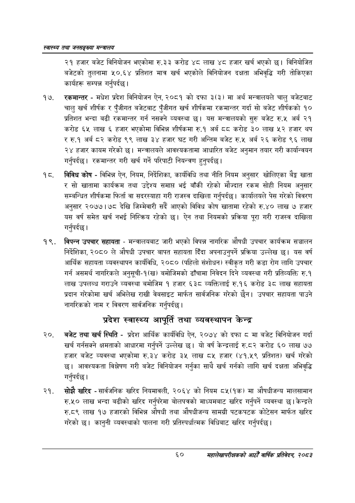

# Page 82 QA

## Rendered page


## Extracted text

```text
स्वास्थ्य तथा जनसङ्ख्या मन्त्रालय
२१ हजार बजेट विनियोजन भएकोमा रु.३३ करोड ४८ लाख ४८ हजार खर्च भएको छ। विनियोजित बजेटको तुलनामा ५०.६४ प्रतिशत मात्र खर्च भएकोले विनियोजन दक्षता अभिवृद्धि गरी तोकिएका कार्यहरू सम्पन्न गर्नुपर्दछ |
रकमान्तर -मधेश प्रदेश विनियोजन ऐन, २०८१ को दफा ३(३) मा अर्थ मन्त्रालयले चालु बजेटबाट चालु खर्च शीर्षक र पुँजीगत बजेटबाट पुँजीगत खर्च शीर्षकमा रकमान्तर गर्दा सो बजेट शीर्षकको १० प्रतिशत भन्दा बढी रकमान्तर गर्न नसक्ने व्यवस्था छ। यस मन्त्रालयको सुरु बजेट रु.५ अर्ब २१ करोड ६५ लाख हजार भएकोमा विभिन्न शीर्षकमा रु.१ अर्ब दद करोड ३० लाख ५२ हजार थप र रु.१ अर्ब ८२ करोड ९९ लाख ३४ हजार घट गरी अन्तिम बजेट रु.५ अर्ब २६ करोड ९६ लाख २४ हजार कायम गरेको छ। मन्त्रालयले आवश्यकतामा आधारित बजेट अनुमान तयार गरी कार्यान्वयन गर्नुपर्दछ। रकमान्तर गरी खर्च गर्ने परिपाटी नियन्त्रण हुनुपर्दछ |
विविध कोष -विभिन्न ऐन, नियम, निर्देशिका, कार्यविधि तथा नीति नियम अनुसार खोलिएका बैङ्क खाता र सो खातामा कार्यक्रम तथा उद्देश्य समाप्त भई बाँकी रहेको मौज्दात रकम सोही नियम अनुसार सम्बन्धित शीर्षकमा फिर्ता वा सदरस्याहा गरी राजस्व दाखिला गर्नुपर्दछ। कार्यालयले पेस गरेको विवरण अनुसार २०७७।७८ देखि जिम्मेवारी सर्दै आएको विविध कोष खातामा रहेको रु.४० लाख ७ हजार यस वर्ष समेत खर्च नभई निस्क्रिय रहेको छ। ऐन तथा नियमको प्रक्रिया पूरा गरी राजस्व दाखिला गर्नुपर्दछ |
विपन्न उपचार सहायता -मन्त्रालयबाट जारी भएको विपन्न नागरिक औषधी उपचार कार्यक्रम सञ्चालन निर्देशिका, २०८० ले औषधी उपचार बापत सहायता दिँदा अपनाउनुपर्ने प्रक्रिया उल्लेख छ। यस वर्ष आर्थिक सहायता व्यवस्थापन कार्यविधि, २०८० (पहिलो संशोधन) स्वीकृत गरी कडा रोग लागि उपचार गर्न असमर्थ नागरिकले अनुसूची-१(ख) बमोजिमको ढाँचामा निवेदन दिने व्यवस्था गरी प्रतिव्यक्ति रु.१ लाख उपलब्ध गराउने व्यवस्था बमोजिम १ हजार ६३८ व्यक्तिलाई रु.१६ करोड ३८ लाख सहायता प्रदान गरेकोमा खर्च अभिलेख राखी वेबसाइट मार्फत सार्वजनिक गरेको छैन। उपचार सहायता पाउने नागरिकको नाम र विवरण सार्वजनिक गर्नुपर्दछ |
प्रदेश स्वास्थ्य आपूर्ति तथा व्यवस्थापन केन्द्र
२०, बजेट तथा खर्च स्थिति -प्रदेश आर्थिक कार्यविधि ऐन, २०७४ को दफा मा बजेट विनियोजन गर्दा खर्च गर्नसक्ने क्षमताको आधारमा गर्नुपर्ने उल्लेख छ। यो वर्ष केन्द्रलाई रु.८२ करोड ६० लाख ७७ हजार बजेट व्यवस्था भएकोमा रु.२४ करोड ३५ लाख ८५ हजार (४१.५९ प्रतिशत) खर्च गरेको छ। आवश्यकता विश्लेषण गरी बजेट विनियोजन गर्नुका साथै खर्च गर्नको लागि खर्च दक्षता अभिवृद्धि गर्नुपर्दछ |
सोझै खरिद -सार्वजनिक खरिद नियमावली, २०६४ को नियम ८५(१क) मा औषधीजन्य मालसामान रु.५० लाख भन्दा बढीको खरिद गर्नुपरेमा बोलपत्रको माध्यमबाट खरिद गर्नुपर्ने व्यवस्था केन्द्रले रु.द९ लाख १७ हजारको विभिन्न औषधी तथा औषधीजन्य सामग्री पटकपटक कोटेसन मार्फत खरिद गरेको | कानुनी व्यवस्थाको पालना गरी प्रतिस्पर्धात्मक विधिबाट खरिद गर्नुपर्दछ |
६०
महालेखापरीक्षकको आठौ वाषिकि प्रतिवेदन २०८२
```

## Flags
- None
