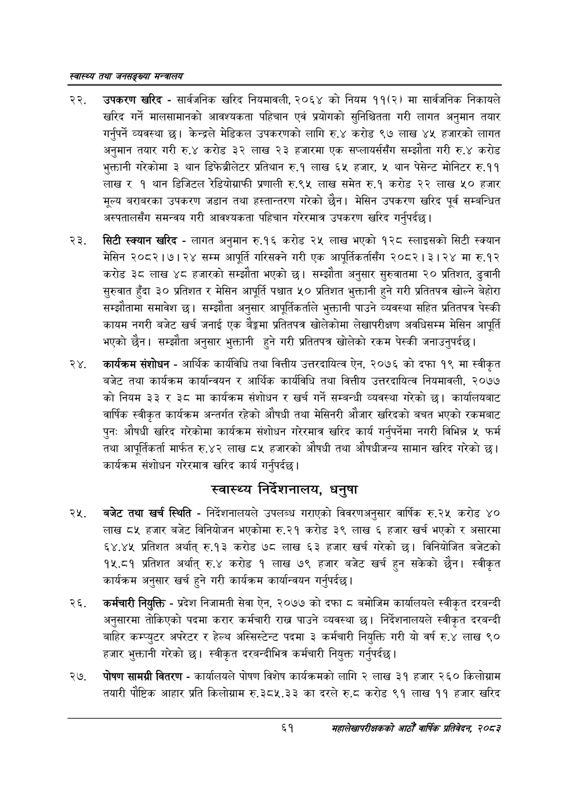

# Page 83 QA

## Rendered page


## Extracted text

```text
स्वास्थ्य तथा जनसङ्ख्या मन्त्रालय
उपकरण खरिद -सार्वजनिक खरिद नियमावली, २०६४ को नियम ११(२) मा सार्वजनिक निकायले खरिद गर्ने मालसामानको आवश्यकता पहिचान एवं प्रयोगको सुनिश्चितता गरी लागत अनुमान तयार गर्नुपर्ने व्यवस्था छ। केन्द्रले मेडिकल उपकरणको लागि रु.४ करोड ९७ लाख ४५ हजारको लागत अनुमान तयार गरी रु.४ करोड ३२ लाख २३ हजारमा एक सप्लायर्ससँग सम्झौता गरी रु.४ करोड भुक्तानी गरेकोमा ३ थान डिफेब्रीलेटर प्रतिथान रु.१ लाख ६५ हजार, ५ थान पेसेन्ट मोनिटर रु.११ लाख र १ थान डिजिटल रेडियोग्राफी प्रणाली रु.९५ लाख समेत रु.१ करोड २२ लाख ५० हजार मूल्य बराबरका उपकरण जडान तथा हस्तान्तरण गरेको छैन। मेसिन उपकरण खरिद पूर्व सम्बन्धित अस्पतालसँग समन्वय गरी आवश्यकता पहिचान गरेरमात्र उपकरण खरिद गर्नुपर्दछ |
सिटी स्क्यान खरिद -लागत अनुमान रु.१६ करोड २५ लाख भएको १२८ स्लाइसको सिटी स्क्यान मेसिन २०८२।७। २४ सम्म आपूर्ति गरिसक्ने गरी एक आपूर्तिकर्तासँग २०८२।३।२४ मा रु.१२ करोड ३८ लाख ४८ हजारको सम्झौता भएको छ। सम्झौता अनुसार सुरुवातमा २० प्रतिशत, ढुवानी सुरुवात हुँदा ३० प्रतिशत र मेसिन आपूर्ति पश्चात ५० प्रतिशत भुक्तानी हुने गरी प्रतितपत्र खोल्ने बेहोरा सम्झौतामा समावेश छ। सम्झौता अनुसार आपूर्तिकर्ताले भुक्तानी पाउने व्यवस्था सहित प्रतितपत्र पेस्की कायम नगरी बजेट खर्च जनाई एक बेङ्कमा प्रतितपत्र खोलेकोमा लेखापरीक्षण अवधिसम्म मेसिन आपूर्ति भएको छैन। सम्झौता अनुसार भुक्तानी हुने गरी प्रतितपत्र खोलेको रकम पेस्की जनाउनुपर्दछ।
२४, कार्यक्रम संशोधन -आर्थिक कार्यविधि तथा वित्तीय उत्तरदायित्व ऐन, २०७६ को दफा १९ मा स्वीकृत बजेट तथा कार्यक्रम कार्यान्वयन र आर्थिक कार्यविधि तथा वित्तीय उत्तरदायित्व नियमावली, २०७७ को नियम ३३ र ३ मा कार्यक्रम संशोधन र खर्च गर्ने सम्बन्धी व्यवस्था गरेको छ। कार्यालयबाट वार्षिक स्वीकृत कार्यक्रम अन्तर्गत रहेको औषधी तथा मेसिनरी औजार खरिदको बचत भएको रकमबाट पुन: औषधी खरिद गरेकोमा कार्यक्रम संशोधन गरेरमात्र खरिद कार्य गर्नुपर्नेमा नगरी विभिन्न ५ फर्म तथा आपूर्तिकर्ता मार्फत रु.४२ लाख ८५ हजारको औषधी तथा औषधीजन्य सामान खरिद गरेको छ। कार्यक्रम संशोधन गरेरमात्र खरिद कार्य गर्नुपर्दछ |
स्वास्थ्य निर्देशनालय, धनुषा
बजेट तथा खर्च स्थिति -निर्देशनालयले उपलब्ध गराएको विवरणअनुसार वार्षिक रु.२५ करोड ४० लाख ८५ हजार बजेट विनियोजन भएकोमा रु.२१ करोड ३९ लाख ६ हजार खर्च भएको र असारमा ६४.४५ प्रतिशत अर्थात्‌ रु.१३ करोड ७८ लाख ६३ हजार खर्च गरेको छ। विनियोजित बजेटको १५.८१ प्रतिशत अर्थात्‌ रु.४ करोड १ लाख ७९ हजार बजेट खर्च हुन सकेको छैन। स्वीकृत कार्यक्रम अनुसार खर्च हुने गरी कार्यक्रम कार्यान्वयन गर्नुपर्दछ |
कर्मचारी नियुक्ति -प्रदेश निजामती सेवा ऐन, २०७७ को दफा बमोजिम कार्यालयले स्वीकृत दरबन्दी अनुसारमा तोकिएको पदमा करार कर्मचारी राख्न पाउने व्यवस्था छ। निर्देशनालयले स्वीकृत दरबन्दी बाहिर कम्प्युटर अपरेटर र हेल्थ अस्सिस्टेन्ट पदमा ३ कर्मचारी नियुक्ति गरी यो वर्ष रु.४ लाख ९० हजार भुक्तानी गरेको | स्वीकृत दरबन्दीभित्र कर्मचारी नियुक्त गर्नुपर्दछ |
२७, पोषण सामग्री वितरण -कार्यालयले पोषण विशेष कार्यक्रमको लागि २ लाख ३१ हजार २६० किलोग्राम तयारी पौष्टिक आहार प्रति किलोग्राम रु.३८५.३३ का दरले ६.० करोड ९१ लाख ११ हजार खरिद
६१
महालेखापरीक्षकको आठौ वाषिकि प्रतिवेदन २०८२
```

## Flags
- None
