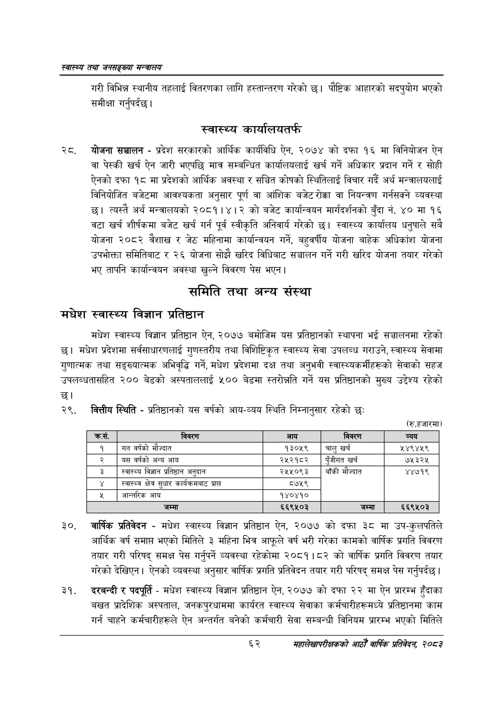

# Page 84 QA

## Rendered page


## Extracted text

```text
स्वास्थ्य तथा जनसङ्ख्या मन्त्रालय
गरी विभिन्न स्थानीय तहलाई वितरणका लागि हस्तान्तरण गरेको छ। पौष्टिक आहारको सदपुयोग भएको समीक्षा गर्नुपर्दछ |
स्वास्थ्य कार्यालयतर्फ
, योजना सञ्चालन -प्रदेश सरकारको आर्थिक कार्यविधि ऐन, २०७४ को दफा १६ मा विनियोजन ऐन वा पेस्की खर्च ऐन जारी भएपछि मात्र सम्बन्धित कार्यालयलाई खर्च गर्ने अधिकार प्रदान गर्ने र सोही ऐनको दफा १८ मा प्रदेशको आर्थिक अवस्था र सञ्चित कोषको स्थितिलाई विचार गर्दै अर्थ मन्त्रालयलाई विनियोजित बजेटमा आवश्यकता अनुसार पूर्ण वा आंशिक बजेट रोक्का वा नियन्त्रण गर्नसक्ने व्यवस्था छ। त्यस्तै अर्थ मन्त्रालयको २०८१।४।२ को बजेट कार्यान्वयन मार्गदर्शनको बुँदा नं. ४० मा १६ वटा खर्च शीर्षकमा बजेट खर्च गर्न पूर्व स्वीकृति अनिवार्य गरेको छ। स्वास्थ्य कार्यालय धनुषाले सबै योजना २०८२ वैशाख र जेठ महिनामा कार्यान्वयन गर्ने, बहुवर्षीय योजना बाहेक अधिकांश योजना उपभोक्ता समितिबाट र २६ योजना सोझै खरिद विधिबाट सञ्चालन गर्ने गरी खरिद योजना तयार गरेको भए तापनि कार्यान्वयन अवस्था खुल्ने विवरण पेस भएन।
समिति तथा अन्य संस्था
मधेश स्वास्थ्य विज्ञान प्रतिष्ठान
मधेश स्वास्थ्य विज्ञान प्रतिष्ठान ऐन, २०७७ बमोजिम यस प्रतिष्ठानको स्थापना भई सञ्चालनमा रहेको छ। मधेश प्रदेशमा सर्वसाधारणलाई गुणस्तरीय तथा विशिष्टिकृत स्वास्थ्य सेवा उपलब्ध गराउने, स्वास्थ्य सेवामा गुणात्मक तथा सङ्ख्यात्मक अभिवृद्धि गर्ने, मधेश प्रदेशमा दक्ष तथा अनुभवी स्वास्थ्यकर्मीहरूको सेवाको सहज उपलब्धतासहित २०० बेडको अस्पताललाई ५०० बेडमा स्तरोन्नति गर्ने यस प्रतिष्ठानको मुख्य उद्देश्य रहेको छ।
वित्तीय स्थिति -प्रतिष्ठानको यस वर्षको आय-व्यय स्थिति निम्नानुसार रहेको छः
(रु.हजारमा)
वार्षिक प्रतिवेदन -मधेश स्वास्थ्य विज्ञान प्रतिष्ठान ऐन, २०७७ को दफा ३८ मा उप-कुलपतिले आर्थिक वर्ष समाप्त भएको मितिले ३ महिना भित्र आफूले वर्ष भरी गरेका कामको वार्षिक प्रगति विवरण तयार गरी परिषद्‌ समक्ष पेस गर्नुपर्ने व्यवस्था रहेकोमा २०८१।८२ को वार्षिक प्रगति विवरण तयार गरेको देखिएन। ऐनको व्यवस्था अनुसार वार्षिक प्रगति प्रतिवेदन तयार गरी परिषद्‌ समक्ष पेस गर्नुपर्दछ |
दरबन्दी र पदपूर्ति -मधेश स्वास्थ्य विज्ञान प्रतिष्ठान ऐन, २०७७ को दफा २२ मा ऐन प्रारम्भ हुँदाका बखत प्रादेशिक अस्पताल, जनकपुरधाममा कार्यरत स्वास्थ्य सेवाका कर्मचारीहरूमध्ये प्रतिष्ठानमा काम गर्न चाहने कर्मचारीहरूले ऐन अन्तर्गत बनेको कर्मचारी सेवा सम्बन्धी विनियम प्रारम्भ भएको मितिले
६२
महालेखापरीक्षकको आठौ वाषिकि प्रतिवेदन २०८२

|  | विवरण | आय | विवरण | व्यय |
| --- | --- | --- | --- | --- |
| १ | गत वर्षको मौज्दात | ३०४% | चालु खर्च | २४९४५९ |
| २ | यस वर्षको अन्य आय | २५२१८२ | पुँजीगत खर्च | ७५३२५ |
| ३ | स्वास्थ्य विज्ञान प्रतिष्ठान अनुदान | २५५०९३ | बाँकी मौज्दात | ४४७१९ |
| ४ | स्वास्थ्व क्षेत्र सुघार कार्यक्रमबाट प्राप्त | ८७५९ |  |  |
| ५ | आन्तरिक आय | १४०४१० |  |  |
| ६ | जम्मा | ६६९५०३ | जम्मा | ६६९५०३ |
```

## Flags
- table_page
- medium_quality_table
