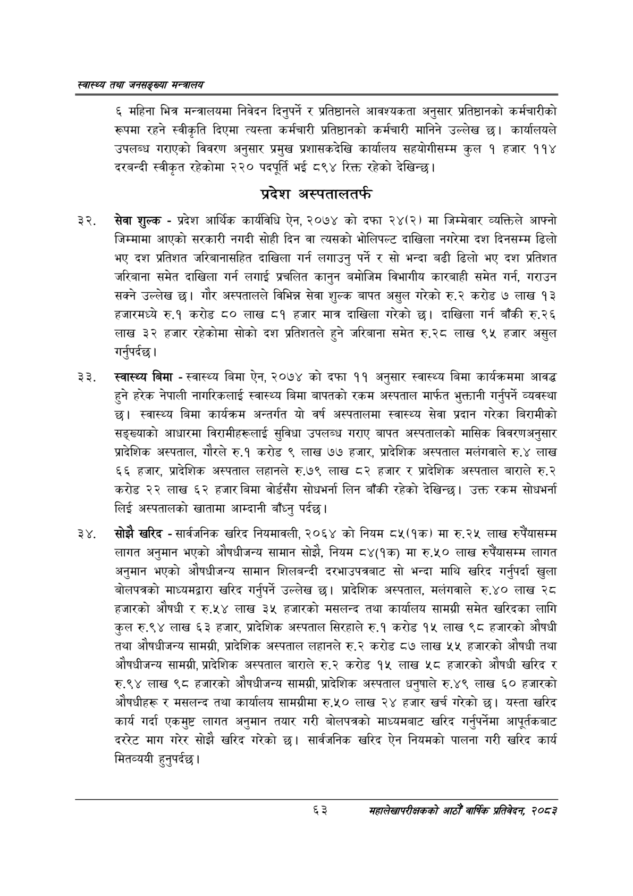

# Page 85 QA

## Rendered page


## Extracted text

```text
स्वास्थ्य तथा जनसङ्ख्या मन्त्रालय
६ महिना भित्र मन्त्रालयमा निवेदन दिनुपर्ने र प्रतिष्ठानले आवश्यकता अनुसार प्रतिष्ठानको कर्मचारीको रूपमा रहने स्वीकृति दिएमा त्यस्ता कर्मचारी प्रतिष्ठानको कर्मचारी मानिने उल्लेख छ। कार्यालयले उपलब्ध गराएको विवरण अनुसार प्रमुख प्रशासकदेखि कार्यालय सहयोगीसम्म कुल १ हजार ११४ दरबन्दी स्वीकृत रहेकोमा २२० पदपूर्ति भ ८९४ रिक्त रहेको देखिन्छ।
प्रदेश अस्पतालतर्फ
सेवा शुल्क -प्रदेश आर्थिक कार्यविधि ऐन, २०७४ को दफा २४(२) मा जिम्मेवार व्यक्तिले आफ्नो जिम्मामा आएको सरकारी नगदी सोही दिन वा त्यसको भोलिपल्ट दाखिला नगरेमा दश दिनसम्म ढिलो भए दश प्रतिशत जरिबानासहित दाखिला गर्न लगाउनु पर्ने र सो भन्दा बढी ढिलो भए दश प्रतिशत जरिबाना समेत दाखिला गर्न लगाई प्रचलित कानुन बमोजिम विभागीय कारबाही समेत गर्न, गराउन सक्ने उल्लेख छ। गौर अस्पतालले विभिन्न सेवा शुल्क बापत असुल गरेको रु.२ करोड ७ लाख १३ हजारमध्ये रु.१ करोड ८० लाख ८१ हजार मात्र दाखिला गरेको छ। दाखिला गर्न बाँकी रु.२६ लाख ३२ हजार रहेकोमा सोको दश प्रतिशतले हुने जरिबाना समेत रु.२८ लाख ९५ हजार असुल गर्नुपर्दछ |
स्वास्थ्य बिमा -स्वास्थ्य बिमा ऐन, २०७४ को दफा ११ अनुसार स्वास्थ्य बिमा कार्यक्रममा आवद्ध हुने हरेक नेपाली नागरिकलाई स्वास्थ्य बिमा बापतको रकम अस्पताल मार्फत भुक्तानी गर्नुपर्ने व्यवस्था | स्वास्थ्य बिमा कार्यक्रम अन्तर्गत यो वर्ष अस्पतालमा स्वास्थ्य सेवा प्रदान गरेका बिरामीको सङ्ख्याको आधारमा विरामीहरूलाई सुविधा उपलब्ध गराए बापत अस्पतालको मासिक विवरणअनुसार प्रादेशिक अस्पताल, गौरले रु.१ करोड ९ लाख ७७ हजार, प्रादेशिक अस्पताल मलंगवाले रु.४ लाख ६६ हजार, प्रादेशिक अस्पताल लहानले रु.७९ लाख ८२ हजार र प्रादेशिक अस्पताल बाराले रु.२ करोड २२ लाख ६२ हजार बिमा वोर्डसँग सोधभर्ना लिन बाँकी रहेको देखिन्छ। उक्त रकम सोधभर्ना लिई अस्पतालको खातामा आम्दानी बाँध्नु पर्दछ।
सोझै खरिद -सार्वजनिक खरिद नियमावली, २०६४ को नियम ८५(१क) मा रु.२५ लाख रुपैंयासम्म लागत अनुमान भएको औषधीजन्य सामान सोझै, नियम ८४(१क) मा रु.५० लाख रुपैँयासम्म लागत अनुमान भएको औषधीजन्य सामान शिलबन्दी दरभाउपत्रबाट सो भन्दा माथि खरिद गर्नुपर्दा खुला बोलपत्रको माध्यमद्वारा खरिद गर्नुपर्ने उल्लेख | प्रादेशिक अस्पताल, मलेंगवाले रु.४० लाख २८ हजारको औषधी र रु.५४ लाख ३५ हजारको मसलन्द तथा कार्यालय सामग्री समेत खरिदका लागि कुल रु.९४ लाख ६३ हजार, प्रादेशिक अस्पताल सिरहाले रु.१ करोड १५ लाख ९८ हजारको औषधी तथा औषधीजन्य सामग्री, प्रादेशिक अस्पताल लहानले रु.२ करोड ८७ लाख ५५ हजारको औषधी तथा औषधीजन्य सामग्री, प्रादेशिक अस्पताल बाराले रु.२ करोड १५ लाख ५८ हजारको औषधी खरिद र रु.९४ लाख ९८ हजारको औषधीजन्य सामग्री, प्रादेशिक अस्पताल धनुषाले रु.४९ लाख ६० हजारको औषधीहरू र मसलन्द तथा कार्यालय सामग्रीमा रु.५० लाख २४ हजार खर्च गरेको छ। यस्ता खरिद कार्य गर्दा एकमुष्ट लागत अनुमान तयार गरी बोलपत्रको माध्यमबाट खरिद गर्नुपर्नेमा आपूर्तवकबाट दररेट माग गरेर सोझै खरिद गरेको छ। सार्वजनिक खरिद ऐन नियमको पालना गरी खरिद कार्य मितव्ययी हुनुपर्दछ।
६३
महालेखापरीक्षकको आठौ वाषिकि प्रतिवेदन २०८२
```

## Flags
- None
