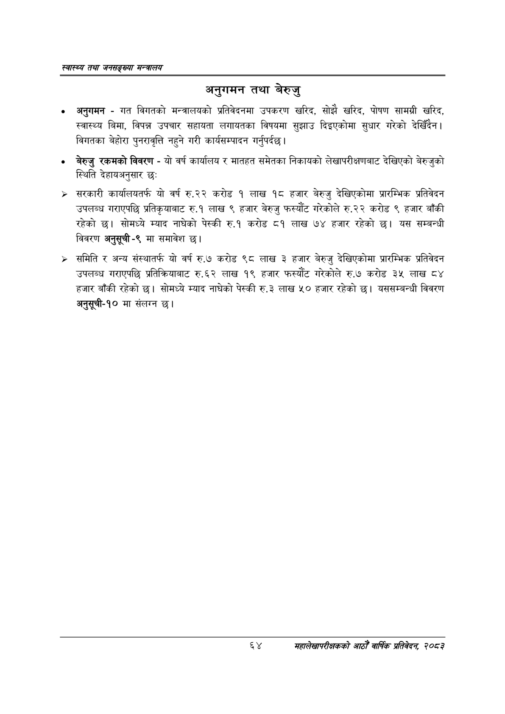

# Page 86 QA

## Rendered page


## Extracted text

```text
स्वास्थ्य तथा जनसङ्ख्या मन्त्रालय
अनुगमन तथा बेरुजु
० अनुगमन -गत विगतको मन्त्रालयको प्रतिवेदनमा उपकरण खरिद, सोझै खरिद, पोषण सामग्री खरिद, स्वास्थ्य बिमा, विपन्न उपचार सहायता लगायतका विषयमा सुझाउ दिइएकोमा सुधार गरेको देखिँदैन। विगतका बेहोरा पुनरावृत्ति नहुने गरी कार्यसम्पादन गर्नुपर्दछ |
० बेरुजु रकमको विवरण -यो वर्ष कार्यालय र मातहत समेतका निकायको लेखापरीक्षणबाट देखिएको बेरुजुको स्थिति देहायअनुसार छः
> सरकारी कार्यालयतर्फ यो वर्ष रु.२२ करोड १ लाख १८ हजार बेरुजु देखिएकोमा प्रारम्भिक प्रतिवेदन उपलब्ध गराएपछि प्रतिकृयाबाट रु.१ लाख ९ हजार बेरुजु फस्यौंट गरेकोले रु.२२ करोड ९ हजार बाँकी रहेको | सोमध्ये म्याद नाघेको पेस्की रु.१ करोड ८१ लाख ७४ हजार रहेको यस सम्बन्धी विवरण अनुसूची-९ मा समावेश छ।
> समिति र अन्य संस्थातर्फ यो वर्ष रु.७ करोड ९८ लाख ३ हजार बेरुजु देखिएकोमा प्रारम्भिक प्रतिवेदन उपलब्ध गराएपछि प्रतिक्रियाबाट रु.६२ लाख १९ हजार फस्यौट गरेकोले रु.७ करोड ३५ लाख ८४ हजार बाँकी रहेको छ। सोमध्ये म्याद नाघेको पेस्की रु.३ लाख ५० हजार रहेको | यससम्बन्धी विवरण अनुसूची-१० मा संलग्न छ।
६४
महालेखापरीक्षकको आठौ वाषिकि प्रतिवेदन २०८२
```

## Flags
- None
