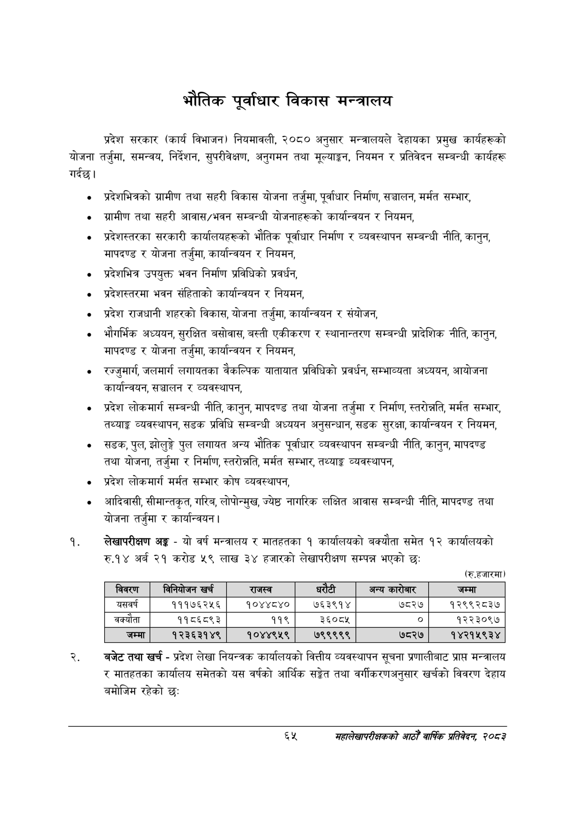

# Page 87 QA

## Rendered page


## Extracted text

```text
भौतिक पूर्वाधार विकास मन्त्रालय
प्रदेश सरकार (कार्य विभाजन) नियमावली, २०८० अनुसार मन्त्रालयले देहायका प्रमुख कार्यहरूको योजना तर्जुमा, समन्वय, निर्देशन, सुपरीवेक्षण, अनुगमन तथा मूल्याङ्कन, नियमन र प्रतिवेदन सम्बन्धी कार्यहरू गर्दछ।
प्रदेशभित्रको ग्रामीण तथा सहरी विकास योजना तर्जुमा, पूर्वाधार निर्माण, सञ्चालन, मर्मत सम्भार,
ग्रामीण तथा सहरी आवास/भवन सम्बन्धी योजनाहरूको कार्यान्वयन र नियमन,
प्रदेशस्तरका सरकारी कार्यालयहरूको भौतिक पूर्वाधार निर्माण र व्यवस्थापन सम्बन्धी नीति, कानुन, मापदण्ड र योजना तर्जुमा, कार्यान्वयन र नियमन,
प्रदेशभित्र उपयुक्त भवन निर्माण प्रविधिको प्रवर्धन,
प्रदेशस्तरमा भवन संहिताको कार्यान्वयन र नियमन,
प्रदेश राजधानी शहरको विकास, योजना तर्जुमा, कार्यान्वयन र संयोजन,
भौगर्भिक अध्ययन, सुरक्षित बसोवास, बस्ती एकीकरण र स्थानान्तरण सम्बन्धी प्रादेशिक नीति, कानुन, मापदण्ड र योजना तर्जुमा, कार्यान्वयन र नियमन,
रज्जुमार्ग, जलमार्ग लगायतका वैकल्पिक यातायात प्रविधिको प्रवर्धन, सम्भाव्यता अध्ययन, आयोजना कार्यान्वयन, सञ्चालन र व्यवस्थापन,
प्रदेश लोकमार्ग सम्बन्धी नीति, कानुन, मापदण्ड तथा योजना तर्जुमा र निर्माण, स्तरोन्नति, मर्मत सम्भार, तथ्याङ्क व्यवस्थापन, सडक प्रविधि सम्बन्धी अध्ययन अनुसन्धान, सडक सुरक्षा, कार्यान्वयन र नियमन,
सडक, पुल, झोलुङ्गे पुल लगायत अन्य भौतिक पूर्वाधार व्यवस्थापन सम्बन्धी नीति, कानुन, मापदण्ड तथा योजना, तर्जुमा र निर्माण, स्तरोन्नति, मर्मत सम्भार, तथ्याङ्क व्यवस्थापन,
प्रदेश लोकमार्ग मर्मत सम्भार कोष व्यवस्थापन,
आदिवासी, सीमान्तकृत, गरिव, लोपोन्मुख, ज्येष्ठ नागरिक लक्षित आवास सम्बन्धी नीति, मापदण्ड तथा योजना तर्जुमा र कार्यान्वयन |
लेखापरीक्षण अङ्क -यो वर्ष मन्त्रालय र मातहतका १ कार्यालयको बक्यौता समेत १२ कार्यालयको रु.१४ अर्ब २१ करोड ५९ लाख ३४ हजारको लेखापरीक्षण सम्पन्न भएको छ:
(रु.हजारमा)
बजेट तथा खर्च -प्रदेश लेखा नियन्त्रक कार्यालयको वित्तीय व्यवस्थापन सूचना प्रणालीबाट प्राप्त मन्त्रालय र मातहतका कार्यालय समेतको यस वर्षको आर्थिक सङ्ेत तथा वर्गीकरणअनुसार खर्चको विवरण देहाय बमोजिम रहेको छ:
६५
महालेखापरीक्षकको आठौ वाषिकि प्रतिवेदन २०८२

| विवरण | निनबाजन खर्च | राजस्व |  | अन्य कारबार | जम्मा |
| --- | --- | --- | --- | --- | --- |
| यसवर्ष | १११७६२५६ | १०४४८४० | ७६३९१४ | ७८२७ | १२९९२८३७ |
| बक्यौता | ११८६८९३ | ११९ | ३६०८४५ | ० | १२२३०९७ |
| जम्मा | १२३६३१४९ | १०४४९५९ | ७९९९९९ | ७८२७ | १४२१५९३४ |
```

## Flags
- table_page
- medium_quality_table
