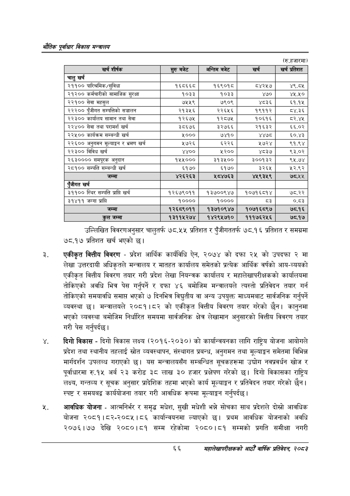

# Page 88 QA

## Rendered page


## Extracted text

```text
एवधार विकास मन्त्रालय
(रु.हजारमा)
उल्लिखित विवरणअनुसार चालुतर्फ ७८.५५ प्रतिशत र पुँजीगततर्फ १७७८.१६ प्रतिशत र समग्रमा ७८.१७ प्रतिशत खर्च भएको छ।
एकीकृत वित्तीय विवरण -प्रदेश आर्थिक कार्यविधि ऐन, २०७४ को दफा २५ को उपदफा २ मा लेखा उत्तरदायी अधिकृतले मन्त्रालय र मातहत कार्यालय समेतको प्रत्येक आर्थिक वर्षको आय-व्ययको एकीकृत वित्तीय विवरण तयार गरी प्रदेश लेखा नियन्त्रक कार्यालय र महालेखापरीक्षकको कार्यालयमा तोकिएको अवधि भित्र पेस गर्नुपर्ने र दफा ४६ बमोजिम मन्त्रालयले त्यस्तो प्रतिवेदन तयार गर्न तोकिएको समयावधि समाप्त भएको ७ दिनभित्र विद्युतीय वा अन्य उपयुक्त माध्यमबाट सार्वजनिक गर्नुपर्ने व्यवस्था छ। मन्त्रालयले २०८१।८२ को एकीकृत वित्तीय विवरण तयार गरेको छैन। कानुनमा भएको व्यवस्था बमोजिम निर्धारित समयमा सार्वजनिक क्षेत्र लेखामान अनुसारको वित्तीय विवरण तयार गरी पेस गर्नुपर्दछ।
दिगो विकास -दिगो विकास लक्ष्य (२०१६-२०३०) को कार्यान्वयनका लागि राष्ट्रिय योजना आयोगले प्रदेश तथा स्थानीय तहलाई स्रोत व्यवस्थापन, संस्थागत प्रबन्ध, अनुगमन तथा मूल्याङ्कन समेतमा विभिन्न मार्गदर्शन उपलब्ध गराएको | यस मन्त्रालयसँग सम्बन्धित सूचकहरूमा उद्योग नवप्रवर्धन खोज र पूर्वाधारमा रु.१५ अर्ब २३ करोड ३८ लाख ३० हजार प्रक्षेपण गरेको छ। दिगो विकासका राष्ट्रिय लक्ष्य, गन्तव्य र सूचक अनुसार प्रादेशिक तहमा भएको कार्य मूल्याङ्कन र प्रतिवेदन तयार गरेको छैन | स्पष्ट र समयबद्द कार्ययोजना तयार गरी आवधिक रूपमा मूल्याङ्कन गर्नुपर्दछ |
आवधिक योजना -आत्मनिर्भर र समृद्ध मधेश, सुखी मधेशी भन्ने सोचका साथ प्रदेशले दोस्रो आवधिक योजना २०८१।८२-२०८५।८६ कार्यान्वयनमा ल्याएको छ। प्रथम आवधिक योजनाको अवधि २०७६।७७ देखि २०८०।८१ सम्म रहेकोमा २०८०।८१ सम्मको प्रगति समीक्षा नगरी
६६
महालेखापरीक्षकको आठौ वाषिकि प्रतिवेदन २०८२

| खर्च शीर्षक | सुरु बजेट | अन्तिम बजेट | खर्च | खर्च प्रतिशत |
| --- | --- | --- | --- | --- |
| चालु खर्च |  |  |  |  |
| २११०० पारित्रमिक/सुविधा | १६८६६८ | १६९०१८ | ८४२५७ | ४९.८५ |
| २९३०० कर्मचारीको सामाजिक सुरक्षा | १०३३ | १०३३ | ४७० | ४५,४५० |
| २२१०० सेवा महसुल | ७५५९ | ७९०९ | ४८३६ | ९.९% |
| २३३०० पुँजीगत खन्पततिको सञ्चालन | २१३५६ | २२६५६ | १९११२ | ८४.३६ |
| २२३०० कार्वालय सामान तथा सेवा | १२६७५ | १२८७४५ | १०६१६ | ८२,४४५ |
| २२४०० सेवा तथा परामर्श खर्च | ३८६७६ | ३२७६६ | २१६३२ | ६६.०२ |
| २२५०० कार्यक्रम सम्बन्धी खर्च | ५००० | ७४१० | ४४७८ | ६०.४३ |
| २२६०० अनुगमन मूल्याङ्कन र भ्रमण खर्च | ५७२६ | ६२२६ | ५७२४ | ९१.९४ |
| २२३०० विविध खर्च | ४४०० | %३०० | ४८३७ | ९३.०२ |
| २६३०००० समपूरक अनुदान | १५५००० | २९३%०० | ३००९३३ | ९५.७४ |
| २८१०० सम्पत्ति सम्बन्धी खर्च | ६१७० | ६१७० | ३२६५ | ५२.९२ |
| जम्मा | ४२६२६३ | ५८४७६३ | ४२५९३५९ | ७८.५५ |
| रंजीगत खर्च |  |  |  |  |
| ३११०० स्थिर सम्पत्ति प्राप्ति खर्च | १२६७९०११ | १३७००९४७ | १०७१६८१४ | ७८.२२ |
| ३१४११ जग्गा प्राप्ति | १०००० | १०००० | ८३ | ०.८३ |
| जम्मा | १२६८९०११ | १३७१०९४७ | १०७१६८९७ | ७८.१६ |
| तल जम्मा | १३११५२७४ | १४२९५७१० | १११७६२५६ | ७८.१७ |
```

## Flags
- table_page
- medium_quality_table
