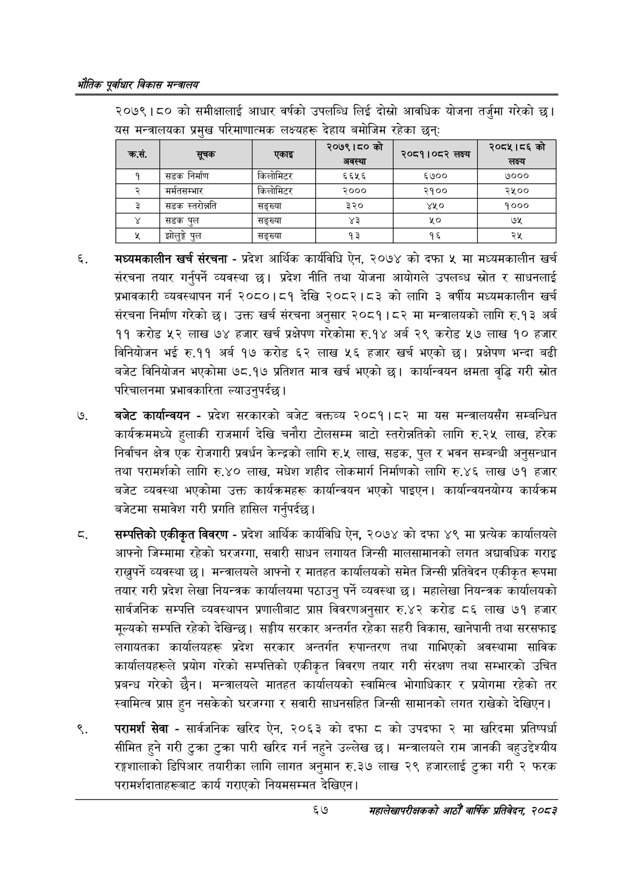

# Page 89 QA

## Rendered page


## Extracted text

```text
एवधार विकास मन्त्रालय
२०७९।८० को समीक्षालाई आधार वर्षको उपलब्धि लिई दोस्रो आवधिक योजना तर्जुमा गरेको छ। यस मन्त्रालयका प्रमुख परिमाणात्मक लक्ष्यहरू देहाय बमोजिम रहेका छन्‌ः
मध्यमकालीन खर्च संरचना -प्रदेश आर्थिक कार्यविधि ऐन, २०७४ को दफा ५ मा मध्यमकालीन खर्च संरचना तयार गर्नुपर्ने व्यवस्था छ। प्रदेश नीति तथा योजना आयोगले उपलब्ध स्रोत र साधनलाई प्रभावकारी व्यवस्थापन गर्न २०८०।८१ देखि २०८२।८३ को लागि ३ वर्षीय मध्यमकालीन खर्च संरचना निर्माण गरेको छ। उक्त खर्च संरचना अनुसार २०८१।८२ मा मन्त्रालयको लागि रु.१३ अर्ब ११ करोड ५२ लाख ७४ हजार खर्च प्रक्षेपण गरेकोमा रु.१४ अर्ब २९ करोड ५७ लाख १० हजार विनियोजन भई रु.११ अर्ब १७ करोड ६२ लाख ५६ हजार खर्च भएको छ। प्रक्षेपण भन्दा बढी बजेट विनियोजन भएकोमा ७८.१७ प्रतिशत मात्र खर्च भएको छ। कार्यान्वयन क्षमता वृद्धि गरी स्रोत परिचालनमा प्रभावकारिता ल्याउनुपर्दछ।
बजेट कार्यान्वयन -प्रदेश सरकारको बजेट वक्तव्य २०८१।८२ मा यस मन्त्रालयसँग सम्बन्धित कार्यक्रममध्ये हुलाकी राजमार्ग देखि चनौरा टोलसम्म बाटो स्तरोन्नतिको लागि रु.२५ लाख, हरेक निर्वाचन क्षेत्र एक रोजगारी प्रवर्धन केन्द्रको लागि रु.५ लाख, सडक, पुल र भवन सम्बन्धी अनुसन्धान तथा परामर्शको लागि रु.४० लाख, मधेश शहीद लोकमार्ग निर्माणको लागि रु.४६ लाख ७१ हजार बजेट व्यवस्था भएकोमा उक्त कार्यक्रमहरू कार्यान्वयन भएको पाइएन। कार्यान्वयनयोग्य कार्यक्रम बजेटमा समावेश गरी प्रगति हासिल गर्नुपर्दछ |
सम्पत्तिको एकीकृत विवरण -प्रदेश आर्थिक कार्यविधि ऐन, २०७४ को दफा ४९ मा प्रत्येक कार्यालयले आफ्नो जिम्मामा रहेको घरजग्गा, सवारी साधन लगायत जिन्सी मालसामानको लगत अद्यावधिक गराइ राख्नुपर्ने व्यवस्था छ। मन्त्रालयले आफ्नो र मातहत कार्यालयको समेत जिन्सी प्रतिवेदन एकीकृत रूपमा तयार गरी प्रदेश लेखा नियन्त्रक कार्यालयमा पठाउनु पर्ने व्यवस्था | महालेखा नियन्त्रक कार्यालयको सार्वजनिक सम्पत्ति व्यवस्थापन प्रणालीबाट प्राप्त विवरणअनुसार रु.४२ करोड ८६ लाख ७१ हजार मूल्यको सम्पत्ति रहेको देखिन्छ। सङ्घीय सरकार अन्तर्गत रहेका सहरी विकास, खानेपानी तथा सरसफाइ लगायतका कार्यालयहरू प्रदेश सरकार अन्तर्गत रुपान्तरण तथा गाभिएको अवस्थामा साविक कार्यालयहरूले प्रयोग गरेको सम्पत्तिको एकीकृत विवरण तयार गरी संरक्षण तथा सम्भारको उचित प्रबन्ध गरेको छैन। मन्त्रालयले मातहत कार्यालयको स्वामित्व भोगाधिकार र प्रयोगमा रहेको तर स्वामित्व प्राप्त हुन नसकेको घरजग्गा र सवारी साधनसहित जिन्सी सामानको लगत राखेको देखिएन |
परामर्श सेवा -सार्वजनिक खरिद ऐन, २०६३ को दफा ८ को उपदफा २ मा खरिदमा प्रतिष्पर्धा सीमित हुने गरी टुक्रा टुक्रा पारी खरिद गर्न नहुने उल्लेख छ। मन्त्रालयले राम जानकी बहुउद्देश्यीय रङ्गशालाको डिपिआर तयारीका लागि लागत अनुमान रु.३७ लाख २९ हजारलाई टुक्रा गरी २ फरक परामर्शदाताहरूबाट कार्य गराएको नियमसम्मत देखिएन |
६७
महालेखापरीक्षकको आठौ वाषिकि प्रतिवेदन २०८२

| कस. | सूचक | एकाइ | २०७९।८०को | ३०५९ \|०५ लक्ष्य | २०८५।८६ को लक्ष्य |
| --- | --- | --- | --- | --- | --- |
| १ | सडक निर्माण | किलोमिटर | ६६५६ | ६७०० | ७००० |
| २ | मर्मतसम्भार | किलोमिटर | २००० | २१०० | २५०० |
| ३ | सडक | सङ्ख्या | ३२० | ४५० | १००० |
|  | सडक पुल | सङ्ख्या | ३ | ० | ७५ |
|  | झोलुङ्गे पुल | सङ्ख्या | १३ | १६ | २५ |
```

## Flags
- table_page
- medium_quality_table
