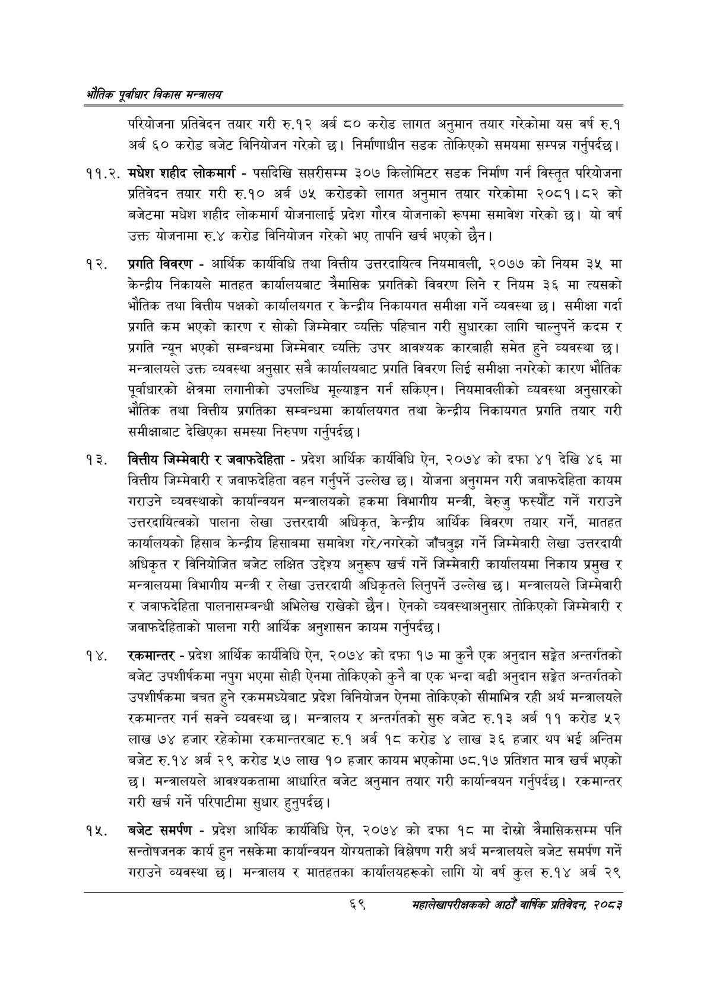

# Page 91 QA

## Rendered page


## Extracted text

```text
एवधार विकास मन्त्रालय
परियोजना प्रतिवेदन तयार गरी रु.१२ अर्ब ८० करोड लागत अनुमान तयार गरेकोमा यस वर्ष रु.१ अर्ब ६० करोड बजेट विनियोजन गरेको छ। निर्माणाधीन सडक तोकिएको समयमा सम्पन्न गर्नुपर्दछ |
११.२. मधेश शहीद लोकमार्ग -पसदिखि सप्तरीसम्म ३०७ किलोमिटर सडक निर्माण गर्न विस्तृत परियोजना प्रतिवेदन तयार गरी रु.१० अर्ब ७५ करोडको लागत अनुमान तयार गरेकोमा २०८१।८२ को बजेटमा मधेश शहीद लोकमार्ग योजनालाई प्रदेश गौरव योजनाको रूपमा समावेश गरेको छ। यो वर्ष उक्त योजनामा रु.४ करोड विनियोजन गरेको भए तापनि खर्च भएको छैन।
प्रगति विवरण -आर्थिक कार्यविधि तथा वित्तीय उत्तरदायित्व नियमावली, २०७७ को नियम ३५ मा केन्द्रीय निकायले मातहत कार्यालयबाट त्रैमासिक प्रगतिको विवरण लिने र नियम ३६ मा त्यसको भौतिक तथा वित्तीय पक्षको कार्यालयगत र केन्द्रीय निकायगत समीक्षा गर्ने व्यवस्था छ। समीक्षा गर्दा प्रगति कम भएको कारण र सोको जिम्मेवार व्यक्ति पहिचान गरी सुधारका लागि चाल्नुपर्ने कदम र प्रगति न्यून भएको सम्बन्धमा जिम्मेवार व्यक्ति उपर आवश्यक कारबाही समेत हुने व्यवस्था | मन्त्रालयले उक्त व्यवस्था अनुसार सबै कार्यालयबाट प्रगति विवरण लिई समीक्षा नगरेको कारण भौतिक पूर्वाधारको क्षेत्रमा लगानीको उपलब्धि मूल्याङ्कन गर्न सकिएन। नियमावलीको व्यवस्था अनुसारको भौतिक तथा वित्तीय प्रगतिका सम्बन्धमा कार्यालयगत तथा केन्द्रीय निकायगत प्रगति तयार गरी समीक्षाबाट देखिएका समस्या निरुपण गर्नुपर्दछ |
वित्तीय जिम्मेवारी र जवाफदेहिता -प्रदेश आर्थिक कार्यविधि ऐन, २०७४ को दफा ४१ देखि ४६ मा वित्तीय जिम्मेवारी र जवाफदेहिता वहन गर्नुपर्ने उल्लेख | योजना अनुगमन गरी जवाफदेहिता कायम गराउने व्यवस्थाको कार्यान्वयन मन्त्रालयको हकमा विभागीय मन्त्री, बेरुजु फस्यौंट गर्ने गराउने उत्तरदायित्वको पालना लेखा उत्तरदायी अधिकृत, केन्द्रीय आर्थिक विवरण तयार गर्ने, मातहत कार्यालयको हिसाब केन्द्रीय हिसाबमा समावेश गरे/नगरेको जाँचवुझ गर्ने जिम्मेवारी लेखा उत्तरदायी अधिकृत र विनियोजित बजेट लक्षित उद्देश्य अनुरूप खर्च गर्ने जिम्मेवारी कार्यालयमा निकाय प्रमुख र मन्त्रालयमा विभागीय मन्त्री र लेखा उत्तरदायी अधिकृतले लिनुपर्ने उल्लेख छ। मन्त्रालयले जिम्मेवारी र जवाफदेहिता पालनासम्बन्धी अभिलेख राखेको छैन। ऐनको व्यवस्थाअनुसार तोकिएको जिम्मेवारी र जवाफदेहिताको पालना गरी आर्थिक अनुशासन कायम गर्नुपर्दछ |
. रकमान्तर -प्रदेश आर्थिक कार्यविधि ऐन, २०७४ को दफा १७ मा कुनै एक अनुदान सङ्केत अन्तर्गतको बजेट उपशीर्षकमा नपुग भएमा सोही ऐनमा तोकिएको कुनै वा एक भन्दा बढी अनुदान सङ्गेत अन्तर्गतको उपशीर्षकमा बचत हुने रकममध्येबाट प्रदेश विनियोजन ऐनमा तोकिएको सीमाभित्र रही अर्थ मन्त्रालयले रकमान्तर गर्न सक्ने व्यवस्था छ। मन्त्रालय र अन्तर्गतको सुरु बजेट रु.१३ अर्ब ११ करोड ५२ लाख ७४ हजार रहेकोमा रकमान्तरबाट रु.१ अर्ब १८ करोड ४ लाख ३६ हजार थप भई अन्तिम बजेट रु.१४ अर्ब २९ करोड ५७ लाख १० हजार कायम भएकोमा ७८.१७ प्रतिशत मात्र खर्च भएको | मन्त्रालयले आवश्यकतामा आधारित बजेट अनुमान तयार गरी कार्यान्वयन गर्नुपर्दछ। रकमान्तर गरी खर्च गर्ने परिपाटीमा सुधार हुनुपर्दछ |
बजेट समर्पण -प्रदेश आर्थिक कार्यविधि ऐन, २०७४ को दफा १८ मा दोस्रो त्रैमासिकसम्म पनि सन्तोषजनक कार्य हुन नसकेमा कार्यान्वयन योरयताको विश्लेषण गरी अर्थ मन्त्रालयले बजेट समर्पण गर्ने गराउने व्यवस्था छ। मन्त्रालय र मातहतका कार्यालयहरूको लागि यो वर्ष कुल रु.१४ अर्ब २९
६९
महालेखापरीक्षकको आठौ वाषिकि प्रतिवेदन २०८२
```

## Flags
- None
