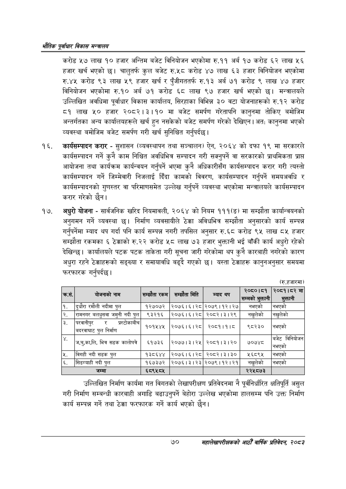

# Page 92 QA

## Rendered page


## Extracted text

```text
एवधार विकास मन्त्रालय
करोड ५७ लाख १० हजार अन्तिम बजेट विनियोजन भएकोमा रु.११ अर्ब १७ करोड ६२ लाख ५६ हजार खर्च भएको | चालुतर्फ कुल बजेट रु.५८ करोड ४७ लाख ६३ हजार विनियोजन भएकोमा रु.४५ करोड ९३ लाख ५९ हजार खर्च र पुँजीगततर्फ रु.१३ अर्ब ७१ करोड ९ लाख ४७ हजार विनियोजन भएकोमा रु.१० अर्ब ७१ करोड ६८ लाख ९७ हजार खर्च भएको छ। मन्त्रालयले उल्लिखित अवधिमा पूर्वाधार विकास कार्यालय, सिरहाका विभिन्न ३० वटा योजनाहरूको रु.१२ करोड ८१ लाख ५० हजार २०८२।३।१० मा बजेट समर्पण गरेतापनि कानुनमा तोकिए बमोजिम अन्तर्गतका अन्य कार्यालयहरूले खर्च हुन नसकेको बजेट समर्पण गरेको देखिएन | अतः कानुनमा भएको व्यवस्था बमोजिम बजेट समर्पण गरी खर्च सुनिश्चित गर्नुपर्दछ |
कार्यसम्पादन करार -सुशासन (व्यवस्थापन तथा सञ्चालन) ऐन, २०६४ को दफा १९ मा सरकारले कार्यसम्पादन गर्ने कुनै काम निश्चित अवधिभित्र सम्पादन गरी सक्नुपर्ने वा सरकारको प्राथमिकता प्राप्त आयोजना तथा कार्यक्रम कार्यन्वयन गर्नुपर्ने भएमा कुनै अधिकारीसँग कार्यसम्पादन करार गरी त्यस्तो कार्यसम्पादन गर्ने जिम्मेवारी निजलाई दिँदा कामको विवरण, कार्यसम्पादन गर्नुपर्ने समयअवधि र कार्यसम्पादनको गुणस्तर वा परिमाणसमेत उल्लेख गर्नुपर्ने व्यवस्था भएकोमा मन्त्रालयले कार्यसम्पादन करार गरेको छैन।
अधुरो योजना -सार्वजनिक खरिद नियमावली, २०६४ को नियम १११(ङ) मा सम्झौता कार्यान्वयनको अनुगमन गर्ने व्यवस्था छ। निर्माण व्यवसायीले ठेक्का अविधभित्र सम्झौता अनुसारको कार्य सम्पन्न गर्नुपर्नेमा म्याद थप गर्दा पनि कार्य सम्पन्न नगरी तपसिल अनुसार रु.६८ करोड ९५ लाख ८५ हजार सम्झौता रकमका ६ ठेक्काको रु.२२ करोड ५८ लाख ७३ हजार भुक्तानी भई बाँकी कार्य अधुरो रहेको देखिन्छ। कार्यालयले पटक पटक ताकेता गरी सूचना जारी गरेकोमा थप कुनै कारबाही नगरेको कारण अधुरा रहने ठेक्काहरूको सङ्ख्या र समायावधि बढ्दै गएको छ। यस्ता ठेक्काहरू कानुनअनुसार समयमा फरफारक गर्नुपर्दछ |
(रु.हजारमा)
उल्लिखित निर्माण कार्यमा गत विगतको लेखापरीक्षण प्रतिवेदनमा नै पूर्वनिर्धारित क्षतिपूर्ति असुल गरी निर्माण सम्बन्धी कारबाही अगाडि बढाउनुपर्ने बेहोरा उल्लेख भएकोमा हालसम्म पनि उक्त निर्माण कार्य सम्पन्न गर्ने तथा ठेक्का फरफारक गर्ने कार्य भएको छैन।
७०
महालेखापरीक्षकको आठौ वाषिकि प्रतिवेदन २०८२

| . क्रस. | नाम | सम्झौता रकम | सम्झौता मिति | म्याद थप | ३०५०१५९ सम्मको | ०५९१५३ मा |
| --- | --- | --- | --- | --- | --- | --- |
| १ | दुघौरा रमौली नदीमा पुल | १२७०७२ | २०७६।६।२८ | २०७९।१२।२७ | नभएको | नभएको |
| २ | रामनगर जलघुस्षवा जमुनी नदी पुल | ९३२१६ | २०७६।६।२८ | २०८२।३।२९ | नखुलेको | नखुलेको |
| ३ | परवानीपुर र अस्टीकाबीच = बढस्वाघाट पुल निर्माण | १०१५४५ | २०७६।१६। २८ | २०८१।१।८ | ९८२३० | - नभएको |
| ४ | कालोपत्र ज.चु.का.लि. भित्र डक कालोपत्रे | ६१७३६ | २०७७।३।२५ | २०८१।३।२० | ७०७४८ | बजेट विनिवोजन नभएको |
| ५ | विगही नदी सडक पुल | १३८६४४ | २०७६।१६।२८ | २०८२।३।३० | ६८९५ | नभएको |
| ६ | सिङ्बाही नदी पुल | १६७३७२ | २०७६।३।२३ | २०७९।१२।२१ | नखुलेको | नभएको |
| ७ | जम्मा | ६८९५८५ |  |  | २२५८७३ |  |
```

## Flags
- table_page
- medium_quality_table
