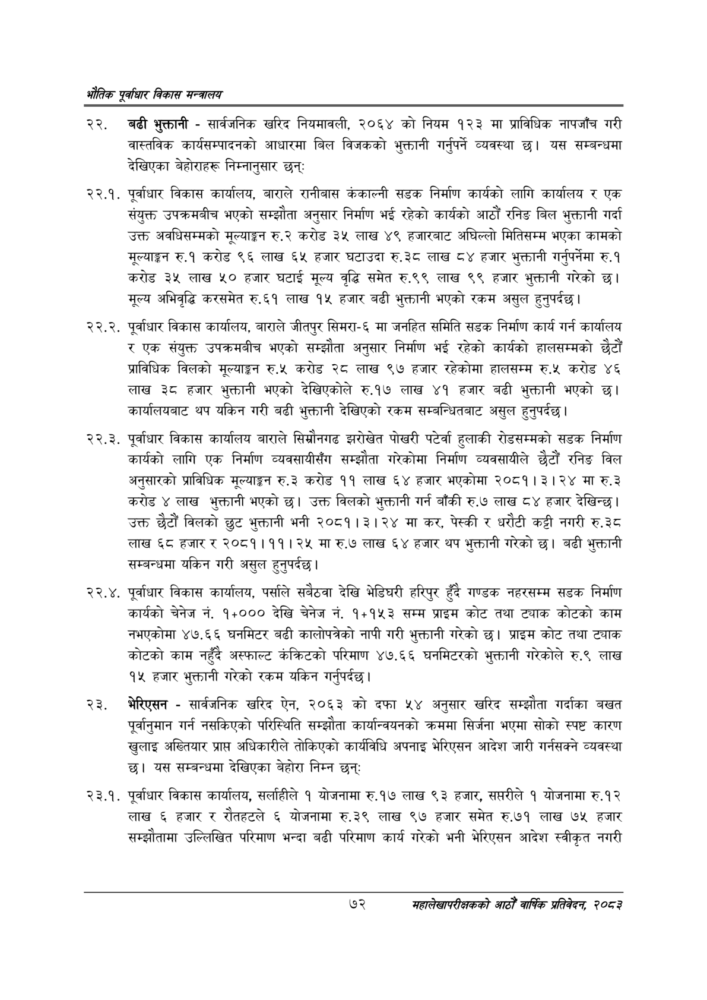

# Page 94 QA

## Rendered page


## Extracted text

```text
एवधार विकास मन्त्रालय
बढी भुक्तानी -सार्वजनिक खरिद नियमावली, २०६४ को नियम १२३ मा प्राविधिक नापजाँच गरी वास्तविक कार्यसम्पादनको आधारमा बिल विजकको भुक्तानी गर्नुपर्ने व्यवस्था छ। यस सम्बन्धमा देखिएका बेहोराहरू निम्नानुसार छन्‌ः
२२.१. पूर्वाधार विकास कार्यालय, बाराले रानीबास कंकाल्नी सडक निर्माण कार्यको लागि कार्यालय र एक संयुक्त उपक्रमबीच भएको सम्झौता अनुसार निर्माण भई रहेको कार्यको आठौं रनिङ बिल भुक्तानी गर्दा उक्त अवधिसम्मको मूल्याङ्कन रु.२ करोड ३५ लाख ४९ हजारबाट अघिल्लो मितिसम्म भएका कामको मूल्याङ्कन रु.१ करोड ९६ लाख ६५ हजार घटाउदा रु.३८ लाख ८४ हजार भुक्तानी गर्नुपर्नेमा रु.१ करोड ३५ लाख ५० हजार घटाई मूल्य वृद्धि समेत रु.९९ लाख ९९ हजार भुक्तानी गरेको छ। मूल्य अभिवृद्धि करसमेत रु.६१ लाख १५ हजार बढी भुक्तानी भएको रकम असुल हुन्‌पर्दछ।
२२.२. पूर्वाधार विकास कार्यालय, बाराले जीतपुर सिमरा-६ मा जनहित समिति सडक निर्माण कार्य गर्न कार्यालय र एक संयुक्त उपक्रमबीच भएको सम्झौता अनुसार निर्माण भई रहेको कार्यको हालसम्मको छैटौं प्राविधिक विलको मूल्याङ्कन रु.५ करोड २८ लाख ९७ हजार रहेकोमा हालसम्म रु.५ करोड ४६ लाख ३८ हजार भुक्तानी भएको देखिएकोले रु.१७ लाख ४१ हजार बढी भुक्तानी भएको कार्यालयबाट थप यकिन गरी बढी भुक्तानी देखिएको रकम सम्बन्धितबाट असुल हुनुपर्दछ |
२२.३. पूर्वाधार विकास कार्यालय बाराले सिम्रौनगढ झरोखेत पोखरी पर्टेर्वा हुलाकी रोडसम्मको सडक निर्माण कार्यको लागि एक निर्माण व्यवसायीसँग सम्झौता गरेकोमा निर्माण व्यवसायीले छैटौं रनिङ विल अनुसारको प्राविधिक मूल्याङ्कन रु.३ करोड ११ लाख ६४ हजार भएकोमा २०८१।३।२४ मा रु.३ करोड लाख भुक्तानी भएको छ। उक्त विलको भुक्तानी गर्न बाँकी रु.७ लाख ८४ हजार देखिन्छ। उक्त छैटौं विलको छुट भुक्तानी भनी २०८१।३।२४ मा कर, पेस्की र धरौटी कट्टी नगरी रु.३८ लाख ६८ हजार र २०८१।११। २५ मा रु.७ लाख ६४ हजार थप भुक्तानी गरेको छ। बढी भुक्तानी सम्बन्धमा यकिन गरी असुल हुनुपर्दछ।
. पूर्वाधार विकास कार्यालय, पर्साले सबैठवा देखि भेडिघरी हरिपुर हुँदै गण्डक नहरसम्म सडक निर्माण कार्यको चेनेज नं. १००० देखि चेनेज नं. ११५३ सम्म प्राइम कोट तथा ट्याक कोटको काम नभएकोमा ४७.६६ घनमिटर बढी कालोपत्रेको नापी गरी भुक्तानी गरेको छ। प्राइम कोट तथा ट्याक कोटको काम नहुँदै अस्फाल्ट केक्रिटको परिमाण ४७.६६ घनमिटरको भुक्तानी गरेकोले रु.९ लाख १५ हजार भुक्तानी गरेको रकम यकिन गर्नुपर्दछ |
भेरिएसन -सार्वजनिक खरिद ऐन, २०६३ को दफा ५४ अनुसार खरिद सम्झौता गर्दाका बखत पूर्वानुमान गर्न नसकिएको परिस्थिति सम्झौता कार्यान्वयनको क्रममा सिर्जना भएमा सोको स्पष्ट कारण खुलाइ अख्तियार प्राप्त अधिकारीले तोकिएको कार्यविधि अपनाइ भेरिएसन आदेश जारी गर्नसक्ने व्यवस्था छ। यस सम्बन्धमा देखिएका बेहोरा निम्न छन्‌
२३.१. पूर्वाधार विकास कार्यालय, सर्लाहीले १ योजनामा रु.१७ लाख ९३ हजार, सप्तरीले १ योजनामा रु.१२ लाख ६ हजार र रौतहटले ६ योजनामा रु.३९ लाख ९७ हजार समेत रु.७१ लाख ७५ हजार सम्झौतामा उल्लिखित परिमाण भन्दा बढी परिमाण कार्य गरेको भनी भेरिएसन आदेश स्वीकृत नगरी
७२
महालेखापरीक्षकको आठौ वाषिकि प्रतिवेदन २०८२
```

## Flags
- None
