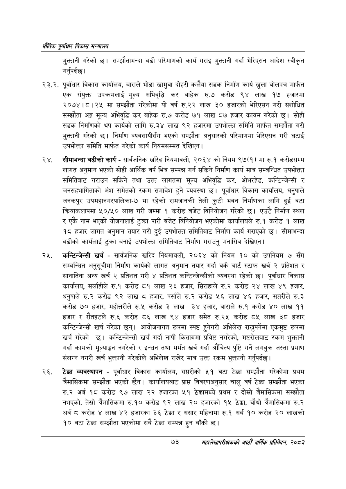

# Page 95 QA

## Rendered page


## Extracted text

```text
एवधार विकास मन्त्रालय
भुक्तानी गरेको छ। सम्झौताभन्दा बढी परिमाणको कार्य गराइ भुक्तानी गर्दा भेरिएसन आदेश स्वीकृत गर्नुपर्दछ |
. पूर्वाधार विकास कार्यालय, बाराले भोडा खामुवा दोहरी कलैया सडक निर्माण कार्य खुला बोलपत्र मार्फत एक संयुक्त उपक्रमलाई मूल्य अभिवृद्धि कर बाहेक रु.७ करोड ९४ लाख १७ हजारमा २०७४।८।२४५ मा सम्झौता गरेकोमा यो वर्ष रु.२२ लाख ३० हजारको भेरिएसन गरी संशोधित सम्झौता अङ्ग मूल्य अभिवृद्धि कर बाहेक रु.७ करोड ७१ लाख ८७ हजार कायम गरेको छ। सोही सडक निर्माणको थप कार्यको लागि रु.३४ लाख ९२ हजारमा उपभोक्ता समिति मार्फत सम्झौता गरी भुक्तानी गरेको छ। निर्माण व्यवसायीसँग भएको सम्झौता अनुसारको परिमाणमा भेरिएसन गरी घटाई उपभोक्ता समिति मार्फत गरेको कार्य नियमसम्मत देखिएन |
सीमाभन्दा बढीको कार्य -सार्वजनिक खरिद नियमावली, २०६४ को नियम ९७(१) मा रु.१ करोडसम्म लागत अनुमान भएको सोही आर्थिक वर्ष भित्र सम्पन्न गर्न सकिने निर्माण कार्य मात्र सम्बन्धित उपभोक्ता समितिबाट गराउन सकिने तथा उक्त लागतमा मूल्य अभिवृद्धि कर, ओभरहेड, कन्टिन्जेन्सी र जनसहभागिताको अंश समेतको रकम समावेश हुने व्यवस्था छ। पूर्वाधार विकास कार्यालय, धनुषाले जनकपुर उपमहानगरपालिका-७ मा रहेको रामजानकी तेली कुटी भवन निर्माणका लागि दुई वटा क्रियाकलापमा ५०/५० लाख गरी जम्मा १ करोड बजेट विनियोजन गरेको छ। एउटै निर्माण स्थल र एकै नाम भएको योजनालाई टुक्रा पारी बजेट विनियोजन भएकोमा कार्यालयले रु.१ करोड १ लाख १८ हजार लागत अनुमान तयार गरी दुई उपभोक्ता समितिबाट निर्माण कार्य गराएको छ। सीमाभन्दा बढीको कार्यलाई टुक्रा बनाई उपभोक्ता समितिबाट निर्माण गराउनु मनासिब देखिएन |
'कन्टिन्जेन्सी खर्च -सार्वजनिक खरिद नियमावली, २०६४ को नियम १० को उपनियम ७ सँग सम्बन्धित अनुसूचीमा निर्माण कार्यको लागत अनुमान तयार गर्दा वर्क चार्ट स्टाफ खर्च २ प्रतिशत र सानातिना अन्य खर्च २ प्रतिशत गरी ४ प्रतिशत कन्टिन्जेन्सीको व्यवस्था रहेको छ। पूर्वाधार विकास कार्यालय, सर्लाहीले रु.१ करोड ८१ लाख २६ हजार, सिराहाले रु.२ करोड २४ लाख ४९ हजार, धनुषाले रु.२ करोड ९२ लाख ८ हजार, पर्साले रु.२ करोड ५६ लाख ४६ हजार, सप्तरीले रु.३ करोड ७० हजार, महोत्तरीले रु.५ करोड ३ लाख ३४ हजार, बाराले रु.१ करोड ४० लाख ९९ हजार र रौतहटले रु.६ करोड ८६ लाख ९४ हजार समेत रु.२५ करोड ८५ लाख ३८ हजार कन्टिन्जेन्सी खर्च गरेका छन्‌। आयोजनागत रूपमा स्पष्ट हुनेगरी अभिलेख राख्नुपर्नेमा एकमुष्ट रूपमा खर्च गरेको | कन्टिन्जेन्सी खर्च गर्दा नापी कितावमा प्रविष्ट नगरेको, मष्टरोलबाट रकम भुक्तानी गर्दा कामको मूल्याङ्ग नगरेको र इन्धन तथा मर्मत खर्च गर्दा औचित्य पुष्टि गर्ने लगबुक जस्ता प्रमाण संलग्न नगरी खर्च भुक्तानी गरेकोले अभिलेख राखेर मात्र उक्त रकम भुक्तानी गर्नुपर्दछ।
ठेक्का व्यवस्थापन -पूर्वाधार विकास कार्यालय, सप्तरीको ५१ वटा ठेक्का सम्झौता गरेकोमा प्रथम चैमासिकमा सम्झौता भएको | कार्यालयबाट प्रापत विवरणअनुसार चालु वर्ष ठेक्का सम्झौता भएका रु.२ अर्ब १८ करोड ९७ लाख २२ हजारका ५१ ठेक्कामध्ये प्रथम र दोस्रो त्रैमासिकमा सम्झौता नभएको, तेस्रो त्रैमासिकमा रु.१० करोड ९२ लाख २० हजारको १५ ठेक्का, चौथो त्रैमासिकमा रु.२ अर्ब ८ करोड ४ लाख ४२ हजारका ३६ ठेक्का र असार महिनामा रु.१ अर्ब १० करोड २० लाखको १० वटा ठेक्का सम्झौता भएकोमा सबै ठेक्का सम्पन्न हुन बाँकी छ।
७३
महालेखापरीक्षकको आठौ वाषिकि प्रतिवेदन २०८२
```

## Flags
- None
