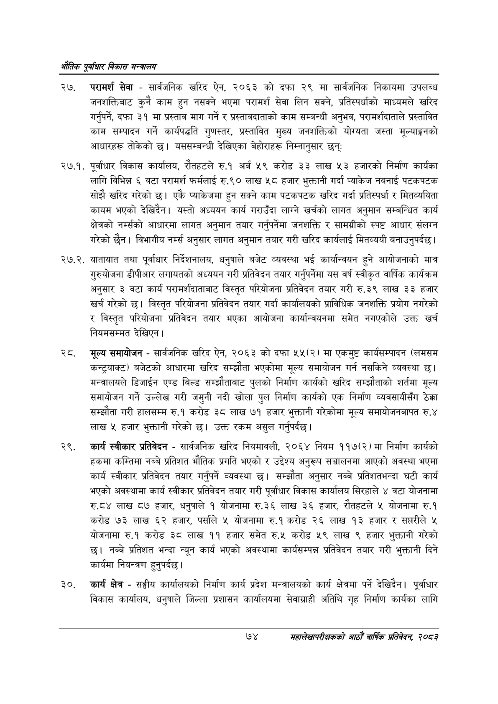

# Page 96 QA

## Rendered page


## Extracted text

```text
एवधार विकास मन्त्रालय
२७, परामर्श सेवा -सार्वजनिक खरिद ऐन, २०६३ को दफा २९ मा सार्वजनिक निकायमा उपलब्ध जनशक्तिबाट कुनै काम हुन नसक्ने भएमा परामर्श सेवा लिन सक्ने, प्रतिस्पर्धाको माध्यमले खरिद गर्नुपर्ने, दफा ३१ मा प्रस्ताव माग गर्ने र प्रस्तावदाताको काम सम्बन्धी अनुभव, परामर्शदाताले प्रस्तावित काम सम्पादन गर्ने कार्यपद्धति गुणस्तर, प्रस्तावित मुख्य जनशक्तिको योग्यता जस्ता मूल्याङ्कनको आधारहरू तोकेको छ। यससम्बन्धी देखिएका बेहोराहरू निम्नानुसार छन्‌ः
२७.१. पूर्वाधार विकास कार्यालय, रौतहटले रु.१ अर्ब ५९ करोड ३३ लाख ५३ हजारको निर्माण कार्यका लागि विभिन्न ६ वटा परामर्श फर्मलाई रु.९० लाख ५८ हजार भुक्तानी गर्दा प्याकेज नबनाई पटकपटक सोझै खरिद गरेको छ। एकै प्याकेजमा हुन सक्ने काम पटकपटक खरिद गर्दा प्रतिस्पर्धा र मितव्ययिता कायम भएको देखिदैन। यस्तो अध्ययन कार्य गराउँदा लाग्ने खर्चको लागत अनुमान सम्बन्धित कार्य क्षेत्रको नर्म्सको आधारमा लागत अनुमान तयार गर्नुपर्नेमा जनशक्ति र सामग्रीको स्पष्ट आधार संलग्न गरेको छैन। विभागीय नर्म्स अनुसार लागत अनुमान तयार गरी खरिद कार्यलाई मितव्ययी बनाउनुपर्दछ |
२. यातायात तथा पूर्वाधार निर्देशनालय, धनुषाले बजेट व्यवस्था भई कार्यान्वयन हुने आयोजनाको मात्र गुरुयोजना डीपीआर लगायतको अध्ययन गरी प्रतिवेदन तयार गर्नुपर्नेमा यस वर्ष स्वीकृत वार्षिक कार्यक्रम अनुसार ३ वटा कार्य परामर्शदाताबाट विस्तृत परियोजना प्रतिवेदन तयार गरी रु.३९ लाख ३३ हजार खर्च गरेको छ। विस्तृत परियोजना प्रतिवेदन तयार गर्दा कार्यालयको प्राविधिक जनशक्ति प्रयोग नगरेको र विस्तृत परियोजना प्रतिवेदन तयार भएका आयोजना कार्यान्वयनमा समेत नगएकोले उक्त खर्च नियमसम्मत देखिएन )
, मूल्य समायोजन -सार्वजनिक खरिद ऐन, २०६३ को दफा ५५(२) मा एकमुष्ट कार्यसम्पादन (लमसम कन्ट्रयाक्ट) बजेटको आधारमा खरिद सम्झौता भएकोमा मूल्य समायोजन गर्न नसकिने व्यवस्था छ। मन्त्रालयले डिजाईन एण्ड बिल्ड सम्झौताबाट पुलको निर्माण कार्यको खरिद सम्झौताको शर्तमा मूल्य समायोजन गर्ने उल्लेख गरी जमुनी नदी खोला पुल निर्माण कार्यको एक निर्माण व्यवसायीसँग ठेक्का सम्झौता गरी हालसम्म रु.१ करोड ३८ लाख ७१ हजार भुक्तानी गरेकोमा मूल्य समायोजनबापत रु.४ लाख ५ हजार भुक्तानी गरेको छ। उक्त रकम असुल गर्नुपर्दछ।
. कार्य स्वीकार प्रतिवेदन -सार्वजनिक खरिद नियमावली, २०६४ नियम ११७(२) मा निर्माण कार्यको हकमा कम्तिमा नब्बे प्रतिशत भौतिक प्रगति भएको र उद्देश्य अनुरूप सञ्चालनमा आएको अवस्था भएमा कार्य स्वीकार प्रतिवेदन तयार गर्नुपर्ने व्यवस्था छ। सम्झौता अनुसार नब्बे प्रतिशतभन्दा घटी कार्य भएको अवस्थामा कार्य स्वीकार प्रतिवेदन तयार गरी पूर्वाधार विकास कार्यालय सिरहाले ४ वटा योजनामा रु.८४ लाख ८७ हजार, धनुषाले १ योजनामा रु.३६ लाख ३६ हजार, रौतहटले ५ योजनामा रु.१ करोड ७३ लाख ६२ हजार, पर्साले ५ योजनामा रु.१ करोड २६ लाख १३ हजार र सप्तरीले ५ योजनामा रु.१ करोड ३८ लाख ११ हजार समेत रु.५ करोड ५९ लाख ९ हजार भुक्तानी गरेको छ। नब्बे प्रतिशत भन्दा न्यून कार्य भएको अवस्थामा कार्यसम्पन्न प्रतिवेदन तयार गरी भुक्तानी दिने कार्यमा नियन्त्रण हुनुपर्दछ |
कार्य क्षेत्र -सङ्घीय कार्यालयको निर्माण कार्य प्रदेश मन्त्रालयको कार्य क्षेत्रमा पर्ने देखिदेन। पूर्वाधार विकास कार्यालय, धनुषाले जिल्ला प्रशासन कार्यालयमा सेवाग्राही अतिथि गृह निर्माण कार्यका लागि
७४
महालेखापरीक्षकको आठौ वाषिकि प्रतिवेदन २०८२
```

## Flags
- None
