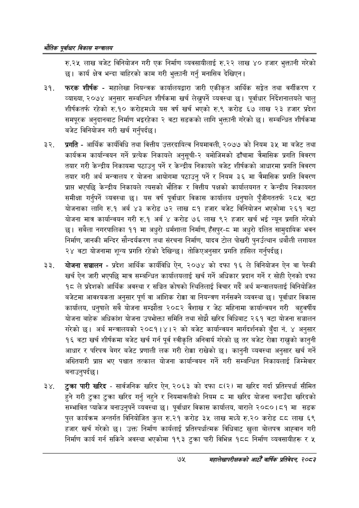

# Page 97 QA

## Rendered page


## Extracted text

```text
एवधार विकास मन्त्रालय
रु.२५ लाख बजेट विनियोजन गरी एक निर्माण व्यवसायीलाई रु.२२ लाख ४० हजार भुक्तानी गरेको छ। कार्य क्षेत्र भन्दा बाहिरको काम गरी भुक्तानी गर्नु मनासिब देखिएन |
फरक शीर्षक -महालेखा नियन्त्रक कार्यालयद्वारा जारी एकीकृत आर्थिक सङ्गेत तथा वर्गीकरण र व्याख्या, २०७४ अनुसार सम्बन्धित शीर्षकमा खर्च लेख्नुपर्ने व्यवस्था छ। पूर्वाधार निर्देशनालयले चालु शीर्षकतर्फ रहेको रु.१० करोडमध्ये यस वर्ष खर्च भएको रु.९ करोड ६७ लाख २३ हजार प्रदेश समपूरक अनुदानबाट निर्माण भइरहेका २ वटा सडकको लागि भुक्तानी गरेको छ। सम्बन्धित शीर्षकमा बजेट विनियोजन गरी खर्च गर्नुपर्दछ।
प्रगति -आर्थिक कार्यविधि तथा वित्तीय उत्तरदायित्व नियमावली, २०७७ को नियम ३५ मा बजेट तथा कार्यक्रम कार्यान्वयन गर्ने प्रत्येक निकायले अनुसूची-२ बमोजिमको ढाँचामा त्रैमासिक प्रगति विवरण तयार गरी केन्द्रीय निकायमा पठाउनु पर्ने र केन्द्रीय निकायले बजेट शीर्षकको आधारमा प्रगति विवरण तयार गरी अर्थ मन्त्रालय र योजना आयोगमा पठाउनु पर्ने र नियम ३६ मा त्रैमासिक प्रगति विवरण प्राप भएपछि केन्द्रीय निकायले त्यसको भौतिक र वित्तीय पक्षको कार्यालयगत र केन्द्रीय निकायगत समीक्षा गर्नुपर्ने व्यवस्था यस वर्ष पूर्वाधार विकास कार्यालय धनुषाले पुँजीगततर्फ २८५ वटा योजनाका लागि रु.१ अर्ब ४३ करोड ७२ लाख ८१ हजार बजेट विनियोजन भएकोमा २६१ वटा योजना मात्र कार्यान्वयन गरी रु.१ अर्ब ४ करोड ७६ लाख ९२ हजार खर्च भई न्यून प्रगति गरेको छ। सबैला नगरपालिका ११ मा अधुरो धर्मशाला निर्माण, हँसपुर-८ मा अधुरो दलित सामुदायिक भवन निर्माण, जानकी मन्दिर सौन्दर्यकरण तथा संरचना निर्माण, यादव टोल पोखरी पुनर्उत्थान धबौली लगायत २४ वटा योजनामा शून्य प्रगति रहेको देखिन्छ। तोकिएअनुसार प्रगति हासिल गर्नुपर्दछ |
योजना सञ्चालन -प्रदेश आर्थिक कार्यविधि ऐन, २०७४ को दफा १६ ले विनियोजन ऐन वा पेस्की खर्च ऐन जारी भएपछि मात्र सम्बन्धित कार्यालयलाई खर्च गर्ने अधिकार प्रदान गर्ने र सोही ऐनको दफा १८ ले प्रदेशको आर्थिक अवस्था र सञ्चित कोषको स्थितिलाई विचार गर्दै अर्थ मन्त्रालयलाई विनियोजित बजेटमा आवश्यकता अनुसार पूर्ण वा आंशिक रोक्का वा नियन्त्रण गर्नसक्ने व्यवस्था छ। पूर्वाधार विकास कार्यालय, धनुषाले सबै योजना सम्झौता २०८२ वैशाख र जेठ महिनामा कार्यान्वयन गरी बहुवर्षीय योजना बाहेक अधिकांश योजना उपभोक्ता समिति तथा सोझै खरिद विधिबाट २६१ वटा योजना सञ्चालन गरेको छ। अर्थ मन्त्रालयको २०८१।४।२ को बजेट कार्यान्वयन मार्गदर्शनको बुँदा नं. ४ अनुसार १६ वटा खर्च शीर्षकमा बजेट खर्च गर्न पूर्व स्वीकृति अनिवार्य गरेको छ तर बजेट रोक्का राख्नुको कानुनी आधार र परिपत्र बेगर बजेट प्रणाली लक गरी रोक्का राखेको छ। कानुनी व्यवस्था अनुसार खर्च गर्ने अख्तियारी प्राप भए पश्चात तत्काल योजना कार्यान्वयन गर्ने गरी सम्बन्धित निकायलाई जिम्मेवार बनाउनुपर्दछ।
टुक्रा पारी खरिद -सार्वजनिक खरिद ऐन, २०६३ को दफा ८(२) मा खरिद गर्दा प्रतिस्पर्धा सीमित हुने गरी टुक्रा टुक्रा खरिद गर्नु नहुने र नियमावलीको नियम ८ मा खरिद योजना बनाउँदा खरिदको सम्भावित प्याकेज बनाउनुपर्ने व्यवस्था | पूर्वाधार विकास कार्यालय, बाराले २०८०।८१ मा सडक पुल कार्यक्रम अन्तर्गत विनियोजित कुल रु.२१ करोड ३५ लाख मध्ये रु.२० करोड ८८ लाख ६९ हजार खर्च गरेको छ। उक्त निर्माण कार्यलाई प्रतिस्पर्धात्मक विधिबाट खुला बोलपत्र आह्वान गरी निर्माण कार्य गर्न सकिने अवस्था भएकोमा १९३ टुक्रा पारी विभिन्न १८८ निर्माण व्यवसायीहरू र ५
७५
महालेखापरीक्षकको आठौ वाषिकि प्रतिवेदन २०८२
```

## Flags
- None
