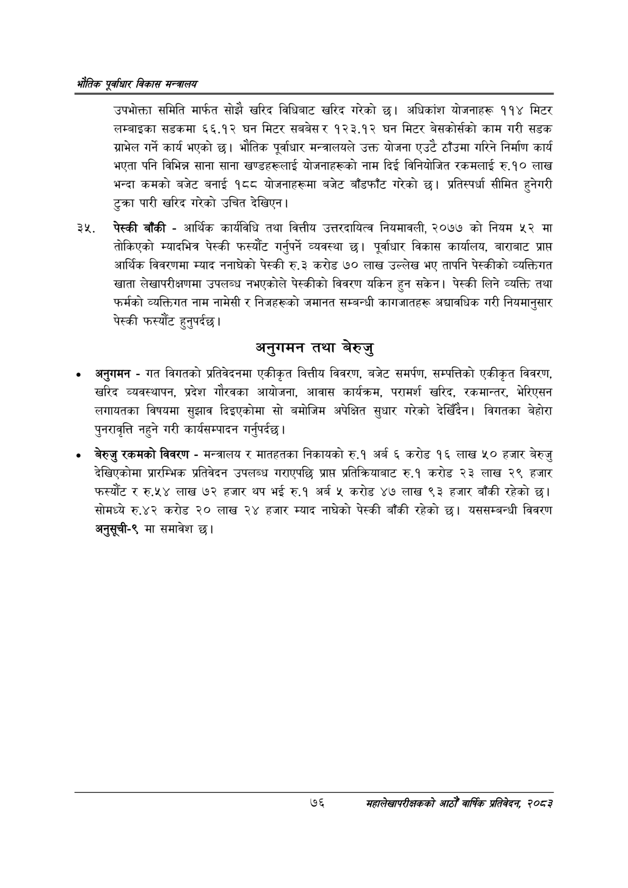

# Page 98 QA

## Rendered page


## Extracted text

```text
एवधार विकास मन्त्रालय
उपभोक्ता समिति मार्फत सोझै खरिद विधिबाट खरिद गरेको छ। अधिकांश योजनाहरू ११४ मिटर लम्बाइका सडकमा ६६.१२ घन मिटर सबबेसर १२३.१२ घन मिटर बेसकोर्सको काम गरी सडक ग्राभेल गर्ने कार्य भएको छ। भौतिक पूर्वाधार मन्त्रालयले उक्त योजना एउटै ठाँउमा गरिने निर्माण कार्य भएता पनि विभिन्न साना साना खण्डहरूलाई योजनाहरूको नाम दिई विनियोजित रकमलाई रु.१० लाख भन्दा कमको बजेट बनाई १८८ योजनाहरूमा बजेट बाँडफाँट गरेको छ। प्रतिस्पर्धा सीमित हुनेगरी टुक्रा पारी खरिद गरेको उचित देखिएन।
पेस्की बाँकी -आर्थिक कार्यविधि तथा वित्तीय उत्तरदायित्व नियमावली, २०७७ को नियम ५२ मा तोकिएको म्यादभित्र पेस्की फस्यौट गर्नुपर्ने व्यवस्था छ। पूर्वाधार विकास कार्यालय, बाराबाट प्राप्त आर्थिक विवरणमा म्याद ननाघेको पेस्की रु.३ करोड ७० लाख उल्लेख भए तापनि पेस्कीको व्यक्तिगत खाता लेखापरीक्षणमा उपलब्ध नभएकोले पेस्कीको विवरण यकिन हुन सकेन। पेस्की लिने व्यक्ति तथा फर्मको व्यक्तिगत नाम नामेसी र निजहरूको जमानत सम्बन्धी कागजातहरू अद्यावधिक गरी नियमानुसार पेस्की फस्यौंट हुनुपर्दछ |
अनुगमन तथा बेरुजु
अनुगमन -गत विगतको प्रतिवेदनमा एकीकृत वित्तीय विवरण, बजेट समर्पण, सम्पत्तिको एकीकृत विवरण, खरिद व्यवस्थापन, प्रदेश गौरवका आयोजना, आवास कार्यक्रम, परामर्श खरिद, रकमान्तर, भेरिएसन लगायतका विषयमा सुझाव दिइएकोमा सो बमोजिम अपेक्षित सुधार गरेको देखिँदैन। विगतका बेहोरा पुनरावृत्ति नहुने गरी कार्यसम्पादन गर्नुपर्दछ |
बेरुजु रकमको विवरण -मन्त्रालय र मातहतका निकायको रु.१ अर्ब ६ करोड १६ लाख ५० हजार बेरुजु देखिएकोमा प्रारम्भिक प्रतिवेदन उपलब्ध गराएपछि प्राप्त प्रतिक्रियाबाट रु.१ करोड २३ लाख २९ हजार फस्यौट र रु.५४ लाख ७२ हजार थप भई रु.१ अर्ब ५ करोड ४७ लाख ९३ हजार बाँकी रहेको सोमध्ये रु.४२ करोड २० लाख २४ हजार म्याद नाघेको पेस्की बाँकी रहेको छ। यससम्बन्धी विवरण अनुसूची-९ मा समावेश छ।
७६
महालेखापरीक्षकको आठौ वाषिकि प्रतिवेदन २०८२
```

## Flags
- None
