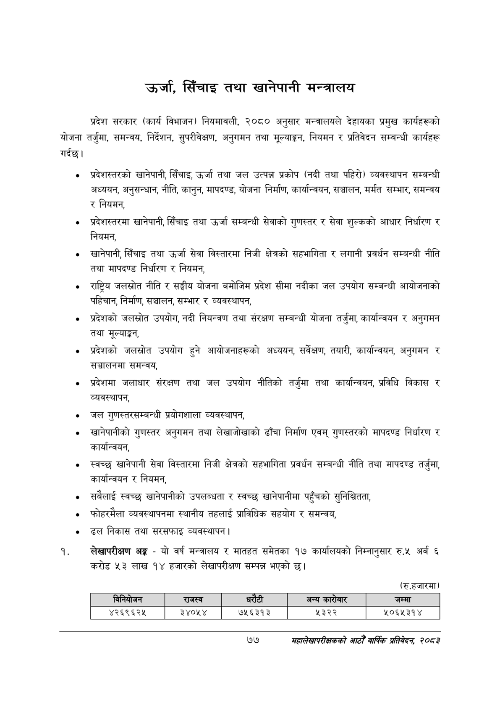

# Page 99 QA

## Rendered page


## Extracted text

```text
उर्जा, सिँचाइ तथा खानेपानी मन्त्रालय
प्रदेश सरकार (कार्य विभाजन) नियमावली, २०८० अनुसार मन्त्रालयले देहायका प्रमुख कार्यहरूको योजना तर्जुमा, समन्वय, निर्देशन, सुपरीवेक्षण, अनुगमन तथा मूल्याङ्कन, नियमन र प्रतिवेदन सम्बन्धी कार्यहरू गर्दछ।
प्रदेशस्तरको खानेपानी, सिँचाइ, उर्जा तथा जल उत्पन्न प्रकोप (नदी तथा पहिरो) व्यवस्थापन सम्बन्धी अध्ययन, अनुसन्धान, नीति, कानुन, मापदण्ड, योजना निर्माण, कार्यान्वयन, सञ्चालन, मर्मत सम्भार, समन्वय र नियमन,
प्रदेशस्तरमा खानेपानी, सिँचाइ तथा उर्जा सम्बन्धी सेवाको गुणस्तर र सेवा शुल्कको आधार निर्धारण र नियमन,
खानेपानी, सिँचाइ तथा उर्जा सेवा विस्तारमा निजी क्षेत्रको सहभागिता र लगानी प्रवर्धन सम्बन्धी नीति तथा मापदण्ड निर्धारण र नियमन,
राष्ट्रिय जलस्रोत नीति र सङ्घीय योजना बमोजिम प्रदेश सीमा नदीका जल उपयोग सम्बन्धी आयोजनाको पहिचान, निर्माण, सञ्चालन, सम्भार र व्यवस्थापन,
प्रदेशको जलस्रोत उपयोग, नदी नियन्त्रण तथा संरक्षण सम्बन्धी योजना तर्जुमा, कार्यान्वयन र अनुगमन तथा मूल्याङ्कन,
प्रदेशको जलस्रोत उपयोग हुने आयोजनाहरूको अध्ययन, सर्वेक्षण, तयारी, कार्यान्वयन, अनुगमन र सञ्चालनमा समन्वय,
प्रदेशमा जलाधार संरक्षण तथा जल उपयोग नीतिको तर्जुमा तथा कार्यान्वयन, प्रविधि विकास र व्यवस्थापन,
जल गुणस्तरसम्बन्धी प्रयोगशाला व्यवस्थापन,
खानेपानीको गुणस्तर अनुगमन तथा लेखाजोखाको ढाँचा निर्माण एवम्‌ गुणस्तरको मापदण्ड निर्धारण र कार्यान्वयन,
स्वच्छ खानेपानी सेवा विस्तारमा निजी क्षेत्रको सहभागिता प्रवर्धन सम्बन्धी नीति तथा मापदण्ड तर्जुमा, कार्यान्वयन र नियमन,
सबैलाई स्वच्छ खानेपानीको उपलब्धता र स्वच्छ खानेपानीमा पहुँचको सुनिश्चितता,
फोहरमैला व्यवस्थापनमा स्थानीय तहलाई प्राविधिक सहयोग र समन्वय,
ढल निकास तथा सरसफाइ व्यवस्थापन |
लेखापरीक्षण अङ्ग -यो वर्ष मन्त्रालय र मातहत समेतका १७ कार्यालयको निम्नानुसार रु.५ अर्ब करोड ५३ लाख १४ हजारको लेखापरीक्षण सम्पन्न भएको |
(रु.हजारमा)
७७
महालेखापरीक्षकको आठौ वाषिकि प्रतिवेदन २०८२

|  |  | ननबोजन | राजस्व | ५ १ १ १ १ ४ ५१७ ११ ३२ १४ ९३.२४९०२३ अन्य ५ १ १ १ १ ५ ५५६ ५ ५७ २० १४.६६२०५६ ५ १ १ १ १ ६ ७२५ ११ ४१ १४ ९१.०००३७४ जम्मा ४ १ १ १ २ ० ४६ ३० ७४५ ३४ -१ ५ १ १ १ २ १ ४६ ३० ८८ ३४ ६१.९९१८६७ ४२६९६२४५ ५ १ १ १ २ २ २१६ ४१ ६३ १५ ८३.९५४३०० ३४०५४ ५ १ १ १ २ ३ ३५५ ४१ ७४ १५ ९०.७७५३४५ ७५६३१३ ५ १ १ १ २ ४ ५३९ ४१ ४८ १५ ८३.३२०८३१ ५३२२ ५ १ १ १ २ ५ ७०२ ४१ ८९ १५ ५५.५०७३३९ ५०६५३१४ |  |  |  |
| --- | --- | --- | --- | --- | --- | --- | --- |
|  |  |  |  |  |  |  |  |
```

## Flags
- table_page
- low_quality_table
