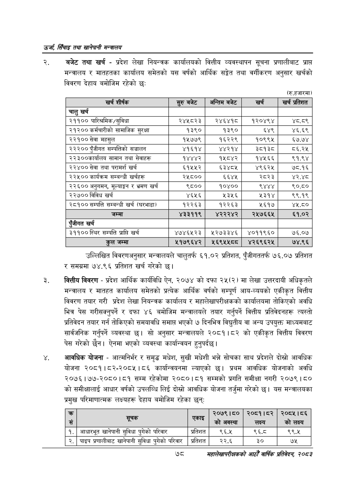

# Page 100 QA

## Rendered page


## Extracted text

```text
उर्जा सिँचाइ तथा खानेपानी
बजेट तथा खर्च -प्रदेश लेखा नियन्त्रक कार्यालयको वित्तीय व्यवस्थापन सूचना प्रणालीबाट प्राप्त मन्त्रालय र मातहतका कार्यालय समेतको यस वर्षको आर्थिक सङ्गेत तथा वर्गीकरण अनुसार खर्चको विवरण देहाय बमोजिम रहेको छ:
(रु.हजारमा)
उल्लिखित विवरणअनुसार मन्त्रालयले चालुतर्फ ६१.०२ प्रतिशत, पुँजीगततर्फ ७६.०७ प्रतिशत र समग्रमा ७४.९६ प्रतिशत खर्च गरेको |
वित्तीय विवरण -प्रदेश आर्थिक कार्यविधि ऐन, २०७४ को दफा २५(२) मा लेखा उत्तरदायी अधिकृतले मन्त्रालय र मातहत कार्यालय समेतको प्रत्येक आर्थिक वर्षको सम्पूर्ण आय-व्ययको एकीकृत वित्तीय विवरण तयार गरी प्रदेश लेखा नियन्त्रक कार्यालय र महालेखापरीक्षकको कार्यालयमा तोकिएको अवधि भित्र पेस गरीसक्नुपर्ने र दफा ४६ बमोजिम मन्त्रालयले तयार गर्नुपर्ने वित्तीय प्रतिवेदनहरू त्यस्तो प्रतिवेदन तयार गर्न तोकिएको समयावधि समाप्त भएको ७ दिनभित्र विद्युतीय वा अन्य उपयुक्त माध्यमबाट सार्वजनिक गर्नुपर्ने व्यवस्था सो अनुसार मन्त्रालयले २०८१।८२ को एकीकृत वित्तीय विवरण पेस गरेको छैन। ऐनमा भएको व्यवस्था कार्यान्वयन हुनुपर्दछ।
आवधिक योजना -आत्मनिर्भर र समृद्ध मधेश, सुखी मधेशी भन्ने सोचका साथ प्रदेशले दोस्रो आवधिक योजना २०८१।८२-२०८५।८६ कार्यान्वयनमा ल्याएको छ। प्रथम आवधिक योजनाको अवधि २०७६।१७७-२०८०।८१ सम्म रहेकोमा २०८०।८१ सम्मको प्रगति समीक्षा नगरी २०७९ | ८० को समीक्षालाई आधार वर्षको उपलब्धि लिई दोस्रो आवधिक योजना तर्जुमा गरेको | यस मन्त्रालयका प्रमुख परिमाणात्मक लक्ष्यहरू देहाय बमोजिम रहेका छन्‌ः
७८
महालेखापरीक्षकको आठौ वाषिकि प्रतिवेदन २०८२

| खर्च शीर्षक | सुरु बबेट | अन्तिम बजेट | खर्च | खर्च प्रतिशत |
| --- | --- | --- | --- | --- |
| चालु खर्च |  |  |  |  |
| २११०० पारिश्रमिक/सुविधा | २४५८२३ | २४६४१८ | १२०४९४ | ५.५% |
| २१२०० कर्बचारीको सामाजिक सुरक्षा | १३९० | १३९० | ६४९ | ४६.६९ |
| २२१०० सेवा महसुल | १५७७९ | १६२२९ | १०९९५ | ६७.७४ |
| २२२०० पुँजीगत सम्पत्तिको सञ्चालन | ४१६१४ | ४४२१४ | ३८१३८ | ८६.२४५ |
| २२३००कार्यालय सामान तथा सेवाहरू | १४४४२ | १५८४२ | १४५६६ | ९१.९४ |
| २२४०० सेवा तथा परामर्श खर्च | ६१५५२ | ६३४८५ | ४९६२५ | ७८.१६ |
| २२५०० कार्यक्रम सम्बन्धी खर्चहरू | २५८०० | ६६४५ | २८२३ | ४२.४८ |
| २२६०० अनुगमन, २ूल्याङ्गन र भ्रमण खर्च | ९८०० | १०४०० | ९४४४ | ९०.८० |
| २२७०० विविध खर्च | ४६५६ | २३५६ | २३१४ | ९९.१९ |
| २८१०० सम्पत्ति सम्बन्धी खर्च (घरभाडा) | १२२६३ | १२२६३ | ५६१७ | ४५,८० |
| जम्मा | ४३३११९ | ४२२२४२ | २५७६६४५ | ६१.०२ |
| एंजीगत खर्च |  |  |  |  |
| ३११०० स्थिर सम्पत्ति प्राप्ति खर्च | ४७४६५२३ | २२७३३४६ | ४०११९६० | ७६.०७ |
| हःल जम्मा | ५२१७९६४२ | ५६९५५८०८०८ | ४२६९६२५ | ७४.९६ |

| क्र सं | सूचक ५ | एकाइ | २०७९।८० 'को अवस्था | २०८१।८२ लक्ष्य | २०८४५।८६ को लक्ष्य |
| --- | --- | --- | --- | --- | --- |
| १. | आधारभूत खानेपानी सुविधा पुगेको परिवार | प्रतिशत | ९६.५ | ९६.८ | ९९.४५ |
| २. | पाइप प्रणालीबाट खानेपानी सुविधा पुगेको परिवार | प्रतिशत | २२.६ | ३० | ७५ |
```

## Flags
- table_page
- medium_quality_table
