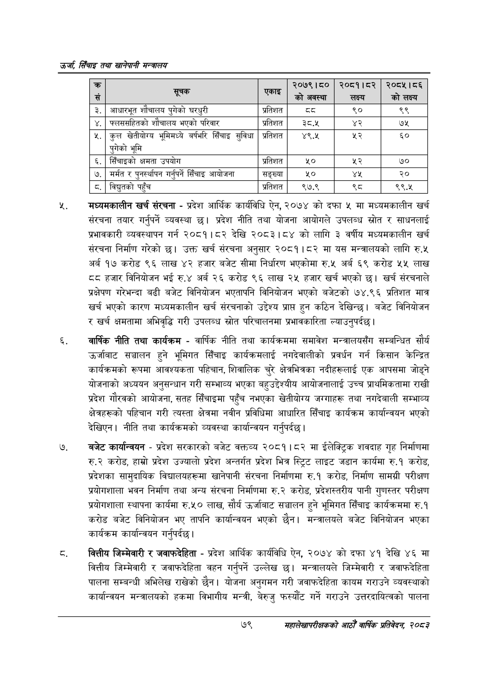

# Page 101 QA

## Rendered page


## Extracted text

```text
उर्जा सिँचाइ तथा खानेपानी
मध्यमकालीन खर्च संरचना -प्रदेश आर्थिक कार्यविधि ऐन, २०७४ को दफा ५ मा मध्यमकालीन खर्च संरचना तयार गर्नुपर्ने व्यवस्था छ। प्रदेश नीति तथा योजना आयोगले उपलब्ध स्रोत र साधनलाई प्रभावकारी व्यवस्थापन गर्न २०८१।८२ देखि २०८३।८४ को लागि ३ वर्षीय मध्यमकालीन खर्च संरचना निर्माण गरेको छ। उक्त खर्च संरचना अनुसार २०८१।८२ मा यस मन्त्रालयको लागि रु.५ अर्ब १७ करोड ९६ लाख ४२ हजार बजेट सीमा निर्धारण भएकोमा रु.४५ अर्ब ६९ करोड ५५ लाख हजार विनियोजन भई रु.४ अर्ब २६ करोड ९६ लाख २५ हजार खर्च भएको छ। खर्च संरचनाले प्रक्षेपण गरेभन्दा बढी बजेट विनियोजन भएतापनि विनियोजन भएको बजेटको ७४.९६ प्रतिशत मात्र खर्च भएको कारण मध्यमकालीन खर्च संरचनाको उद्देश्य प्राप्त हुन कठिन देखिन्छ। बजेट विनियोजन र खर्च क्षमतामा अभिवृद्धि गरी उपलब्ध स्रोत परिचालनमा प्रभावकारिता ल्याउनुपर्दछ।
वार्षिक नीति तथा कार्यक्रम -वार्षिक नीति तथा कार्यक्रममा समावेश मन्त्रालयसँग सम्बन्धित सौर्य उर्जाबाट सञ्चालन हुने भूमिगत सिँचाइ कार्यक्रमलाई नगदेवालीको प्रवर्धन गर्न किसान केन्द्रित कार्यक्रमको रूपमा आवश्यकता पहिचान, शिवालिक चुरे क्षेत्रभित्रका नदीहरूलाई एक आपसमा जोड्ने योजनाको अध्ययन अनुसन्धान गरी सम्भाव्य भएका बहुउद्देश्यीय आयोजनालाई उच्च प्राथमिकतामा राखी प्रदेश गौरवको आयोजना, सतह सिँचाइमा पहुँच नभएका खेतीयोग्य जग्गाहरू तथा नगदेबाली सम्भाव्य क्षेत्रहरूको पहिचान गरी त्यस्ता क्षेत्रमा नवीन प्रविधिमा आधारित सिँचाइ कार्यक्रम कार्यान्वयन भएको देखिएन। नीति तथा कार्यक्रमको व्यवस्था कार्यान्वयन गर्नुपर्दछ |
बजेट कार्यान्वयन -प्रदेश सरकारको बजेट वक्तव्य २०८१।८२ मा ईलेक्ट्रिक शवदाह गृह निर्माणमा रु.२ करोड, हाम्रो प्रदेश उज्यालो प्रदेश अन्तर्गत प्रदेश भित्र स्ट्रिट लाइट जडान कार्यमा रु.१ करोड, प्रदेशका सामुदायिक विद्यालयहरूमा खानेपानी संरचना निर्माणमा रु.१ करोड, निर्माण सामग्री परीक्षण प्रयोगशाला भवन निर्माण तथा अन्य संरचना निर्माणमा रु.२ करोड, प्रदेशस्तरीय पानी गुणस्तर परीक्षण प्रयोगशाला स्थापना कार्यमा रु.५० लाख, सौर्य उर्जाबाट सञ्चालन हुने भूमिगत सिँचाइ कार्यक्रममा रु.१ करोड बजेट विनियोजन भए तापनि कार्यान्वयन भएको छैन। मन्त्रालयले बजेट विनियोजन भएका कार्यक्रम कार्यान्वयन गर्नुपर्दछ |
वित्तीय जिम्मेवारी र जवाफदेहिता -प्रदेश आर्थिक कार्यविधि ऐन, २०७४ को दफा ४१ देखि ४६ मा वित्तीय जिम्मेवारी र जवाफदेहिता वहन गर्नुपर्ने उल्लेख छ। मन्त्रालयले जिम्मेवारी र जवाफदेहिता पालना सम्बन्धी अभिलेख राखेको छैन। योजना अनुगमन गरी जवाफदेहिता कायम गराउने व्यवस्थाको कार्यान्वयन मन्त्रालयको हकमा विभागीय मन्त्री, बेरुजु फस्यौंट गर्ने गराउने उत्तरदायित्वको पालना
७९
महालेखापरीक्षकको आठौ वाषिकि प्रतिवेदन २०८२

| च्छ सं | सूचक | एकाइ | २०७९।८० 'को अवस्था | २०८१।८२ लक्ष्य | २०८४५।०६ को लक्ष्य |
| --- | --- | --- | --- | --- | --- |
| ३. | आधारभूत शोषालब पुगेको घरधुरी | प्रतिशत | ३३ | ९० | ९९ |
| ४. | फ्लक्षसहितको शौचालव भएको परिवार | प्रतिशत | उ३८.१ |  | ७५ |
| ५. | कुल खतीबोषष भूमिमध्ये वर्षभरि सिँचाइ सुविधा पुगेको भूमि | प्रतिशत | ४९. | %३ | ६५० |
| ६. | सिँचाइको क्षमता उपयोग | प्रतिशत | %० | २५२ | ७० |
| ७. | मर्मत र पुनर्स्थापन गर्नुपर्ने सिँचाइ आयोजना | सङ्ख्या | ५० | यश | २० |
| ८. | विद्युतको पहुँच | प्रतिशत | ९७.९ | ३४ | ९९.४५ |
```

## Flags
- table_page
- medium_quality_table
