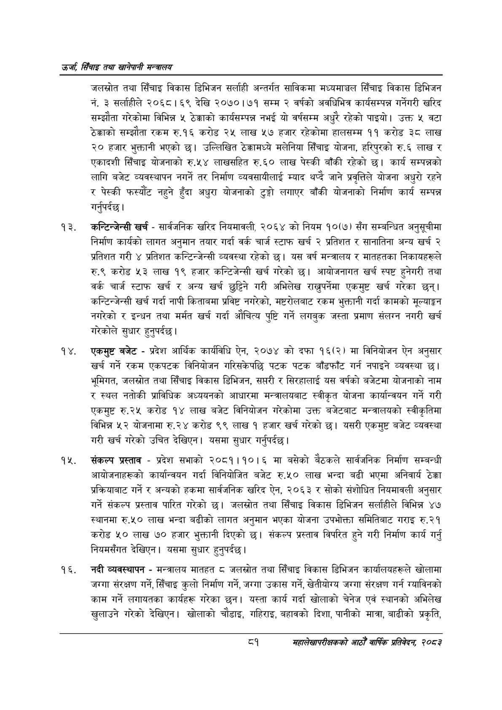

# Page 103 QA

## Rendered page


## Extracted text

```text
उर्जा सिँचाइ तथा खानेपानी
जलस्रोत तथा सिँचाइ विकास डिभिजन सर्लाही अन्तर्गत साविकमा मध्यमाञ्चल सिँचाइ विकास डिभिजन नं. ३ सर्लाहीले २०६८। ६९ देखि २०७०।७१ सम्म २ वर्षको अवधिभित्र कार्यसम्पन्न गर्नेगरी खरिद सम्झौता गरेकोमा विभिन्न ५ ठेक्काको कार्यसम्पन्न नभई यो वर्षसम्म अधुरै रहेको पाइयो। उक्त ५ वटा ठेक्काको सम्झौता रकम रु.१६ करोड २५ लाख ५७ हजार रहेकोमा हालसम्म ११ करोड ३८ लाख २० हजार भुक्तानी भएको छ। उल्लिखित ठेक्कामध्ये मलेनिया सिँचाइ योजना, हरिपुरको रु.६ लाख र एकादशी सिँचाइ योजनाको रु.५४ लाखसहित रु.६० लाख पेस्की बाँकी रहेको छ। कार्य सम्पन्नको लागि बजेट व्यवस्थापन नगर्ने तर निर्माण व्यवसायीलाई म्याद थप्दै जाने प्रवृत्तिले योजना अधुरो रहने र पेस्की फस्यौंट नहुने हुँदा अधुरा योजनाको टुङ्गो लगाएर बाँकी योजनाको निर्माण कार्य सम्पन्न गर्नुपर्दछ |
कन्टिन्जेन्सी खर्च -सार्वजनिक खरिद नियमावली, २०६४ को नियम १०(७) सँग सम्बन्धित अनुसूचीमा निर्माण कार्यको लागत अनुमान तयार गर्दा वर्क चार्ज स्टाफ खर्च २ प्रतिशत र सानातिना अन्य खर्च २ प्रतिशत गरी ४ प्रतिशत कन्टिन्जेन्सी व्यवस्था रहेको छ। यस वर्ष मन्त्रालय र मातहतका निकायहरूले रु.९ करोड ५३ लाख १९ हजार कन्टिजेन्सी खर्च गरेको छ। आयोजनागत खर्च स्पष्ट हुनेगरी तथा वर्क चार्ज स्टाफ खर्च र अन्य खर्च छुट्टिन गरी अभिलेख राख्नुपर्नेमा एकमुष्ट खर्च गरेका छन्‌। कन्टिन्जेन्सी खर्च गर्दा नापी किताबमा प्रविष्ट नगरेको, मष्टरोलबाट रकम भुक्तानी गर्दा कामको मूल्याङ्कन नगरेको र इन्धन तथा मर्मत खर्च गर्दा औचित्य पुष्टि गर्ने लगबुक जस्ता प्रमाण संलग्न नगरी खर्च गरेकोले सुधार हुनुपर्दछ |
एकमुष्ट बजेट -प्रदेश आर्थिक कार्यविधि ऐन, २०७४ को दफा १६(२) मा विनियोजन ऐन अनुसार खर्च गर्ने रकम एकपटक विनियोजन गरिसकेपछि पटक पटक बाँडफाँट गर्न नपाइने व्यवस्था छ। भूमिगत, जलस्रोत तथा सिँचाइ विकास डिभिजन, सप्तरी र सिरहालाई यस वर्षको बजेटमा योजनाको नाम र स्थल नतोकी प्राविधिक अध्ययनको आधारमा मन्त्रालयबाट स्वीकृत योजना कार्यान्वयन गर्ने गरी एकमुष्ट रु.२५ करोड १४ लाख बजेट विनियोजन गरेकोमा उक्त बजेटबाट मन्त्रालयको स्वीकृतिमा विभिन्न ५२ योजनामा रु.२४ करोड ९९ लाख १ हजार खर्च गरेको छ। यसरी एकमुष्ट बजेट व्यवस्था गरी खर्च गरेको उचित देखिएन। यसमा सुधार गर्नुपर्दछ |
संकल्प प्रस्ताव -प्रदेश सभाको २०८१।१०।६ मा बसेको बैठकले सार्वजनिक निर्माण सम्बन्धी आयोजनाहरूको कार्यान्वयन गर्दा विनियोजित बजेट रु.५० लाख भन्दा बढी भएमा अनिवार्य ठेक्का प्रक्रियाबाट गर्ने र अन्यको हकमा सार्वजनिक खरिद ऐन, २०६३ र सोको संशोधित नियमावली अनुसार गर्ने संकल्प प्रस्ताव पारित गरेको | जलस्रोत तथा सिँचाइ विकास डिभिजन सर्लाहीले विभिन्न ४७ स्थानमा रु.५० लाख भन्दा बढीको लागत अनुमान भएका योजना उपभोक्ता समितिबाट गराइ रु.२१ करोड ५० लाख ७० हजार भुक्तानी दिएको छ। संकल्प प्रस्ताव विपरित हुने गरी निर्माण कार्य गर्नु नियमसँगत देखिएन। यसमा सुधार हुनुपर्दछ |
नदी व्यवस्थापन -मन्त्रालय मातहत ८ जलस्रोत तथा सिँचाइ विकास डिभिजन कार्यालयहरूले खोलामा जग्गा संरक्षण गर्ने, सिँचाइ कुलो निर्माण गर्ने, जग्गा उकास गर्ने, खेतीयोग्य जग्गा संरक्षण गर्न ग्याविनको काम गर्ने लगायतका कार्यहरू गरेका | यस्ता कार्य गर्दा खोलाको चेनेज एवं स्थानको अभिलेख खुलाउने गरेको देखिएन। खोलाको चौडाइ, गहिराइ, बहावको दिशा, पानीको मात्रा, बाढीको प्रकृति,
९
महालेखापरीक्षकको वाषिकि प्रतिवेदन २०८२
```

## Flags
- None
