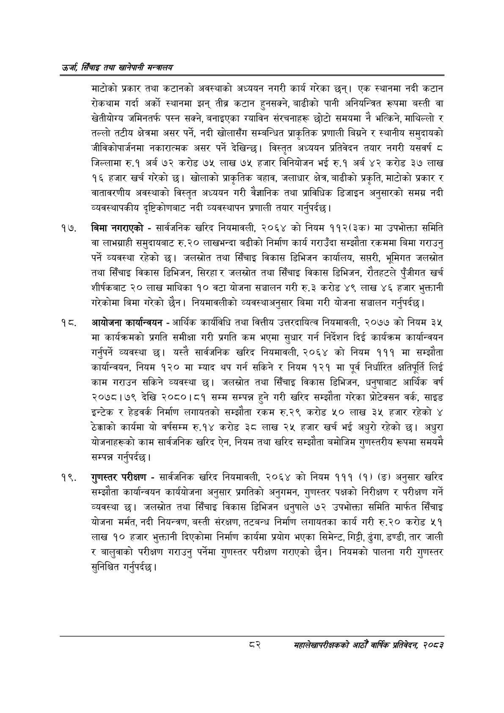

# Page 104 QA

## Rendered page


## Extracted text

```text
उर्जा सिँचाइ तथा खानेपानी
माटोको प्रकार तथा कटानको अवस्थाको अध्ययन नगरी कार्य गरेका छन्‌। एक स्थानमा नदी कटान रोकथाम गर्दा अर्को स्थानमा झन्‌ तीब्र कटान हुनसक्ने, बाढीको पानी अनियन्त्रित रूपमा बस्ती वा खेतीयोग्य जमिनतर्फ पस्न सक्ने, बनाइएका ग्याविन संरचनाहरू छोटो समयमा नै भत्किने, माथिल्लो र तल्लो तटीय क्षेत्रमा असर पर्ने, नदी खोलासँग सम्बन्धित प्राकृतिक प्रणाली बिग्रने र स्थानीय समुदायको जीविकोपार्जनमा नकारात्मक असर पर्ने देखिन्छ। विस्तृत अध्ययन प्रतिवेदन तयार नगरी यसवर्ष ८ जिल्लामा रु.१ अर्ब ७२ करोड ७५ लाख ७५ हजार विनियोजन भई रु.१ अर्ब ४२ करोड ३७ लाख १६ हजार खर्च गरेको | खोलाको प्राकृतिक बहाव, जलाधार क्षेत्र, बाढीको प्रकृति, माटोको प्रकार र वातावरणीय अवस्थाको विस्तृत अध्ययन गरी वैज्ञानिक तथा प्राविधिक डिजाइन अनुसारको समग्र नदी व्यवस्थापकीय दृष्टिकोणबाट नदी व्यवस्थापन प्रणाली तयार गर्नुपर्दछ |
बिमा नगराएको -सार्वजनिक खरिद नियमावली, २०६४ को नियम ११२(३क) मा उपभोक्ता समिति वा लाभग्राही समुदायबाट रु.२० लाखभन्दा बढीको निर्माण कार्य गराउँदा सम्झौता रकममा बिमा गराउनु पर्ने व्यवस्था रहेको जलस्रोत तथा सिँचाइ विकास डिभिजन कार्यालय, सप्तरी, भूमिगत जलस्रोत तथा सिँचाइ विकास डिभिजन, सिरहा र जलस्रोत तथा सिँचाइ विकास डिभिजन, रौतहटले पुँजीगत खर्च शीर्षकबाट २० लाख माथिका १० वटा योजना सञ्चालन गरी रु.३ करोड ४९ लाख ४६ हजार भुक्तानी गरेकोमा बिमा गरेको छैन। नियमावलीको व्यवस्थाअनुसार बिमा गरी योजना सञ्चालन गर्नुपर्दछ |
आयोजना कार्यान्वयन -आर्थिक कार्यविधि तथा वित्तीय उत्तरदायित्व नियमावली, २०७७ को नियम ३५ मा कार्यक्रमको प्रगति समीक्षा गरी प्रगति कम भएमा सुधार गर्न निर्देशन दिई कार्यक्रम कार्यान्वयन गर्नुपर्ने व्यवस्था छ। यस्तै सार्वजनिक खरिद नियमावली, २०६४ को नियम १११ मा सम्झौता कार्यान्वयन, नियम १२० मा म्याद थप गर्न सकिने र नियम १२१ मा पूर्व निर्धारित क्षतिपूर्ति लिई काम गराउन सकिने व्यवस्था छ। जलस्रोत तथा सिँचाइ विकास डिभिजन, धनुषाबाट आर्थिक वर्ष २०७८।७९ देखि २०८०।८१ सम्म सम्पन्न हुने गरी खरिद सम्झौता गरेका प्रोटेक्सन वर्क, साइड इन्टेक र हेडवर्क निर्माण लगायतको सम्झौता रकम रु.२९ करोड ५० लाख ३५ हजार रहेको ४ ठेक्काको कार्यमा यो वर्षसम्म रु.१४ करोड ३८ लाख २५ हजार खर्च भई अधुरो रहेको छ। अधुरा योजनाहरूको काम सार्वजनिक खरिद ऐन, नियम तथा खरिद सम्झौता बमोजिम गुणस्तरीय रूपमा समयमै सम्पन्न गर्नुपर्दछ |
गुणस्तर परीक्षण -सार्वजनिक खरिद नियमावली, २०६४ को नियम १११ (१) (ङ) अनुसार खरिद सम्झौता कार्यान्वयन कार्ययोजना अनुसार प्रगतिको अनुगमन, गुणस्तर पक्षको निरीक्षण र परीक्षण गर्ने व्यवस्था छ। जलस्रोत तथा सिँचाइ विकास डिभिजन धनुषाले ७२ उपभोक्ता समिति मार्फत सिँचाइ योजना मर्मत, नदी नियन्त्रण, बस्ती संरक्षण, तटबन्ध निर्माण लगायतका कार्य गरी रु.२० करोड ५१ लाख १० हजार भुक्तानी दिएकोमा निर्माण कार्यमा प्रयोग भएका सिमेन्ट, गिट्टी, ढुंगा, डण्डी, तार जाली र बालुवाको परीक्षण गराउनु पर्नेमा गुणस्तर परीक्षण गराएको छैन। नियमको पालना गरी गुणस्तर सुनिश्चित गर्नुपर्दछ।
महालेखापरीक्षकको वाषिकि प्रतिवेदन २०८२
```

## Flags
- None
