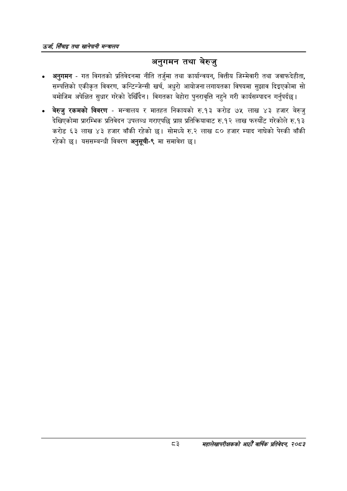

# Page 105 QA

## Rendered page


## Extracted text

```text
उर्जा सिँचाइ तथा खानेपानी
अनुगमन तथा बेरुजु
अनुगमन -गत विगतको प्रतिवेदनमा नीति तर्जुमा तथा कार्यान्वयन, वित्तीय जिम्मेवारी तथा जवाफदेहीता, सम्पत्तिको एकीकृत विवरण, कन्टिन्जेन्सी खर्च, अधुरो आयोजना लगायतका विषयमा सुझाव दिइएकोमा सो बमोजिम अपेक्षित सुधार गरेको देखिँदैन। विगतका बेहोरा पुनरावृत्ति नहुने गरी कार्यसम्पादन गर्नुपर्दछ |
बेरुजु रकमको विवरण -मन्त्रालय र मातहत निकायको रु.१३ करोड ७५ लाख ४३ हजार बेरुजु देखिएकोमा प्रारम्भिक प्रतिवेदन उपलब्ध गराएपछि प्राप्त प्रतिक्रियाबाट रु.१२ लाख फस्यौट गरेकोले रु.१३ करोड ६३ लाख ४३ हजार बाँकी रहेको छ। सोमध्ये रु.२ लाख ८० हजार म्याद नाघेको पेस्की बाँकी रहेको | यससम्बन्धी विवरण अनुसूची-९ मा समावेश |
३
महालेखापरीक्षकको वाषिकि प्रतिवेदन २०८२
```

## Flags
- None
