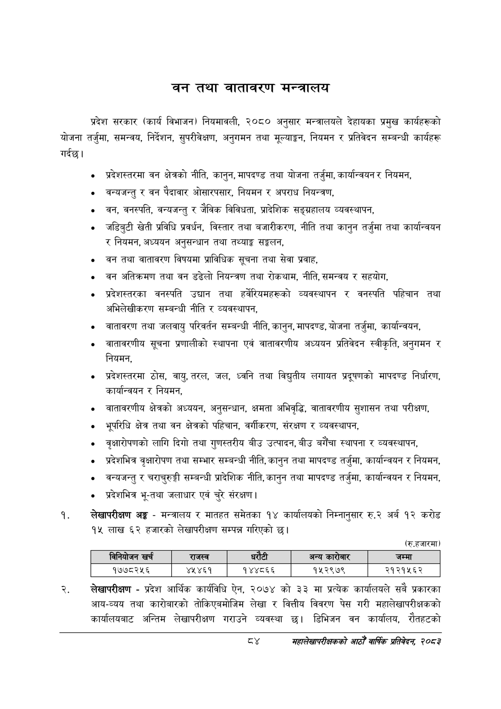

# Page 106 QA

## Rendered page


## Extracted text

```text
बनन तथा वातावरण मन्त्रालय
गर्दछ। प्रदेश सरकार (कार्य विभाजन) नियमावली, २०८० अनुसार मन्त्रालयले देहायका प्रमुख कार्यहरूको योजना तर्जुमा, समन्वय, निर्देशन, सुपरीवेक्षण, अनुगमन तथा मूल्याङ्कन, नियमन र प्रतिवेदन सम्बन्धी कार्यहरू
प्रदेशस्तरमा वन क्षेत्रको नीति, कानुन, मापदण्ड तथा योजना तर्जुमा, कार्यान्वयन र नियमन,
वन्यजन्तु र वन पैदावार ओसारपसार, नियमन र अपराध नियन्त्रण,
वन, वनस्पति, वन्यजन्तु र जैविक विविधता, प्रादेशिक सङ्ग्रहालय व्यवस्थापन,
जडिबुटी खेती प्रविधि प्रवर्धन, विस्तार तथा बजारीकरण, नीति तथा कानुन तर्जुमा तथा कार्यान्वयन र नियमन, अध्ययन अनुसन्धान तथा तथ्याङ्क सङ्लन,
वन तथा वातावरण विषयमा प्राविधिक सूचना तथा सेवा प्रवाह,
वन अतिक्रमण तथा वन डढेलो नियन्त्रण तथा रोकथाम, नीति, समन्वय र सहयोग,
प्रदेशस्तरका वनस्पति उद्यान तथा हर्वेरियमहरूको व्यवस्थापन र वनस्पति पहिचान तथा अभिलेखीकरण सम्बन्धी नीति र व्यवस्थापन,
वातावरण तथा जलवायु परिवर्तन सम्बन्धी नीति, कानुन, मापदण्ड, योजना तर्जुमा, कार्यान्वयन,
वातावरणीय सूचना प्रणालीको स्थापना एवं वातावरणीय अध्ययन प्रतिवेदन स्वीकृति, अनुगमन र नियमन,
प्रदेशस्तरमा ठोस, वायु, तरल, जल, ध्वनि तथा विद्युतीय लगायत प्रदूषणको मापदण्ड निर्धारण, कार्यान्वयन र नियमन,
वातावरणीय क्षेत्रको अध्ययन, अनुसन्धान, क्षमता अभिवृद्धि, वातावरणीय सुशासन तथा परीक्षण,
भूपरिधि क्षेत्र तथा वन क्षेत्रको पहिचान, वर्गीकरण, संरक्षण र व्यवस्थापन,
वृक्षारोपणको लागि दिगो तथा गुणस्तरीय बीउ उत्पादन, बीउ बगैँचा स्थापना र व्यवस्थापन,
प्रदेशभित्र वृक्षारोपण तथा सम्भार सम्बन्धी नीति, कानुन तथा मापदण्ड तर्जुमा, कार्यान्वयन र नियमन,
वन्यजन्तु र चराचुरुङ्गी सम्बन्धी प्रादेशिक नीति, कानुन तथा मापदण्ड तर्जुमा, कार्यान्वयन र नियमन,
प्रदेशभित्र भू-तथा जलाधार एवं चुरे संरक्षण |
लेखापरीक्षण अङ्ग -मन्त्रालय र मातहत समेतका १४ कार्यालयको निम्नानुसार रु.२ अर्ब १२ करोड १५ लाख ६२ हजारको लेखापरीक्षण सम्पन्न गरिएको छ।
(रु.हजारमा)
लेखापरीक्षण -प्रदेश आर्थिक कार्यविधि ऐन, २०७४ को ३३ मा प्रत्येक कार्यालयले सबै प्रकारका आय-व्यय तथा कारोबारको तोकिएबमोजिम लेखा र वित्तीय विवरण पेस गरी महालेखापरीक्षकको कार्यालयबाट अन्तिम लेखापरीक्षण गराउने व्यवस्था छु। डिभिजन वन कार्यालय, रौतहटको
४
महालेखापरीक्षकको आठौ वाषिकि प्रतिवेदन २०८२

|  |  | खर्च | राजस्व |  |  | अन्य कारोबार | जम्मा |
| --- | --- | --- | --- | --- | --- | --- | --- |
|  |  | १७७८२५६ | ४५४६१ | १४४८६६ |  | १५२९७९ | २१२१५६२ |
```

## Flags
- table_page
- medium_quality_table
