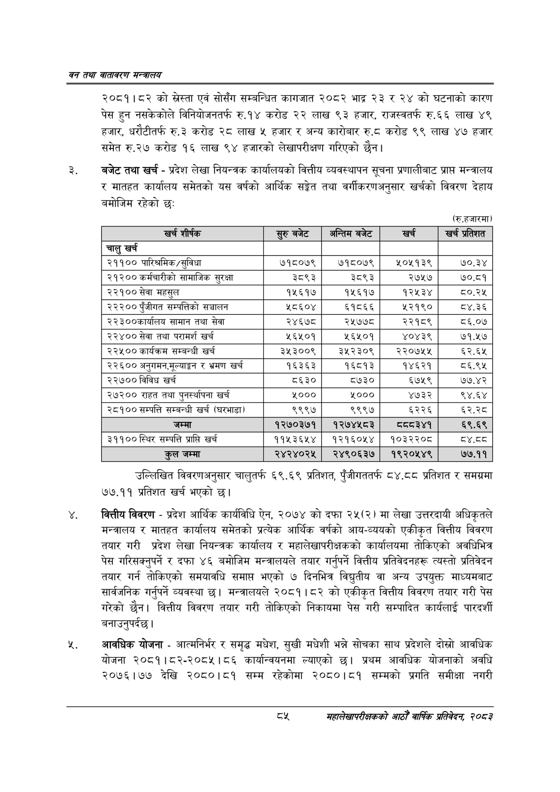

# Page 107 QA

## Rendered page


## Extracted text

```text
वन तथा वातावरण मन्त्रालय
२०८१।८२ को स्रेस्ता एवं सोसँग सम्बन्धित कागजात २०८२ भाद्र २३ र २४ को घटनाको कारण पेस हुन नसकेकोले विनियोजनतर्फ रु.१४ करोड २२ लाख ९३ हजार, राजस्वतर्फ रु.६६ लाख ४९ हजार, धरौटीतर्फ रु.३ करोड २८ लाख ५ हजार र अन्य कारोबार रु.८ करोड ९९ लाख ४७ हजार समेत रु.२७ करोड १६ लाख ९४ हजारको लेखापरीक्षण गरिएको छैन |
बजेट तथा खर्च -प्रदेश लेखा नियन्त्रक कार्यालयको वित्तीय व्यवस्थापन सूचना प्रणालीबाट प्राप्त मन्त्रालय र मातहत कार्यालय समेतको यस वर्षको आर्थिक सङ्गेत तथा वर्गीकरणअनुसार खर्चको विवरण देहाय बमोजिम रहेको छः
(रु.हजारमा)
उल्लिखित विवरणअनुसार चालुतर्फ ६९.६९ प्रतिशत, पुँजीगततर्फ ८४,८८ प्रतिशत र समग्रमा ७७.११ प्रतिशत खर्च भएको छ।
वित्तीय विवरण -प्रदेश आर्थिक कार्यविधि ऐन, २०७४ को दफा २५(२) मा लेखा उत्तरदायी अधिकृतले मन्त्रालय र मातहत कार्यालय समेतको प्रत्येक आर्थिक वर्षको आय-व्ययको एकीकृत वित्तीय विवरण तयार गरी प्रदेश लेखा नियन्त्रक कार्यालय र महालेखापरीक्षकको कार्यालयमा तोकिएको अवधिभित्र पेस गरिसक्नुपर्ने र दफा ४६ बमोजिम मन्त्रालयले तयार गर्नुपर्ने वित्तीय प्रतिवेदनहरू त्यस्तो प्रतिवेदन तयार गर्न तोकिएको समयावधि समाप्त भएको ७ दिनभित्र विद्युतीय वा अन्य उपयुक्त माध्यमबाट सार्वजनिक गर्नुपर्ने व्यवस्था छ। मन्त्रालयले २०८१।८२ को एकीकृत वित्तीय विवरण तयार गरी पेस गरेको छैन। वित्तीय विवरण तयार गरी तोकिएको निकायमा पेस गरी सम्पादित कार्यलाई पारदर्शी बनाउनुपर्दछ |
आवधिक योजना -आत्मनिर्भर र समृद्ध मधेश, सुखी मधेशी भन्ने सोचका साथ प्रदेशले दोत्रो आवधिक योजना २०८१।८२-२०८५।८६ कार्यान्वयनमा ल्याएको छ। प्रथम आवधिक योजनाको अवधि २०७६।७७ देखि २०८०।८१ सम्म रहेकोमा २०८०।८१ सम्मको प्रगति समीक्षा नगरी
दश
महालेखापरीक्षकको आठौ वाषिकि प्रतिवेदन २०८२

| खच शीर्षक | र्रुबबेट | अन्तिम बजेट | खर्च | खच प्रतेशत |
| --- | --- | --- | --- | --- |
| चालु खर्च |  |  |  |  |
| २११०० पारिश्रमिक/सुविधा | ७१८०७९ | ७१८०७९ | २०५१३९ | ७०.३४ |
| २१२०० कर्मचारीको सामाजिक सुरक्षा | ३८९३ | ३८९३ | २७५७ | ७०.८१ |
| २२१०० सेवा महसुल | १५६१७ | १५६१७ | १२५३४ | ८०.२५ |
| २२२०० पुँजीगत सम्पत्तिको सञ्चालन | श८६०४ | ६१८६६ | ५२१९० | ८४.३६ |
| २२३००कार्थालय सामान तथा सेवा | २४६७८ | २५७७८ | २२१८९ | ८६.०७ |
| २२४०० सेवा तथा परामर्श खर्च | २६५०१ | ५६४५०१ | ४०४३९ | ७१.५७ |
| २२५०० कार्यक्रम सम्बन्धी खर्च | ३५३००९ | ३५२३०९ | २२०७५५ | ६२.६४५ |
| २२६०० अनुनमन,भूल्याङ्गन र भ्रमण खर्च | १६३६३ | १६८१३ | १४६२१ | ८६.९५ |
| २२७०० विविध खर्च | ८६३० | ८७३० | ६७५९ | ७७.४२ |
| २७२०० राहत तथा पुनर्स्थापना खर्च | ५००० | ५००० | ४७३२ | ९४.६४ |
| २८१०० सम्पत्ति सम्बन्धी खर्च (घरभाडा) | ९९९७ | ९९९७ | ६२२६ | ६२.२८ |
| जम्मा | १२७०३७१ | १२७४५८३ | द्वय ३४१ | ६९.६९ |
| ३११०० स्थिर सम्पत्ति प्राप्ति खर्च | ११५३६५४ | १२१६०५४ | १०३२२०८ | ८.८ |
| कुल जम्मा | २४२४०२५ | २४९०६३७ | १९२०५४९ | ७७.११ |
```

## Flags
- table_page
- medium_quality_table
