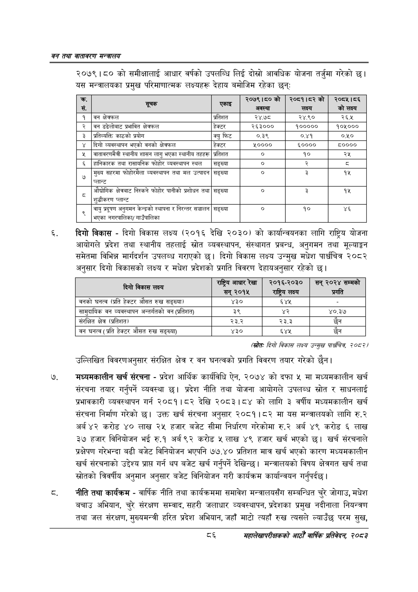

# Page 108 QA

## Rendered page


## Extracted text

```text
वन तथा वातावरण मन्त्रालय
२०७९।८० को समीक्षालाई आधार वर्षको उपलब्धि लिई दोस्रो आवधिक योजना तर्जुमा गरेको छ। यस मन्त्रालयका प्रमुख परिमाणात्मक लक्ष्यहरू देहाय बमोजिम रहेका छन्‌
दिगो विकास -दिगो विकास लक्ष्य (२०१६ देखि २०३०) को कार्यान्वयनका लागि राष्ट्रिय योजना आयोगले प्रदेश तथा स्थानीय तहलाई स्रोत व्यवस्थापन, संस्थागत प्रबन्ध, अनुगमन तथा मूल्याङ्कन समेतमा विभिन्न मार्गदर्शन उपलब्ध गराएको छ। दिगो विकास लक्ष्य उन्मुख मधेश पार्धचित्र २०८२ अनुसार दिगो विकासको लक्ष्य र मधेश प्रदेशको प्रगति विवरण देहायअनुसार रहेको छ।
(स्रोतः दिगो विकास लक्ष्य उन्मुख +, २०८२/
उल्लिखित विवरणअनुसार संरक्षित क्षेत्र र वन घनत्वको प्रगति विवरण तयार गरेको छैन।
मध्यमकालीन खर्च संरचना -प्रदेश आर्थिक कार्यविधि ऐन, २०७४ को दफा मा मध्यमकालीन खर्च संरचना तयार गर्नुपर्ने व्यवस्था छ। प्रदेश नीति तथा योजना आयोगले उपलब्ध स्रोत र साधनलाई प्रभावकारी व्यवस्थापन गर्न २०८१।८२ देखि २०८३।८४ को लागि ३ वर्षीय मध्यमकालीन खर्च संरचना निर्माण गरेको छ। उक्त खर्च संरचना अनुसार २०८१।८२ मा यस मन्त्रालयको लागि रु.२ अर्ब ४२ करोड ४० लाख २४ हजार बजेट सीमा निर्धारण गरेकोमा रु.२ अर्ब ४९ करोड लाख ३७ हजार विनियोजन भई रु.१ अर्ब ९२ करोड ५ लाख ४९ हजार खर्च भएको छ। खर्च संरचनाले प्रक्षेपण गरेभन्दा बढी बजेट विनियोजन भएपनि ७७.४० प्रतिशत मात्र खर्च भएको कारण मध्यमकालीन खर्च संरचनाको उद्देश्य प्राप्त गर्न थप बजेट खर्च गर्नुपर्ने देखिन्छ। मन्त्रालयको विषय क्षेत्रगत खर्च तथा स्रोतको त्रिवर्षीय अनुमान अनुसार बजेट विनियोजन गरी कार्यक्रम कार्यान्वयन गर्नुपर्दछ |
नीति तथा कार्यक्रम -वार्षिक नीति तथा कार्यक्रममा समावेश मन्त्रालयसँग सम्बन्धित चुरे जोगाउ, मधेश बचाउ अभियान, चुरे संरक्षण सम्वाद, सहरी जलाधार व्यवस्थापन, प्रदेशका प्रमुख नदीनाला नियन्त्रण तथा जल संरक्षण, मुख्यमन्त्री हरित प्रदेश अभियान, जहाँ माटो त्यहाँ रुख त्यसले ल्याउँछ परम सुख,
८६
महालेखापरीक्षकको आठौ वाषिकि प्रतिवेदन २०८२

| क. रस |  |  | २०७९।८०को अवस्था | २०८१।८२को लक्ष्य | २०८५।८६ को लक्ष्य |
| --- | --- | --- | --- | --- | --- |
| १ | बन क्षेत्रफल | प्रतिशत | २४.७८ | २४.९० | २६.५ |
| २ | वन ङढलो१८ प्रभावित क्षेत्रफल | हेक्टर | २६३००० | १००००० | १०४५००० |
| ३ | श्रतिव्वत्ति काठको प्रयोग | क्यु फिट | ०.३९ | ०.४१ | ०.४५० |
| ४ | दिगो व्यवस्थापन भएको वनको क्षेत्रफल | हेक्टर | %०००० | ६०००० | ५०००० |
| ५ | वातावरणमैत्री स्थानीय शासन लागु भएका स्थानीय तहहरू | प्रतिशत | ० | १० | २५ |
| ६ | हानिकारक तथा साकनिक फोहोर व्यवस्थापन स्थल | सङ्ख्या | ० | र |  |
| ७ | सहरमा फोहोरमैला व्यवस्थापन तथा मल उत्पादन प्लान्ट | सङ्ख्या | ० | ३ | ९% |
| ८ | आँच्चोगिक क्षेत्रबाट निस्कने फोहोर पानीको प्रशोधन तथा प्लान्ट | सङ्ख्या | ० | ३ | १५ |
| ९ | वायु प्रदूषण अनुगमन केन्द्रको स्थापना र निरन्तर सञ्चालन भएका नगरपालिका नाउँपालिका | सङ्ख्या | ० | १० | ४६ |

| दिगो विकास लक्ष्य | राष्ट्रिय आधार रेखा सन्‌ २०१५ | २०१६-२०३० राष्ट्रिय लक्ष्य |
| --- | --- | --- |
| वनको घनत्व (प्रति हेक्टर औसत रुख सङ्ख्या) | ४३० | ६४४५ |
| सासुदाधिक वन व्यवस्थापन अन्तर्गतको वन (प्रतिशत) | ३९ |  |
| संरक्षित क्षेत्र (प्रतिशत) | २३.२ | २३.३ |
| वन घनत्व ( प्रति हेक्टर औसत रुख सङ्ख्या) | ४३० | ६४५ |
```

## Flags
- table_page
- medium_quality_table
