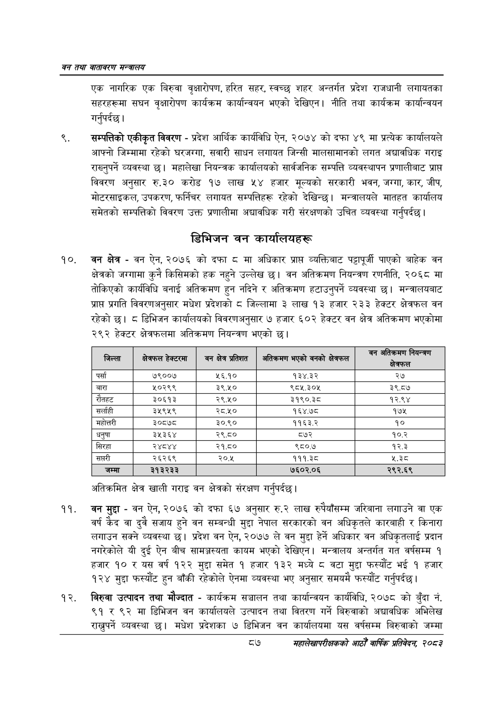

# Page 109 QA

## Rendered page


## Extracted text

```text
वन तथा वातावरण मन्त्रालय
एक नागरिक एक बिरुवा वृक्षारोपण, हरित सहर, स्वच्छ शहर अन्तर्गत प्रदेश राजधानी लगायतका सहरहरूमा सघन वृक्षारोपण कार्यक्रम कार्यान्वयन भएको देखिएन। नीति तथा कार्यक्रम कार्यान्वयन गर्नुपर्दछ |
सम्पत्तिको एकीकृत विवरण -प्रदेश आर्थिक कार्यविधि ऐन, २०७४ को दफा ४९ मा प्रत्येक कार्यालयले आफ्नो जिम्मामा रहेको घरजग्गा, सवारी साधन लगायत जिन्सी मालसामानको लगत अद्यावधिक गराइ राख्नुपर्ने व्यवस्था | महालेखा नियन्त्रक कार्यालयको सार्वजनिक सम्पत्ति व्यवस्थापन प्रणालीबाट प्राप्त विवरण अनुसार रु.३० करोड १७ लाख ५४ हजार मूल्यको सरकारी भवन, जग्गा, कार, जीप, मोटरसाइकल, उपकरण, फर्निचर लगायत सम्पत्तिहरू रहेको देखिन्छ। मन्त्रालयले मातहत कार्यालय समेतको सम्पत्तिको विवरण उक्त प्रणालीमा अद्यावधिक गरी संरक्षणको उचित व्यवस्था गर्नुपर्दछ।
डिभिजन वन कार्यालयहरू
वन क्षेत्र -वन ऐन, २०७६ को दफा मा अधिकार प्राप्त व्यक्तिबाट पट्टापूर्जी पाएको बाहेक वन क्षेत्रको जग्गामा कुनै किसिमको हक नहुने उल्लेख छ। वन अतिक्रमण नियन्त्रण रणनीति, २०६८ मा तोकिएको कार्यविधि बनाई अतिक्रमण हुन नदिने र अतिक्रमण हटाउनुपर्ने व्यवस्था छ। मन्त्रालयबाट प्राप्त प्रगति विवरणअनुसार मधेश प्रदेशको ८ जिल्लामा ३ लाख ९३ हजार २३३ हेक्टर क्षेत्रफल वन रहेको | ठ डिभिजन कार्यालयको विवरणअनुसार ७ हजार ६०२ हेक्टर वन क्षेत्र अतिक्रमण भएकोमा २९२ हेक्टर क्षेत्रफलमा अतिक्रमण नियन्त्रण भएको |
अतिक्रमित क्षेत्र खाली गराइ वन क्षेत्रको संरक्षण गर्नुपर्दछ |
वन मुद्दा -वन ऐन, २०७६ को दफा ६७ अनुसार रु.२ लाख रुपैयाँसम्म जरिवाना लगाउने वा एक वर्ष कैद वा दुवै सजाय हुने वन सम्बन्धी मुद्दा नेपाल सरकारको वन अधिकृतले कारबाही र किनारा लगाउन सक्ने व्यवस्था छ। प्रदेश वन ऐन, २०७७ ले वन मुद्दा हेर्ने अधिकार वन अधिकृतलाई प्रदान नगरेकोले यी दुई ऐन बीच सामञ्जस्यता कायम भएको देखिएन। मन्त्रालय अन्तर्गत गत वर्षसम्म १ हजार १० र यस वर्ष १२२ मुद्दा समेत १ हजार १३२ मध्ये ८ वटा मुद्दा फस्यौट भई १ हजार १२४ मुद्दा फस्यौट हुन बाँकी रहेकोले ऐनमा व्यवस्था भए अनुसार समयमै फस्यौंट गर्नुपर्दछ |
बिरुवा उत्पादन तथा मौज्दात -कार्यक्रम सञ्चालन तथा कार्यान्वयन कार्यविधि, २०७८ को बुँदा नं. ९१ र ९२ मा डिभिजन वन कार्यालयले उत्पादन तथा वितरण गर्ने बिरुवाको अद्यावधिक अभिलेख राख्नुपर्ने व्यवस्था मधेश प्रदेशका ७ डिभिजन वन कार्यालयमा यस वर्षसम्म बिरुवाको जम्मा
८७
महालेखापरीक्षकको आठौ वाषिकि प्रतिवेदन २०८२

| जिल्ला | क्षेत्रफल हेक्टरमा | वन क्षेत्र प्रतिशत | आतन्ःमण भएको वनको क्षेत्रफल |
| --- | --- | --- | --- |
| पर्सा | ७९००७ | ५६.१० | १३४.३२ |
| बारा | ५०२९९ | ३९.५० | ९८५.३०५ |
| रौतहट | ३०६१३ | २९.५० | ३१९०.३८ |
| सर्लाही | ३५९५९ | २८.५० | १६४.७८ |
| महोत्तरी | ३०८७८ | ३०.९० | ११६३.२ |
| धनुषा | ३५३६४ | २९.८० | ८७२ |
| सिरहा | २४८४४ | २१.८० | ९८०.७ |
| सप्तरी | २६२६९ | २०.५ | १११.३८ |
| जम्मा | ३१३२३३ |  | ७६०२.०६ |
```

## Flags
- table_page
- medium_quality_table
