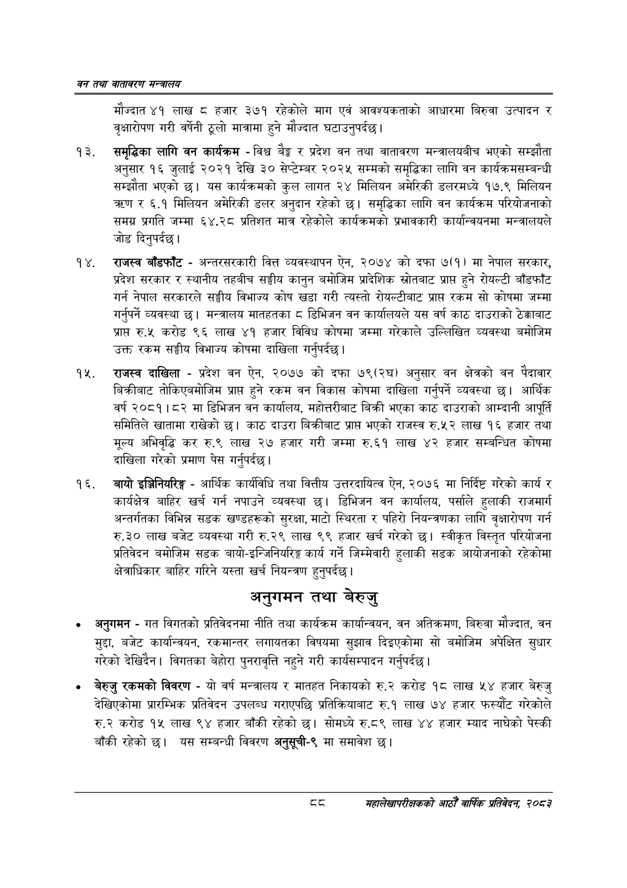

# Page 110 QA

## Rendered page


## Extracted text

```text
वन तथा वातावरण मन्त्रालय
मौज्दात ४१ लाख © हजार ३७१ रहेकोले माग एवं आवश्यकताको आधारमा बिरुवा उत्पादन र वृक्षारोपण गरी वर्षेनी ठूलो मात्रामा हुने मौज्दात घटाउनुपर्दछ।
समृद्धिका लागि वन कार्यक्रम -विश्व बैङ्क र प्रदेश वन तथा वातावरण मन्त्रालयबीच भएको सम्झौता अनुसार १६ जुलाई २०२१ देखि ३० सेप्टेम्बर २०२५ सम्मको समृद्धिका लागि वन कार्यक्रमसम्बन्धी सम्झौता भएको छ। यस कार्यक्रमको कुल लागत २४ मिलियन अमेरिकी डलरमध्ये १७.९ मिलियन तरण र ६.१ मिलियन अमेरिकी डलर अनुदान रहेको छ। समृद्धिका लागि वन कार्यक्रम परियोजनाको समग्र प्रगति जम्मा ६४.२८ प्रतिशत मात्र रहेकोले कार्यक्रमको प्रभावकारी कार्यान्वयनमा मन्त्रालयले जोड दिनुपर्दछ।
राजस्व बाँडफाँट -अन्तरसरकारी वित्त व्यवस्थापन ऐन, २०७४ को दफा ७(१) मा नेपाल सरकार, प्रदेश सरकार र स्थानीय तहबीच सङ्घीय कानुन बमोजिम प्रादेशिक स्रोतबाट प्राप्त हुने रोयल्टी बाँडफाँट गर्न नेपाल सरकारले सङ्घीय विभाज्य कोष खडा गरी त्यस्तो रोयल्टीबाट प्राप रकम सो कोषमा जम्मा गर्नुपर्ने व्यवस्था | मन्त्रालय मातहतका डिभिजन वन कार्यालयले यस वर्ष काठ दाउराको ठेक्काबाट प्रापत रु.« करोड ९६ लाख ४१ हजार विविध कोषमा जम्मा गरेकाले उल्लिखित व्यवस्था बमोजिम उक्त रकम सङ्घीय विभाज्य कोषमा दाखिला गर्नुपर्दछ |
राजस्व दाखिला -प्रदेश वन ऐन, २०७७ को दफा ७९(२घ) अनुसार वन क्षेत्रको वन पैदावार बिक्रीबाट तोकिएबमोजिम प्राप्त हुने रकम वन विकास कोषमा दाखिला गर्नुपर्ने व्यवस्था | आर्थिक वर्ष २०८१।८२ मा डिभिजन वन कार्यालय, महोत्तरीबाट बिक्री भएका काठ दाउराको आम्दानी आपूर्ति समितिले खातामा राखेको छ। काठ दाउरा बिक्रीबाट प्रापत भएको राजस्व रु.५२ लाख १६ हजार तथा मूल्य अभिवृद्धि कर रु.९ लाख २७ हजार गरी जम्मा रु.६१ लाख ४२ हजार सम्बन्धित कोषमा दाखिला गरेको प्रमाण पेस गर्नुपर्दछ |
बायो इञ्जिनियरिङ्ग -आर्थिक कार्यविधि तथा वित्तीय उत्तरदायित्व ऐन, २०७६ मा निर्दिष्ट गरेको कार्य र कार्यक्षेत्र बाहिर खर्च गर्न नपाउने व्यवस्था छ। डिभिजन वन कार्यालय, पर्साले हुलाकी राजमार्ग अन्तर्गतका विभिन्न सडक खण्डहरूको सुरक्षा, माटो स्थिरता र पहिरो नियन्त्रणका लागि वृक्षारोपण गर्न रु.३० लाख बजेट व्यवस्था गरी रु.२९ लाख ९९ हजार खर्च गरेको छ। स्वीकृत विस्तृत परियोजना प्रतिवेदन बमोजिम सडक बायो-इन्जिनियरिङ्ग कार्य गर्ने जिम्मेवारी हुलाकी सडक आयोजनाको रहेकोमा क्षेत्राधिकार बाहिर गरिने यस्ता खर्च नियन्त्रण हुनुपर्दछ |
अनुगमन तथा बेरुजु
० अनुगमन -गत विगतको प्रतिवेदनमा नीति तथा कार्यक्रम कार्यान्वयन, वन अतिक्रमण, बिरुवा मौज्दात, वन मुद्दा, बजेट कार्यान्वयन, रकमान्तर लगायतका विषयमा सुझाव दिइएकोमा सो बमोजिम अपेक्षित सुधार गरेको देखिदैन। विगतका बेहोरा पुनरावृत्ति नहुने गरी कार्यसम्पादन गर्नुपर्दछ |
बेरुजु रकमको विवरण -यो वर्ष मन्त्रालय र मातहत निकायको रु.२ करोड १८ लाख ५४ हजार बेरुजु देखिएकोमा प्रारम्भिक प्रतिवेदन उपलब्ध गराएपछि प्रतिक्रियाबाट रु.१ लाख ७४ हजार फस्यौट गरेकोले रु.२ करोड १४५ लाख ९४ हजार बाँकी रहेको छ। सोमध्ये रु.८९ लाख ४४ हजार म्याद नाघेको पेस्की बाँकी रहेको छ। यस सम्बन्धी विवरण अनुसूची-९ मा समावेश छ।
द्द
महालेखापरीक्षकको आठौ वाषिकि प्रतिवेदन २०८२
```

## Flags
- None
