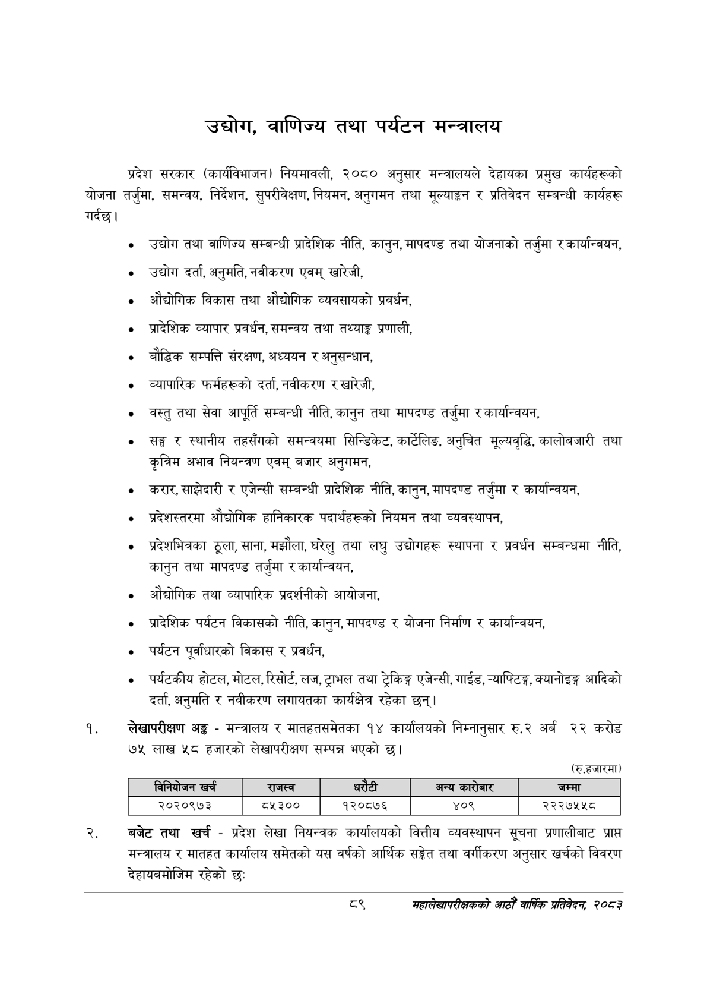

# Page 111 QA

## Rendered page


## Extracted text

```text
उद्योग, वाणिज्य तथा पर्यटन मन्त्रालय
प्रदेश सरकार (कार्यविभाजन) नियमावली, २०८० अनुसार मन्त्रालयले देहायका प्रमुख कार्यहरूको योजना तर्जुमा, समन्वय, निर्देशन, सुपरीवेक्षण, नियमन, अनुगमन तथा मूल्याङ्कन र प्रतिवेदन सम्बन्धी कार्यहरू गर्दछ।
० उद्योग तथा वाणिज्य सम्बन्धी प्रादेशिक नीति, कानुन, मापदण्ड तथा योजनाको तर्जुमा र कार्यान्वयन,
० उद्योग दर्ता, अनुमति, नवीकरण एवम्‌ खारेजी,
औद्योगिक विकास तथा औद्योगिक व्यवसायको प्रवर्धन,
० प्रादेशिक व्यापार प्रवर्धन, समन्वय तथा तथ्याङ्क प्रणाली,
० बौद्धिक सम्पत्ति संरक्षण, अध्ययन र अनुसन्धान,
व्यापारिक फर्महरूको दर्ता, नवीकरण र खारेजी,
० वस्तु तथा सेवा आपूर्ति सम्बन्धी नीति, कानुन तथा मापदण्ड तर्जुमा र कार्यान्वयन,
सङ्ग र स्थानीय तहसँगको समन्वयमा सिन्डिकेट, कार्टेलिङ, अनुचित मूल्यवृद्धि, कालोबजारी तथा कृत्रिम अभाव नियन्त्रण एवम्‌ बजार अनुगमन,
करार,साझेदारी र एजेन्सी सम्बन्धी प्रादेशिक नीति, कानुन, मापदण्ड तर्जुमा र कार्यान्वयन,
० प्रदेशस्तरमा औद्योगिक हानिकारक पदार्थहरूको नियमन तथा व्यवस्थापन,
० प्रदेशभित्रका ठूला, साना, मझौला, घरेलु तथा लघु उद्योगहरू स्थापना र प्रवर्धन सम्बन्धमा नीति, कानुन तथा मापदण्ड तर्जुमा र कार्यान्वयन,
औद्योगिक तथा व्यापारिक प्रदर्शनीको आयोजना,
० प्रादेशिक पर्यटन विकासको नीति, कानुन, मापदण्ड र योजना निर्माण र कार्यान्वयन,
«० पर्यटन पूर्वाधारको विकास र प्रवर्धन,
० पर्यटकीय होटल, मोटल, रिसोर्ट, लज, ट्राभल तथा ट्रेकिङ्ग एजेन्सी, गाईड, -याफ्टिङ्ग, क्यानोइङ्ग आदिको दर्ता, अनुमति र नवीकरण लगायतका कार्यक्षेत्र रहेका छन्‌।
लेखापरीक्षण अङ्ग -मन्त्रालय र मातहतसमेतका १४ कार्यालयको निम्नानुसार रु.२ अर्ब २२ करोड ७५ लाख ४५८ हजारको लेखापरीक्षण सम्पन्न भएको छ।
(रु.हजारमा)
बजेट तथा खर्च -प्रदेश लेखा नियन्त्रक कार्यालयको वित्तीय व्यवस्थापन सूचना प्रणालीबाट प्राप्त मन्त्रालय र मातहत कार्यालय समेतको यस वर्षको आर्थिक सङ्ेत तथा वर्गीकरण अनुसार खर्चको विवरण देहायबमोजिम रहेको छः
महालेखापरीक्षकको वाषिकि प्रतिवेदन २०८२

|  |  | ।'ननपोजन खरी |  | राजस्व |  |  | अन्य बररेजार | जम्मा |
| --- | --- | --- | --- | --- | --- | --- | --- | --- |
|  |  | २०२०९७३ |  | ८५३०० | १२०८७६ |  | ४०९ | २२२७५५८ |
```

## Flags
- table_page
- medium_quality_table
