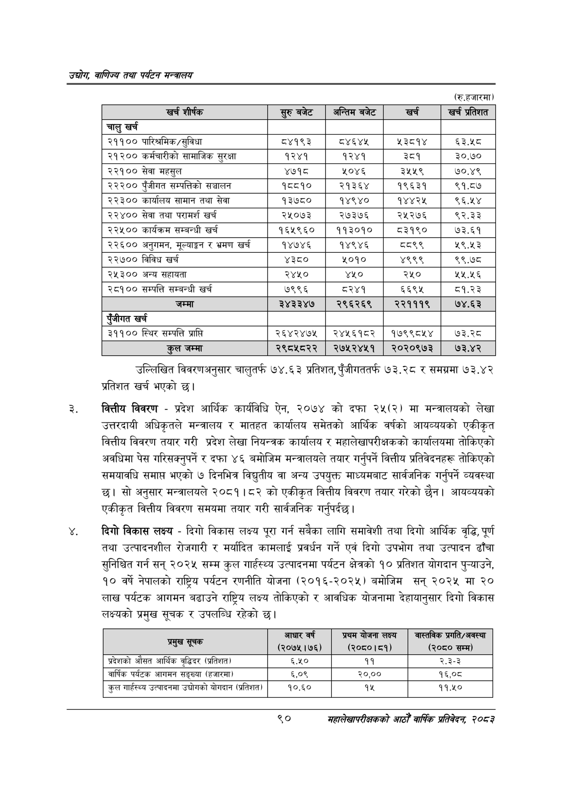

# Page 112 QA

## Rendered page


## Extracted text

```text
उद्योग वाणिज्य तथा पर्यटन सन्वालय
(रु.हजारमा)
उल्लिखित विवरणअनुसार चालुतर्फ ७४.६३ प्रतिशत, पुँजीगततर्फ ७३.२८ र समग्रमा ७३.४२ प्रतिशत खर्च भएको |
वित्तीय विवरण -प्रदेश आर्थिक कार्यविधि ऐन, २०७४ को दफा २५(२) मा मन्त्रालयको लेखा उत्तरदायी अधिकृतले मन्त्रालय र मातहत कार्यालय समेतको आर्थिक वर्षको आयव्ययको एकीकृत वित्तीय विवरण तयार गरी प्रदेश लेखा नियन्त्रक कार्यालय र महालेखापरीक्षकको कार्यालयमा तोकिएको अवधिमा पेस गरिसक्नुपर्ने र दफा ४६ बमोजिम मन्त्रालयले तयार गर्नुपर्ने वित्तीय प्रतिवेदनहरू तोकिएको समयावधि समाप्त भएको ७ दिनभित्र विद्युतीय वा अन्य उपयुक्त माध्यमबाट सार्वजनिक गर्नुपर्ने व्यवस्था | सो अनुसार मन्त्रालयले २०८१।८२ को एकीकृत वित्तीय विवरण तयार गरेको छैन। आयव्ययको एकीकृत वित्तीय विवरण समयमा तयार गरी सार्वजनिक गर्नुपर्दछ |
दिगो विकास लक्ष्य -दिगो विकास लक्ष्य पूरा गर्न सबैका लागि समावेशी तथा दिगो आर्थिक वृद्धि, पूर्ण तथा उत्पादनशील रोजगारी र मर्यादित कामलाई प्रवर्धन गर्ने एवं दिगो उपभोग तथा उत्पादन ढाँचा सुनिश्चित गर्न सन्‌ २०२५ सम्म कुल गार्हस्थ्य उत्पादनमा पर्यटन क्षेत्रको १० प्रतिशत योगदान पुन्याउने, १० वर्षे नेपालको राष्ट्रिय पर्यटन रणनीति योजना (२०१६-२०२५) बमोजिम सन्‌ २०२५ मा ० लाख पर्यटक आगमन बढाउने राष्ट्रिय लक्ष्य तोकिएको र आवधिक योजनामा देहायानुसार दिगो विकास लक्ष्यको प्रमुख सूचक र उपलब्धि रहेको छ।
९०
महालेखापरीक्षकको आठौ वाषिकि प्रतिवेदन २०८२

| खरी शीष्क |  | अन्तिम बजेट | खर्च | खर्च प्रतिशत |
| --- | --- | --- | --- | --- |
| चालु खर्च |  |  |  |  |
| २११०० पारिश्रमिक/सुविधा | ८४१९३ | ४६४५ | ५३८१४ | ६३.५८ |
| २१२०० कर्मचारीको सामाजिक सुरक्षा | १२४१ | १२४१ | ३८१ | ३०.७० |
| २२१०० सेवा महसुल | ४७१८ | ५०४६ | ३५५९ | ७०.४९ |
| २२२०० पुँजीगत सम्पत्तिको सञ्चालन | १८८१० | २१३६४ | १९६३१ | ९१.८७ |
| २२३०० कार्यालष सामान तथा सेवा | १३७८० | १४९४० | १४४२४५ | ९६.५४ |
| २२४०० सेवा तथा परामर्श खर्च | २५०७३ | २७३७६ | २५२७६ | ९२.३३ |
| २२५०० कार्यक्रम सम्बन्धी खर्च | १६५९६० | ११३०१० | ८३१९० | ७३.६१ |
| २२६०० अनुगमन, र भ्रमण खर्च | १४७४६ | १४९४६ | दव९९ | २९.४३ |
| २२७०० विविध खर्च | ४३८० | ५०१० | ४९९९ | ९९.७८ |
| २५३०० अन्य सहायता | २४५० | ४० | २५० | २.६ |
| २८१०० सम्पत्ति सम्बन्धी खर्च | ७९९६ | ८२४१ | ६६९५ | ८१.२३ |
| जम्मा | ३४३३४७ | २९६२६९ | २२१११९ | ७४.६३ |
| पुँजीगत खर्च |  |  |  |  |
| ३११०० स्थिर सम्पत्ति प्राप्ति | २६४२४७५ | २४५६१८२ | १७९९८५४ | ७३.२८ |
| कुल जम्मा | २९८५८२२ | २७५२४५१ | २०२०९७३ | ७३.४२ |

| प्रमुख सूचक | आधार वर्ष (२०७५।७६) | प्रथम योजना लक्ष्य (२०६०।८१) | प्रगति/अवस्था (२०८० सम्म) |
| --- | --- | --- | --- |
| प्रदेशको औसत आर्थिक वृद्धिदर (प्रतिशत) | ६.५० | ११ | २.३-३ |
| वार्षिक पर्यटक आगमन सङ्ख्या (हजारमा) | ६,०९ | २०,०० | १६,०८ |
| कुल गार्हस्थ्य उत्पादनमा उद्योगको योगदान (प्रतिशत) | १०.६० | १५ | ११.५० |
```

## Flags
- table_page
- medium_quality_table
