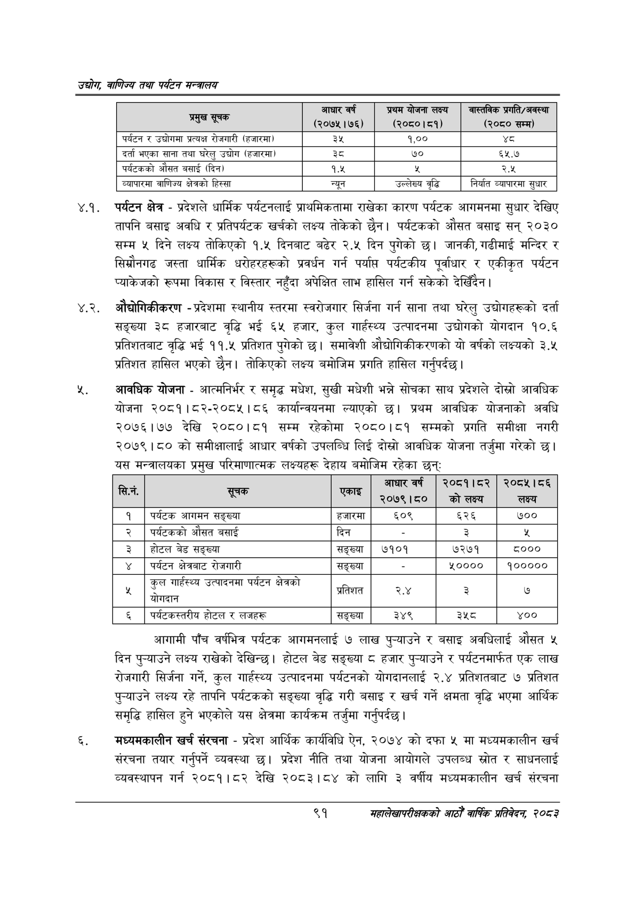

# Page 113 QA

## Rendered page


## Extracted text

```text
उद्योग वाणिज्य तथा पर्यटन सन्वालय
४.१. पर्यटन क्षेत्र -प्रदेशले धार्मिक पर्यटनलाई प्राथमिकतामा राखेका कारण पर्यटक आगमनमा सुधार देखिए तापनि बसाइ अवधि र प्रतिपर्यटक खर्चको लक्ष्य तोकेको छैन। पर्यटकको औसत बसाइ सन्‌ २०३० सम्म ५ दिने लक्ष्य तोकिएको १.५ दिनबाट बढेर २.५ दिन पुगेको छ। जानकी, गढीमाई मन्दिर र सिम्रौनगढ जस्ता धार्मिक धरोहरहरूको प्रवर्धन गर्न पर्याप्त पर्यटकीय पूर्वाधार र एकीकृत पर्यटन प्याकेजको रूपमा विकास र विस्तार नहुँदा अपेक्षित लाभ हासिल गर्न सकेको देखिँदैन।
४.२. औद्योगिकीकरण -प्रदेशमा स्थानीय स्तरमा स्वरोजगार सिर्जना गर्न साना तथा घरेलु उद्योगहरूको दर्ता सङ्ख्या ३८ हजारबाट वृद्धि भई ६५ हजार, कुल गार्हस्थ्य उत्पादनमा उद्योगको योगदान १०.६ प्रतिशतबाट वृद्धि भई ११.५ प्रतिशत पुगेको | समावेशी औद्योगिकीकरणको यो वर्षको लक्ष्यको ३.५ प्रतिशत हासिल भएको छैन। तोकिएको लक्ष्य बमोजिम प्रगति हासिल गर्नुपर्दछ |
आवधिक योजना -आत्मनिर्भर र समृद्ध मधेश, सुखी मधेशी भन्ने सोचका साथ प्रदेशले दोस्रो आवधिक योजना २०८१।८२-२०८५।८६ कार्यान्वयनमा ल्याएको छ। प्रथम आवधिक योजनाको अवधि २०७६।७७ देखि २०८०।८१ सम्म रहेकोमा २०८०।८१ सम्मको प्रगति समीक्षा नगरी २०७९।८० को समीक्षालाई आधार वर्षको उपलब्धि लिई दोस्रो आवधिक योजना तर्जुमा गरेको | यस मन्त्रालयका प्रमुख परिमाणात्मक लक्ष्यहरू देहाय बमोजिम रहेका छन्‌ः
आगामी पाँच वर्षभित्र पर्यटक आगमनलाई ७ लाख पुन्याउने र बसाइ अवधिलाई औसत ५ दिन पुन्याउने लक्ष्य राखेको देखिन्छ। होटल बेड सङ्ख्या ८ हजार पुन्याउने र पर्यटनमार्फत एक लाख रोजगारी सिर्जना गर्ने, कुल गार्हस्थ्य उत्पादनमा पर्यटनको योगदानलाई २.४ प्रतिशतबाट ७ प्रतिशत पुन्याउने लक्ष्य रहे तापनि पर्यटकको सङ्ख्या वृद्धि गरी बसाइ र खर्च गर्ने क्षमता वृद्धि भएमा आर्थिक समृद्धि हासिल हुने भएकोले यस क्षेत्रमा कार्यक्रम तर्जुमा गर्नुपर्दछ |
मध्यमकालीन खर्च संरचना -प्रदेश आर्थिक कार्यविधि ऐन, २०७४ को दफा ५ मा मध्यमकालीन खर्च संरचना तयार गर्नुपर्ने व्यवस्था छ। प्रदेश नीति तथा योजना आयोगले उपलब्ध स्रोत र साधनलाई व्यवस्थापन गर्न २०८१।८२ देखि २०८३।८४ को लागि ३ वर्षीय मध्यमकालीन खर्च संरचना
९१
महालेखापरीक्षकको आठौ वाषिकि प्रतिवेदन २०८२

| प्रमुख सूचक | आधार वर्ष (२०७५।७६) | प्रथम योजना लक्ष्य (२०६०।८१) | नास्तिक प्रगति/अवस्था (२०८० सम्म) |
| --- | --- | --- | --- |
| पर्यटन र उद्योगमा प्रत्यक्ष रोजगारी (हजारमा) | ३५ | १,०० | श्ट |
| दर्ता भएका साना तथा घरेलु उद्योग (हजारमा) | ३ | ७० | ६५.७ |
| पर्वटकको औसत बसाई (दिन। | १.५ |  | २.५ |
| व्यापारमा वाणिज्य क्षेत्रको हिस्सा | न्युन | उल्लेख्य वृद्धि | निर्यात सुधार |

| जा | ३ | एकाइ | आधार वर्ष २०७९।८० | २०८१।८२ को लक्ष्य | २०८५।८६ लक्ष्य |
| --- | --- | --- | --- | --- | --- |
| १ | पर्यटक आगमन सङ्ख्या | हजारमा | ६०९ | ६२६ | ७०० |
| २ | पर्यटकको औसत बसाई | दिन |  | ३ |  |
| ३ | होटल बेड सङ्ख्या | सङ्ख्या | ७१०१ | ७२७१ | ८००० |
| ४ | पर्यटन क्षेत्रबाट रोजभारी | सङ्ख्या |  | ४०००० | ४००००० |
| ५ | कुल भा्हस्थ्य उत्पादनमा पर्यटन क्षेत्रको २ | प्रतिशत | २.४ | ३ | ७ |
| ६ | पर्यटकलह्तरीय होटल र लजहरू | सङ्ख्या | ३४९ | ३५८ | ४०० |
```

## Flags
- table_page
- medium_quality_table
