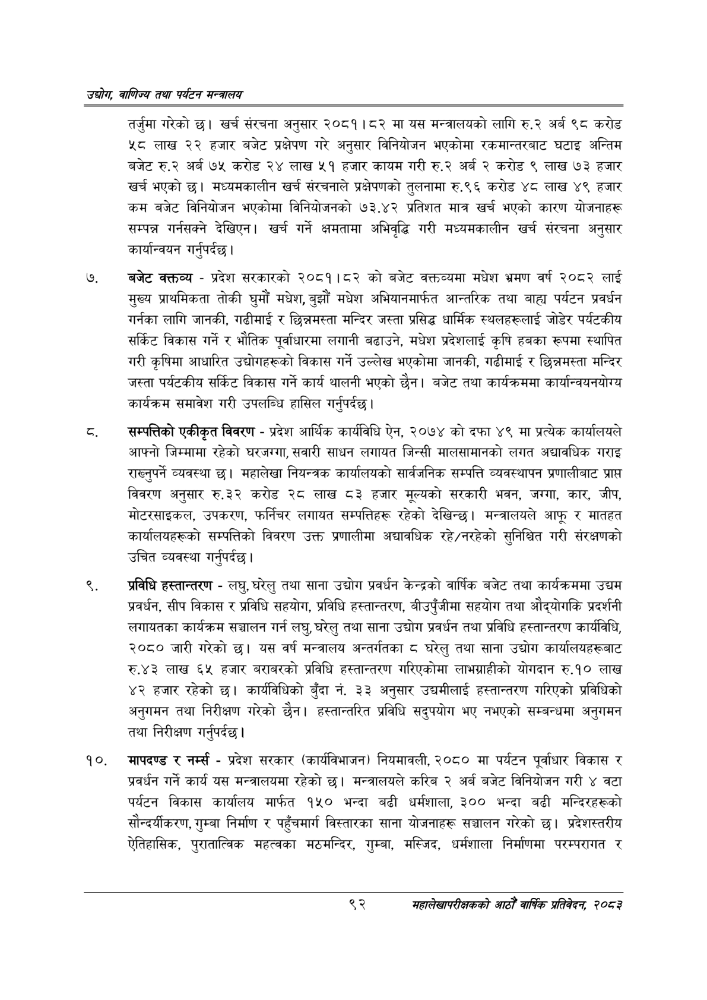

# Page 114 QA

## Rendered page


## Extracted text

```text
उद्योग वाणिज्य तथा पर्यटन सन्वालय
तर्जुमा गरेको | खर्च संरचना अनुसार २०८१।८२ मा यस मन्त्रालयको लागि रु.२ अर्ब ९८ करोड ५८ लाख २२ हजार बजेट प्रक्षेपण गरे अनुसार विनियोजन भएकोमा रकमान्तरबाट घटाइ अन्तिम बजेट रु.२ अर्ब ७५ करोड २४ लाख ५१ हजार कायम गरी रु.२ अर्ब २ करोड ९ लाख ७३ हजार खर्च भएको | मध्यमकालीन खर्च संरचनाले प्रक्षेपणको तुलनामा रु.९६ करोड ४८ लाख ४९ हजार कम बजेट विनियोजन भएकोमा विनियोजनको १७३.४२ प्रतिशत मात्र खर्च भएको कारण योजनाहरू सम्पन्न गर्नसक्ने देखिएन। खर्च गर्ने क्षमतामा अभिवृद्धि गरी मध्यमकालीन खर्च संरचना अनुसार कार्यान्वयन गर्नुपर्दछ |
बजेट वक्तव्य -प्रदेश सरकारको २०८१।८२ को बजेट वक्तव्यमा मधेश भ्रमण वर्ष २०८२ लाई मुख्य प्राथमिकता तोकी घुमौं मधेश, बुझौं मधेश अभियानमार्फत आन्तरिक तथा बाह्य पर्यटन प्रवर्धन गर्नका लागि जानकी, गढीमाई र छिन्नमस्ता मन्दिर जस्ता प्रसिद्ध धार्मिक स्थलहरूलाई जोडेर पर्यटकीय सर्किट विकास गर्ने र भौतिक पूर्वाधारमा लगानी बढाउने, मधेश प्रदेशलाई कृषि हबका रूपमा स्थापित गरी कृषिमा आधारित उद्योगहरूको विकास गर्ने उल्लेख भएकोमा जानकी, गढीमाई र छिन्नमस्ता मन्दिर जस्ता पर्यटकीय सर्किट विकास गर्ने कार्य थालनी भएको छैन। बजेट तथा कार्यक्रममा कार्यान्वयनयोग्य कार्यक्रम समावेश गरी उपलब्धि हासिल गर्नुपर्दछ |
सम्पत्तिको एकीकृत विवरण -प्रदेश आर्थिक कार्यविधि ऐन, २०७४ को दफा ४९ मा प्रत्येक कार्यालयले आफ्नो जिम्मामा रहेको घरजग्गा, सवारी साधन लगायत जिन्सी मालसामानको लगत अद्यावधिक गराइ राख्नुपर्ने व्यवस्था | महालेखा नियन्त्रक कार्यालयको सार्वजनिक सम्पत्ति व्यवस्थापन प्रणालीबाट प्राप्त विवरण अनुसार रु.३२ करोड २८ लाख ८३ हजार मूल्यको सरकारी भवन, जग्गा, कार, जीप, मोटरसाइकल, उपकरण, फर्निचर लगायत सम्पत्तिहरू रहेको देखिन्छ। मन्त्रालयले आफू र मातहत कार्यालयहरूको सम्पत्तिको विवरण उक्त प्रणालीमा अद्यावधिक रहे/नरहेको सुनिश्चित गरी संरक्षणको उचित व्यवस्था गर्नुपर्दछ |
प्रविधि हस्तान्तरण -लघु, घरेलु तथा साना उद्योग प्रवर्धन केन्द्रको वार्षिक बजेट तथा कार्यक्रममा उद्यम प्रवर्धन, सीप विकास र प्रविधि सहयोग, प्रविधि हस्तान्तरण, बीउपुँजीमा सहयोग तथा औद्योगकि प्रदर्शनी लगायतका कार्यक्रम सञ्चालन गर्न लघु, घरेलु तथा साना उद्योग प्रवर्धन तथा प्रविधि हस्तान्तरण कार्यविधि, २०८० जारी गरेको छ। यस वर्ष मन्त्रालय अन्तर्गतका ८ घरेलु तथा साना उद्योग कार्यालयहरूबाट रु.४३ लाख ६५ हजार बराबरको प्रविधि हस्तान्तरण गरिएकोमा लाभग्राहीको योगदान रु.१० लाख ४२ हजार रहेको | कार्यविधिको बुँदा नं. ३३ अनुसार उद्यमीलाई हस्तान्तरण गरिएको प्रविधिको अनुगमन तथा निरीक्षण गरेको छैन। हस्तान्तरित प्रविधि सदुपयोग भए नभएको सम्बन्धमा अनुगमन तथा निरीक्षण गर्नुपर्दछ।
मापदण्ड र नर्म्स -प्रदेश सरकार (कार्यविभाजन) नियमावली, २०८० मा पर्यटन पूर्वाधार विकास र प्रवर्धन गर्ने कार्य यस मन्त्रालयमा रहेको छ। मन्त्रालयले करिब २ अर्ब बजेट विनियोजन गरी ४ वटा पर्यटन विकास कार्यालय मार्फत १५० भन्दा बढी धर्मशाला, ३२०० भन्दा बढी मन्दिरहरूको सौन्दर्यीकरण, गुम्बा निर्माण र पहुँचमार्ग विस्तारका साना योजनाहरू सञ्चालन गरेको छ। प्रदेशस्तरीय ऐतिहासिक, पुरातात्विक महत्वका मठमन्दिर, गुम्बा, मस्जिद, धर्मशाला निर्माणमा परम्परागत र
९२
महालेखापरीक्षकको आठौ वाषिकि प्रतिवेदन २०८२
```

## Flags
- None
