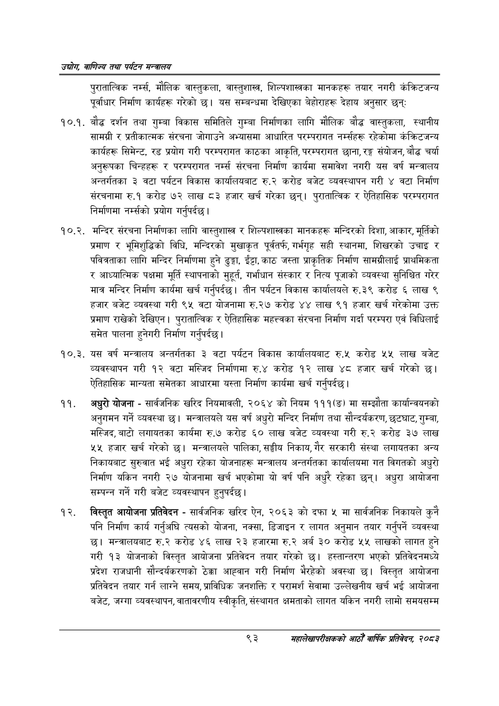

# Page 115 QA

## Rendered page


## Extracted text

```text
उद्योग वाणिज्य तथा पर्यटन सन्वालय
पुरातात्विक नर्म्स, मौलिक वास्तुकला, वास्तुशास्त्र, शिल्पशास्त्रका मानकहरू तयार नगरी कंक्रिटजन्य पूर्वाधार निर्माण कार्यहरू गरेको छ। यस सम्बन्धमा देखिएका बेहोराहरू देहाय अनुसार छन्‌:
१०.१. बौद्ध दर्शन तथा गुम्बा विकास समितिले गुम्बा निर्माणका लागि मौलिक बौद्ध वास्तुकला, स्थानीय सामग्री र प्रतीकात्मक संरचना जोगाउने अभ्यासमा आधारित परम्परागत नम्सहरू रहेकोमा कंक्रिटजन्य कार्यहरू सिमेन्ट, रड प्रयोग गरी परम्परागत काठका आकृति, परम्परागत छाना, रङ्ग संयोजन, बौद्ध चर्या अनुरूपका चिन्हहरू र परम्परागत नर्म्स संरचना निर्माण कार्यमा समावेश नगरी यस वर्ष मन्त्रालय अन्तर्गतका ३ वटा पर्यटन विकास कार्यालयबाट रु.२ करोड बजेट व्यवस्थापन गरी ४ वटा निर्माण संरचनामा रु.१ करोड ७२ लाख ८३ हजार खर्च गरेका छन्‌। पुरातात्विक र ऐतिहासिक परम्परागत निर्माणमा नर्सको प्रयोग गर्नुपर्दछ |
१०.२. मन्दिर संरचना निर्माणका लागि वास्तुशास्त्र र शिल्पशास्त्रका मानकहरू मन्दिरको दिशा, आकार, मूर्तिको प्रमाण र भूमिशुद्धिको विधि, मन्दिरको मुखाकृत पूर्वतर्फ, गर्भगृह सही स्थानमा, शिखरको उचाइ र पवित्रताका लागि मन्दिर निर्माणमा हुने ढुङ्गा, इँटा, काठ जस्ता प्राकृतिक निर्माण सामग्रीलाई प्राथमिकता र आध्यात्मिक पक्षमा मूर्ति स्थापनाको मुहूर्त, गर्भाधान संस्कार र नित्य पूजाको व्यवस्था सुनिश्चित गरेर मात्र मन्दिर निर्माण कार्यमा खर्च गर्नुपर्दछ। तीन पर्यटन विकास कार्यालयले रु.३९ करोड ६ लाख ९ हजार बजेट व्यवस्था गरी ९५ वटा योजनामा रु.२७ करोड ४४ लाख ९१ हजार खर्च गरेकोमा उक्त प्रमाण राखेको देखिएन। पुरातात्विक र ऐतिहासिक महत्त्वका संरचना निर्माण गर्दा परम्परा एवं विधिलाई समेत पालना हुनेगरी निर्माण गर्नुपर्दछ |
१०.३. यस वर्ष मन्त्रालय अन्तर्गतका ३ वटा पर्यटन विकास कार्यालयबाट रु.५ करोड ५५ लाख बजेट व्यवस्थापन गरी १२ वटा मस्जिद निर्माणमा रु.४ करोड १२ लाख ४८ हजार खर्च गरेको ऐतिहासिक मान्यता समेतका आधारमा यस्ता निर्माण कार्यमा खर्च गर्नुपर्दछ |
अधुरो योजना -सार्वजनिक खरिद नियमावली, २०६४ को नियम १११(ङ) मा सम्झौता कार्यान्वयनको अनुगमन गर्ने व्यवस्था छ। मन्त्रालयले यस वर्ष अधुरो मन्दिर निर्माण तथा सौन्दर्यकरण, छटघाट, गुम्बा, मस्जिद, बाटो लगायतका कार्यमा रु.७ करोड ६० लाख बजेट व्यवस्था गरी रु.२ करोड ३७ लाख ५५ हजार खर्च गरेको छ। मन्त्रालयले पालिका, सङ्घीय निकाय, गैर सरकारी संस्था लगायतका अन्य निकायबाट सुरुवात भई अधुरा रहेका योजनाहरू मन्त्रालय अन्तर्गतका कार्यालयमा गत विगतको अधुरो निर्माण यकिन नगरी २७ योजनामा खर्च भएकोमा यो वर्ष पनि अधुरै रहेका छन्‌। अधुरा आयोजना सम्पन्न गर्ने गरी बजेट व्यवस्थापन हुनुपर्दछ |
विस्तृत आयोजना प्रतिवेदन -सार्वजनिक खरिद ऐन, २०६३ को दफा ५ मा सार्वजनिक निकायले कुनै पनि निर्माण कार्य गर्नुअघि त्यसको योजना, नक्सा, डिजाइन र लागत अनुमान तयार गर्नुपर्ने व्यवस्था छ। मन्त्रालयबाट रु.२ करोड ४६ लाख २३ हजारमा रु.२ अर्ब ३० करोड ५५ लाखको लागत हुने गरी १३ योजनाको विस्तृत आयोजना प्रतिवेदन तयार गरेको छ। हस्तान्तरण भएको प्रतिवेदनमध्ये प्रदेश राजधानी सौन्दर्यकरणको ठेक्का आह्वान गरी निर्माण भैरहेको अवस्था छ। विस्तृत आयोजना प्रतिवेदन तयार गर्न लाग्ने समय, प्राविधिक जनशक्ति र परामर्श सेवामा उल्लेखनीय खर्च भई आयोजना बजेट, जग्गा व्यवस्थापन, वातावरणीय स्वीकृति, संस्थागत क्षमताको लागत यकिन नगरी लामो समयसम्म
९३
महालेखापरीक्षकको आठौ वाषिकि प्रतिवेदन २०८२
```

## Flags
- None
