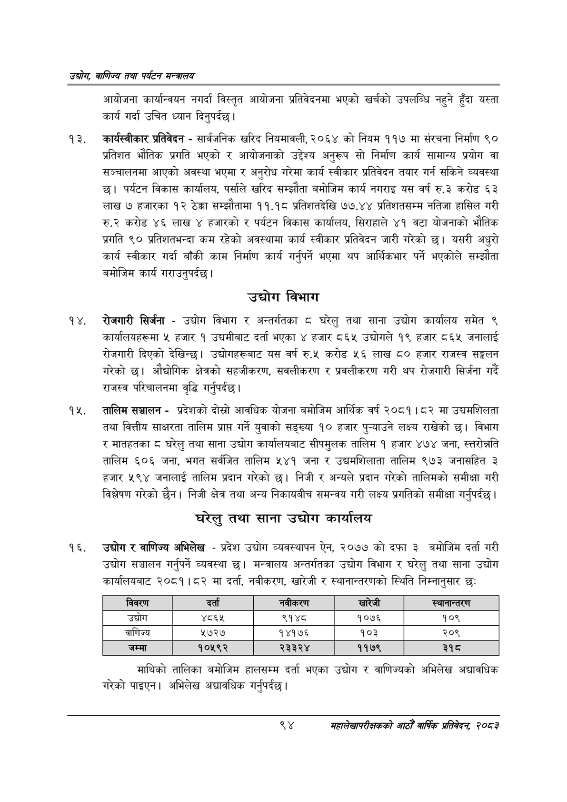

# Page 116 QA

## Rendered page


## Extracted text

```text
उद्योग वाणिज्य तथा पर्यटन सन्वालय
आयोजना कार्यान्वयन नगर्दा विस्तृत आयोजना प्रतिवेदनमा भएको खर्चको उपलब्धि नहुने हुँदा यस्ता कार्य गर्दा उचित ध्यान दिनुपर्दछ।
कार्यस्वीकार प्रतिवेदन -सार्वजनिक खरिद नियमावली, २०६४ को नियम ११७ मा संरचना निर्माण ९० प्रतिशत भौतिक प्रगति भएको र आयोजनाको उद्देश्य अनुरूप सो निर्माण कार्य सामान्य प्रयोग वा सञ्चालनमा आएको अवस्था भएमा र अनुरोध गरेमा कार्य स्वीकार प्रतिवेदन तयार गर्न सकिने व्यवस्था छ। पर्यटन विकास कार्यालय, पर्साले खरिद सम्झौता बमोजिम कार्य नगराइ यस वर्ष रु.३ करोड ६३ लाख ७ हजारका १२ ठेक्का सम्झौतामा ११.१८ प्रतिशतदेखि ७७.४४ प्रतिशतसम्म नतिजा हासिल गरी रु.२ करोड ४६ लाख ४ हजारको र पर्यटन विकास कार्यालय, सिराहाले ४१ वटा योजनाको भौतिक प्रगति ९० प्रतिशतभन्दा कम रहेको अवस्थामा कार्य स्वीकार प्रतिवेदन जारी गरेको छ। यसरी अधुरो कार्य स्वीकार गर्दा बाँकी काम निर्माण कार्य गर्नुपर्ने भएमा थप आर्थिकभार पर्ने भएकोले सम्झौता बमोजिम कार्य गराउनुपर्दछ।
उद्योग विभाग
रोजगारी सिर्जना -उद्योग विभाग र अन्तर्गतका ८ घरेलु तथा साना उद्योग कार्यालय समेत ९ कार्यालयहरूमा ५ हजार १ उद्यमीबाट दर्ता भएका हजार ८६५ उद्योगले १९ हजार ८६४ जनालाई रोजगारी दिएको देखिन्छ। उद्योगहरूबाट यस वर्ष रु.५ करोड ५६ लाख ८० हजार राजस्व सङ्कलन गरेको | औद्योगिक क्षेत्रको सहजीकरण, सवलीकरण र प्रवलीकरण गरी थप रोजगारी सिर्जना गर्दै राजस्व परिचालनमा वृद्धि गर्नुपर्दछ |
तालिम सञ्चालन -प्रदेशको दोस्रो आवधिक योजना बमोजिम आर्थिक वर्ष २०८१। ८२ मा उद्यमशिलता तथा वित्तीय साक्षरता तालिम प्राप्त गर्ने युवाको सङ्ख्या १० हजार पुन्याउने लक्ष्य राखेको छ। विभाग र मातहतका ८ घरेलु तथा साना उद्योग कार्यालयबाट सीपमुलक तालिम १ हजार ४७४ जना, स्तरोन्नति तालिम ६०६ जना, भगत सर्वजित तालिम ५४१ जना र उद्यमशिलाता तालिम ९७३ जनासहित ३ हजार ५९४ जनालाई तालिम प्रदान गरेको छ। निजी र अन्यले प्रदान गरेको तालिमको समीक्षा गरी विश्लेषण गरेको छैन। निजी क्षेत्र तथा अन्य निकायबीच समन्वय गरी लक्ष्य प्रगतिको समीक्षा गर्नुपर्दछ |
घरेलु तथा साना उद्योग कार्यालय
उद्योग र वाणिज्य अभिलेख -प्रदेश उद्योग व्यवस्थापन ऐन, २०७७ को दफा ३ बमोजिम दर्ता गरी उद्योग सञ्चालन गर्नुपर्ने व्यवस्था छ। मन्त्रालय अन्तर्गतका उद्योग विभाग र घरेलु तथा साना उद्योग कार्यालयबाट २०८१।८२ मा दर्ता, नवीकरण, खारेजी र स्थानान्तरणको स्थिति निम्नानुसार छः
माथिको तालिका बमोजिम हालसम्म दर्ता भएका उद्योग र वाणिज्यको अभिलेख अद्यावधिक गरेको पाइएन। अभिलेख अद्यावधिक गर्नुपर्दछ |
९४
महालेखापरीक्षकको आठौ वाषिकि प्रतिवेदन २०८२

| 'विवरण | दता | नवीकरण | खारेजी | ल्यानान्तरण |
| --- | --- | --- | --- | --- |
| उद्योग | ४८६५ | ९१४८ | १०७६ | १०९ |
| वाणिज्य | १७२७ | १४१७६ | १०३ | २०९ |
| जम्मा | १०५९२ | २३३२४ | ११७९ | ३१८ |
```

## Flags
- table_page
- medium_quality_table
