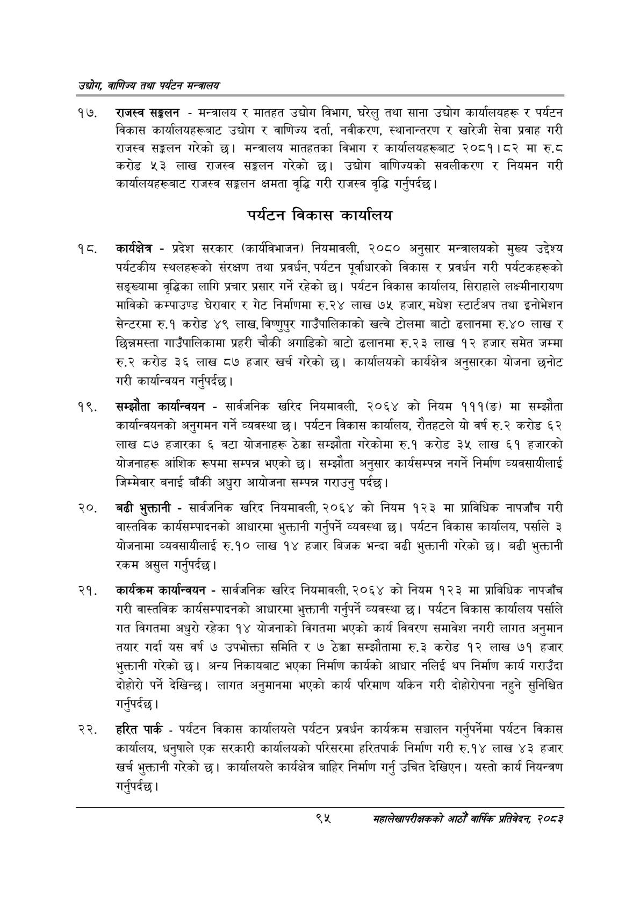

# Page 117 QA

## Rendered page


## Extracted text

```text
उद्योग वाणिज्य तथा पर्यटन सन्वालय
राजस्व सङ्कलन -मन्त्रालय र मातहत उद्योग विभाग, घरेलु तथा साना उद्योग कार्यालयहरू र पर्यटन विकास कार्यालयहरूबाट उद्योग र वाणिज्य दर्ता, नवीकरण, स्थानान्तरण र खारेजी सेवा प्रवाह गरी राजस्व सङ्घलन गरेको छ। मन्त्रालय मातहतका विभाग र कार्यालयहरूबाट २०८१।८२ मा ६.६ करोड ५३ लाख राजस्व सङ्गलन गरेको छ। उद्योग वाणिज्यको सवलीकरण र नियमन गरी कार्यालयहरूबाट राजस्व सङ्कलन क्षमता वृद्धि गरी राजस्व वृद्धि गर्नुपर्दछ |
पर्यटन विकास कार्यालय
कार्यक्षेत्र -प्रदेश सरकार (कार्यविभाजन) नियमावली, २०८० अनुसार मन्त्रालयको मुख्य उद्देश्य पर्यटकीय स्थलहरूको संरक्षण तथा प्रवर्धन, पर्यटन पूर्वाधारको विकास र प्रवर्धन गरी पर्यटकहरूको सङ्ख्यामा वृद्धिका लागि प्रचार प्रसार गर्ने रहेको छ। पर्यटन विकास कार्यालय, सिराहाले लक्ष्मीनारायण माविको कम्पाउण्ड घेरावार र गेट निर्माणमा रु.२४ लाख ७५ हजार, मधेश स्टार्टपप तथा इनोभेशन सेन्टरमा रु.१ करोड ४९ लाख, विष्णुपुर गाउँपालिकाको खत्वे टोलमा बाटो ढलानमा रु.४० लाख र छिन्नमस्ता गाउँपालिकामा प्रहरी चौकी अगाडिको बाटो ढलानमा रु.२३ लाख १२ हजार समेत जम्मा रु.२ करोड ३६ लाख ८७ हजार खर्च गरेको छ। कार्यालयको कार्यक्षेत्र अनुसारका योजना छनोट गरी कार्यान्वयन गर्नुपर्दछ |
सम्झौता कार्यान्वयन -सार्वजनिक खरिद नियमावली, २०६४ को नियम १११(ङ) मा सम्झौता कार्यान्वयनको अनुगमन गर्ने व्यवस्था | पर्यटन विकास कार्यालय, रौतहटले यो वर्ष रु.२ करोड ६२ लाख ८७ हजारका ६ वटा योजनाहरू ठेक्का सम्झौता गरेकोमा रु.१ करोड ३५ लाख ६१ हजारको योजनाहरू आंशिक रूपमा सम्पन्न भएको छ। सम्झौता अनुसार कार्यसम्पन्न नगर्ने निर्माण व्यवसायीलाई जिम्मेवार बनाई बाँकी अधुरा आयोजना सम्पन्न गराउनु पर्दछ।
२०, बढी भुक्तानी -सार्वजनिक खरिद नियमावली, २०६४ को नियम १२३ मा प्राविधिक नापजाँच गरी वास्तविक कार्यसम्पादनको आधारमा भुक्तानी गर्नुपर्ने व्यवस्था छ। पर्यटन विकास कार्यालय, पर्साले ३ योजनामा व्यवसायीलाई रु.१० लाख १४ हजार बिजक भन्दा बढी भुक्तानी गरेको छ। बढी भुक्तानी रकम असुल गर्नुपर्दछ।
कार्यक्रम कार्यान्वयन -सार्वजनिक खरिद नियमावली, २०६४ को नियम १२३ मा प्राविधिक नापजाँच गरी वास्तविक कार्यसम्पादनको आधारमा भुक्तानी गर्नुपर्ने व्यवस्था छ। पर्यटन विकास कार्यालय पर्साले गत विगतमा अधुरो रहेका १४ योजनाको विगतमा भएको कार्य विवरण समावेश नगरी लागत अनुमान तयार गर्दा यस वर्ष ७ उपभोक्ता समिति र ७ ठेक्का सम्झौतामा रु.३ करोड १२ लाख ७१ हजार भुक्तानी गरेको छ। अन्य निकायबाट भएका निर्माण कार्यको आधार नलिई थप निर्माण कार्य गराउँदा दोहोरो पर्ने देखिन्छ। लागत अनुमानमा भएको कार्य परिमाण यकिन गरी दोहोरीपना नहुने सुनिश्चित गर्नुपर्दछ |
हरित पार्क -पर्यटन विकास कार्यालयले पर्यटन प्रवर्धन कार्यक्रम सञ्चालन गर्नुपर्नेमा पर्यटन विकास कार्यालय, धनुषाले एक सरकारी कार्यालयको परिसरमा हरितपार्क निर्माण गरी रु.१४ लाख ४३ हजार खर्च भुक्तानी गरेको छ। कार्यालयले कार्यक्षेत्र बाहिर निर्माण गर्नु उचित देखिएन। यस्तो कार्य नियन्त्रण गर्नुपर्दछ |
९५
महालेखापरीक्षकको आठौ वाषिकि प्रतिवेदन २०८२
```

## Flags
- None
