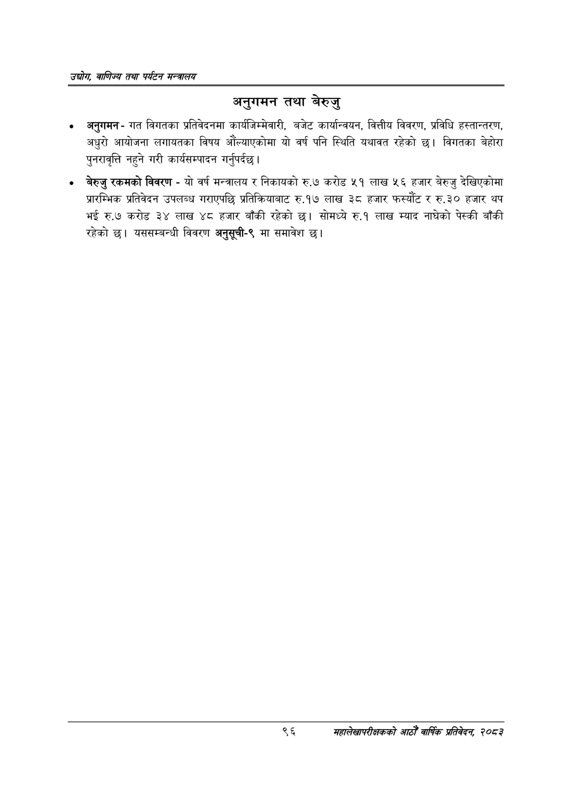

# Page 118 QA

## Rendered page


## Extracted text

```text
उद्योग वाणिज्य तथा पर्यटन मन्वालय
अनुगमन तथा बेरुजु
अनुगमन -गत विगतका प्रतिवेदनमा कार्यजिम्मेवारी, बजेट कार्यान्वयन, वित्तीय विवरण, प्रविधि हस्तान्तरण, अधुरो आयोजना लगायतका विषय औंल्याएकोमा यो वर्ष पनि स्थिति यथावत रहेको छ। विगतका बेहोरा पुनरावृत्ति नहुने गरी कार्यसम्पादन गर्नुपर्दछ |
«० बेरुजु रकमको विवरण -यो वर्ष मन्त्रालय र निकायको रु.७ करोड ५१ लाख ५६ हजार बेरुजु देखिएकोमा प्रारम्भिक प्रतिवेदन उपलब्ध गराएपछि प्रतिक्रियाबाट रु.१७ लाख ३८ हजार फस्यौंट र रु.३० हजार थप भई रु.७ करोड ३४ लाख ४८ हजार बाँकी रहेको छ। सोमध्ये रु.१ लाख म्याद नाघेको पेस्की बाँकी रहेको | यससम्बन्धी विवरण अनुसूची-९ मा समावेश |
९६
महालेखापरीक्षकको आठौ वाषिकि प्रतिवेदन २०८२
```

## Flags
- None
