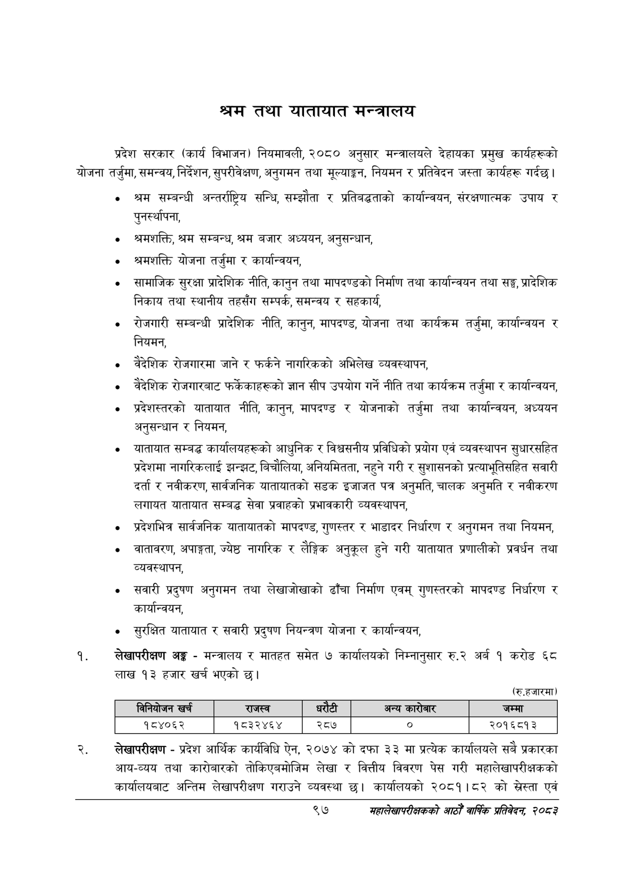

# Page 119 QA

## Rendered page


## Extracted text

```text
श्रम तथा यातायात मन्त्रालय
प्रदेश सरकार (कार्य विभाजन) नियमावली, २०८० अनुसार मन्त्रालयले देहायका प्रमुख कार्यहरूको योजना तर्जुमा, समन्वय, निर्देशन, सुपरीवेक्षण, अनुगमन तथा मूल्याङ्कन, नियमन र प्रतिवेदन जस्ता कार्यहरू गर्दछ।
श्रम सम्बन्धी अन्तर्राष्ट्रिय सन्धि, सम्झौता र प्रतिबद्धताको कार्यान्वयन, संरक्षणात्मक उपाय र पुनर्स्थापना,
श्रमशक्ति, श्रम सम्बन्ध, श्रम बजार अध्ययन, अनुसन्धान,
श्रमशक्ति योजना तर्जुमा र कार्यान्वयन,
सामाजिक सुरक्षा प्रादेशिक नीति, कानुन तथा मापदण्डको निर्माण तथा कार्यान्वयन तथा सङ्ग, प्रादेशिक निकाय तथा स्थानीय तहसँग सम्पर्क, समन्वय र सहकार्य,
रोजगारी सम्बन्धी प्रादेशिक नीति, कानुन, मापदण्ड, योजना तथा कार्यक्रम तर्जुमा, कार्यान्वयन र नियमन,
वैदेशिक रोजगारमा जाने र फर्कने नागरिकको अभिलेख व्यवस्थापन,
वैदेशिक रोजगारबाट फर्केकाहरूको ज्ञान सीप उपयोग गर्ने नीति तथा कार्यक्रम तर्जुमा र कार्यान्वयन,
प्रदेशस्तरको यातायात नीति, कानुन, मापदण्ड र योजनाको तर्जुमा तथा कार्यान्वयन, अध्ययन अनुसन्धान र नियमन,
यातायात सम्बद्ध कार्यालयहरूको आधुनिक र विश्वसनीय प्रविधिको प्रयोग एवं व्यवस्थापन सुधारसहित प्रदेशमा नागरिकलाई झन्झट, बिचौलिया, अनियमितता, नहुने गरी र सुशासनको प्रत्याभूतिसहित सवारी दर्ता र नवीकरण, सार्वजनिक यातायातको सडक इजाजत पत्र अनुमति, चालक अनुमति र नवीकरण लगायत यातायात सम्बद्ध सेवा प्रवाहको प्रभावकारी व्यवस्थापन,
प्रदेशभित्र सार्वजनिक यातायातको मापदण्ड, गुणस्तर र भाडादर निर्धारण र अनुगमन तथा नियमन,
वातावरण, अपाङ्गता, ज्येष्ठ नागरिक र लैङ्गिक अनुकूल हुने गरी यातायात प्रणालीको प्रवर्धन तथा व्यवस्थापन,
सवारी प्रदुषण अनुगमन तथा लेखाजोखाको ढाँचा निर्माण एवम्‌ गुणस्तरको मापदण्ड निर्धारण र कार्यान्वयन,
सुरक्षित यातायात र सवारी प्रदुषण नियन्त्रण योजना र कार्यान्वयन,
लेखापरीक्षण अङ्ग -मन्त्रालय र मातहत समेत ७ कार्यालयको निम्नानुसार रु.२ अर्ब १ करोड ६८ लाख १३ हजार खर्च भएको छ।
(रु.हजारमा)
लेखापरीक्षण -प्रदेश आर्थिक कार्यविधि ऐन, २०७४ को दफा ३३ मा प्रत्येक कार्यालयले सबै प्रकारका आय-व्यय तथा कारोबारको तोकिएबमोजिम लेखा र वित्तीय विवरण पेस गरी महालेखापरीक्षकको कार्यालयबाट अन्तिम लेखापरीक्षण गराउने व्यवस्था | कार्यालयको २०८१।८२ को सस्ता एवं
९७
महालेखापरीक्षकको आठौ वाषिकि प्रतिवेदन २०८२

|  |  | बिनेवोजन खर्च | राजस्व |  | रेटी | अन्य कारोबार | जम्मा |
| --- | --- | --- | --- | --- | --- | --- | --- |
|  |  | १८४०६२ | १८३२४६४ |  | २८७ | ० | २०१६८१३ |
```

## Flags
- table_page
- medium_quality_table
